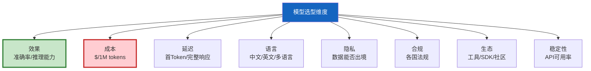

# 模型选型决策矩阵进阶

> 选模型不能只看"谁最强"——成本、延迟、语言、隐私、合规、生态都要考虑。这份指南提供多维度决策矩阵，帮你为不同场景选对模型。

---

## 一、选型维度



---

## 二、主流模型对比矩阵

| 模型 | 效果 | 成本($/1M) | 延迟 | 中文 | 英文 | 多模态 | 可本地 | 生态 |
|------|------|-----------|------|------|------|--------|--------|------|
| GPT-4o | ★★★★★ | 2.50/10 | 中 | ★★★★ | ★★★★★ | ✅ | ❌ | 最大 |
| GPT-4o-mini | ★★★★ | 0.15/0.60 | 低 | ★★★★ | ★★★★ | ✅ | ❌ | 大 |
| Claude 3.5 Sonnet | ★★★★★ | 3.00/15 | 中 | ★★★★ | ★★★★★ | ✅ | ❌ | 大 |
| Claude 3 Haiku | ★★★★ | 0.25/1.25 | 低 | ★★★ | ★★★★ | ✅ | ❌ | 中 |
| Gemini 1.5 Pro | ★★★★★ | 1.25/5 | 中 | ★★★★ | ★★★★★ | ✅ | ❌ | 中 |
| Qwen2.5-72B | ★★★★ | 0.5/1.5 | 中 | ★★★★★ | ★★★★ | ❌ | ✅ | 中 |
| Llama 3.1-70B | ★★★★ | 0.5/1.5 | 中 | ★★★ | ★★★★ | ❌ | ✅ | 大 |
| DeepSeek-V3 | ★★★★ | 0.14/0.28 | 低 | ★★★★★ | ★★★★ | ❌ | ✅ | 新 |

---

## 三、场景化选型

```mermaid
graph TB
    Q1["场景？"] -->|实时对话| Q2&#123;"数据可出境？"&#125;
    Q2 -->|是| Q3&#123;"预算？"&#125;
    Q3 -->|高| GPT4O["GPT-4o"]
    Q3 -->|中| CLAUDE["Claude 3.5"]
    Q3 -->|低| MINI["GPT-4o-mini"]
    Q2 -->|否| QWEN["Qwen2.5本地"]

    Q1 -->|批量处理| BATCH["DeepSeek-V3<br/>成本最低"]
    Q1 -->|RAG问答| Q4&#123;"中文为主？"&#125;
    Q4 -->|是| QWEN2["Qwen2.5<br/>中文最强"]
    Q4 -->|否| MINI2["GPT-4o-mini<br/>通用"]
    Q1 -->|代码生成| CODE["Claude 3.5<br/>代码最强"]
    Q1 -->|多模态| MM["GPT-4o<br/>视觉最强"]

    style GPT4O fill:#C8E6C9,stroke:#2E7D32,stroke-width:3px
```

---

## 四、多模型路由策略

```python
class ModelSelectionMatrix:
    """模型选型决策矩阵。"""

    @staticmethod
    def select(
        task_type: str = "general",
        language: str = "zh",
        budget_sensitive: bool = False,
        data_sensitive: bool = False,
        multimodal: bool = False,
        latency_critical: bool = False,
    ) -> dict:
        """根据需求选模型。"""
        recommendations = []

        # 数据敏感→必须本地
        if data_sensitive:
            if language == "zh":
                recommendations.append(&#123;"model": "Qwen2.5-72B", "reason": "中文+本地", "score": 9&#125;)
            else:
                recommendations.append(&#123;"model": "Llama 3.1-70B", "reason": "英文+本地", "score": 8&#125;)

        # 延迟敏感→快速模型
        elif latency_critical:
            if budget_sensitive:
                recommendations.append(&#123;"model": "GPT-4o-mini", "reason": "快+便宜", "score": 9&#125;)
            else:
                recommendations.append(&#123;"model": "GPT-4o", "reason": "快+强", "score": 8&#125;)

        # 多模态
        elif multimodal:
            recommendations.append(&#123;"model": "GPT-4o", "reason": "视觉最强", "score": 10&#125;)

        # 批量处理
        elif task_type == "batch":
            recommendations.append(&#123;"model": "DeepSeek-V3", "reason": "成本最低", "score": 9&#125;)

        # 代码生成
        elif task_type == "code":
            recommendations.append(&#123;"model": "Claude 3.5 Sonnet", "reason": "代码最强", "score": 10&#125;)

        # 通用
        else:
            if budget_sensitive:
                recommendations.append(&#123;"model": "GPT-4o-mini", "reason": "性价比", "score": 8&#125;)
            elif language == "zh":
                recommendations.append(&#123;"model": "Qwen2.5-72B", "reason": "中文最强", "score": 9&#125;)
            else:
                recommendations.append(&#123;"model": "GPT-4o", "reason": "通用最强", "score": 9&#125;)

        return recommendations[0] if recommendations else &#123;"model": "GPT-4o", "reason": "默认"&#125;
```

---

## 五、成本对比

```mermaid
graph TB
    subgraph 成本 &#123;"月度成本估算(1000请求/天)"&#125;
        GPT4["GPT-4o<br/>$75/月"]
        MINI["GPT-4o-mini<br/>$4.5/月"]
        CLAUDE["Claude 3.5<br/>$90/月"]
        QWEN["Qwen2.5本地<br/>$0(仅服务器)"]
        DS["DeepSeek-V3<br/>$4.2/月"]
    end

    style GPT4 fill:#FFCDD2
    style MINI fill:#C8E6C9,stroke:#2E7D32,stroke-width:3px
    style QWEN fill:#C8E6C9
```

---

## 六、混合策略

```python
# 生产推荐：多模型组合
HYBRID_STRATEGY = &#123;
    "default": "GPT-4o-mini",        # 80%请求走小模型
    "complex": "GPT-4o",             # 复杂查询走大模型
    "code": "Claude 3.5 Sonnet",     # 代码走Claude
    "batch": "DeepSeek-V3",           # 批量走最便宜
    "multimodal": "GPT-4o",           # 多模态走GPT-4o
    "fallback": "GPT-4o-mini",       # 主模型失败降级
    "local": "Qwen2.5-72B",          # 敏感数据本地
&#125;
```

---

## 七、评估方法

```python
class ModelEvaluator:
    """模型评估器：用真实数据对比模型。"""

    @staticmethod
    async def compare_models(
        models: list[str],
        test_cases: list[dict],
        llm_factory: callable,
    ) -> dict:
        """对比多个模型在测试集上的表现。"""
        results = &#123;&#125;
        for model_name in models:
            llm = llm_factory(model_name)
            correct = 0
            total = len(test_cases)

            for tc in test_cases:
                response = await llm.ainvoke(tc["input"])
                # 简化评估：检查关键词
                if any(kw in response.content for kw in tc.get("keywords", [])):
                    correct += 1

            results[model_name] = &#123;
                "accuracy": round(correct / total, 4),
                "total": total,
            &#125;

        return results
```

---

## 八、最佳实践

| 实践 | 说明 | 优先级 |
|------|------|--------|
| 用真实数据评估 | 排行榜不代表你的场景 | ★★★ |
| 默认用小模型 | 80%请求够用 | ★★★ |
| 中文用Qwen | 中文最强 | ★★★ |
| 代码用Claude | 代码最强 | ★★☆ |
| 数据敏感用本地 | 数据不出内网 | ★★★ |
| 批量用DeepSeek | 成本最低 | ★★☆ |

---

## 九、检查清单

| 检查项 | 状态 |
|--------|------|
| 有多维度对比矩阵 | ☐ |
| 按场景选模型 | ☐ |
| 有多模型路由策略 | ☐ |
| 有成本对比 | ☐ |
| 用真实数据评估过 | ☐ |
