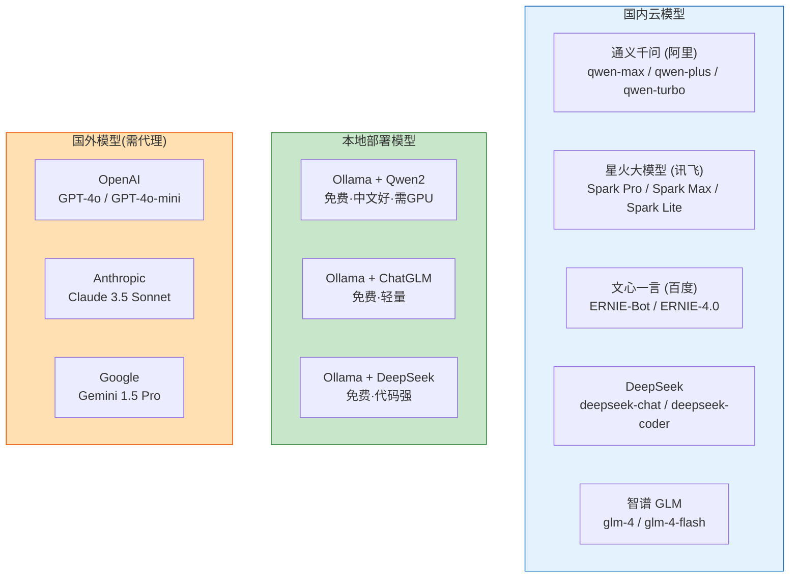
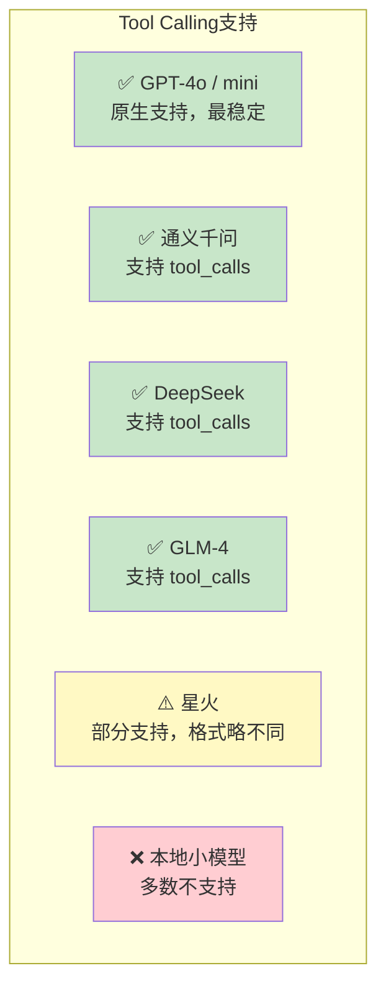

# 中文 LLM 集成指南

> 在国内环境中使用通义千问、讯飞星火、文心一言等中文模型，配合 LangChain 开发应用。

---

## 一、中文 LLM 全景



## 二、各模型接入方式

### 2.1 通义千问（阿里云 DashScope）

```bash
pip install dashscope langchain-community
```

```python
import os
from dotenv import load_dotenv

load_dotenv()
os.environ["DASHSCOPE_API_KEY"] = os.getenv("DASHSCOPE_API_KEY")

from langchain_community.chat_models import ChatTongyi

llm = ChatTongyi(
    model="qwen-plus",       # qwen-max最强 / qwen-plus均衡 / qwen-turbo最快
    temperature=0.7,
)

response = llm.invoke("用一句话解释什么是量子计算")
print(response.content)
```

### 2.2 讯飞星火

```bash
pip install langchain-community
```

```python
import os
from dotenv import load_dotenv

load_dotenv()
os.environ["IFLYTEK_APP_ID"] = os.getenv("IFLYTEK_APP_ID")
os.environ["IFLYTEK_API_KEY"] = os.getenv("IFLYTEK_API_KEY")
os.environ["IFLYTEK_API_SECRET"] = os.getenv("IFLYTEK_API_SECRET")

from langchain_community.chat_models import ChatSparkLLM

llm = ChatSparkLLM(
    model_name="Spark Max",    # Spark Pro / Spark Max / Spark Lite
    temperature=0.7,
)

response = llm.invoke("你好，请介绍一下自己")
print(response.content)
```

### 2.3 DeepSeek

```bash
pip install langchain-deepseek
```

```python
import os
from dotenv import load_dotenv

load_dotenv()
os.environ["DEEPSEEK_API_KEY"] = os.getenv("DEEPSEEK_API_KEY")

from langchain_deepseek import ChatDeepSeek

llm = ChatDeepSeek(
    model="deepseek-chat",    # deepseek-chat / deepseek-coder
    temperature=0,
)

response = llm.invoke("写一个Python快速排序函数")
print(response.content)
```

### 2.4 智谱 GLM

```bash
pip install langchain-community zhipuai
```

```python
import os
from dotenv import load_dotenv

load_dotenv()
os.environ["ZHIPUAI_API_KEY"] = os.getenv("ZHIPUAI_API_KEY")

from langchain_community.chat_models import ChatZhipuAI

llm = ChatZhipuAI(
    model="glm-4-flash",     # glm-4 / glm-4-flash(免费) / glm-4-plus
    temperature=0.7,
)

response = llm.invoke("你好")
print(response.content)
```

### 2.5 本地模型（Ollama + Qwen2）

```bash
# 安装Ollama后拉取模型
ollama pull qwen2       # 通义千问
ollama pull deepseek    # DeepSeek
ollama pull qwen2:7b    # 7B版本（需约8GB显存）
```

```python
from langchain_ollama import ChatOllama

# 不需要API Key，完全免费
llm = ChatOllama(
    model="qwen2",
    temperature=0.7,
)

response = llm.invoke("用一句话解释什么是量子计算")
print(response.content)
```

## 三、模型选择决策

```mermaid
graph TD
    START["选择中文模型"] --> Q1

    Q1&#123;"能访问国外API?"&#125;
    Q1 -->|"能"| Q2&#123;"预算?"&#125;
    Q1 -->|"不能"| Q3

    Q2 -->|"有预算"| OAI["✅ GPT-4o<br/>最强多模态+工具调用"]
    Q2 -->|"省钱"| OAI_MINI["✅ GPT-4o-mini<br/>便宜+工具调用"]

    Q3&#123;"需要免费?"&#125;
    Q3 -->|"是"| Q4&#123;"有GPU?"&#125;
    Q3 -->|"可付费"| Q5&#123;"需求?"&#125;

    Q4 -->|"有(8GB+)"| OLLAMA["✅ Ollama+Qwen2<br/>免费·隐私"]
    Q4 -->|"无"| GLM["✅ GLM-4-Flash<br/>免费API"]

    Q5 -->|"代码任务"| DEEPSEEK["✅ DeepSeek<br/>代码能力强+便宜"]
    Q5 -->|"通用问答"| QWEN["✅ 通义千问<br/>中文好+生态全"]
    Q5 -->|"多模态"| QWEN_VL["✅ Qwen-VL<br/>支持图片"]

    style OAI fill:#C8E6C9
    style OAI_MINI fill:#C8E6C9
    style OLLAMA fill:#C8E6C9
    style GLM fill:#C8E6C9
    style DEEPSEEK fill:#C8E6C9
    style QWEN fill:#C8E6C9
```

## 四、各模型对比

| 模型 | 中文质量 | 工具调用 | 多模态 | 价格 | 免费额度 |
|------|----------|----------|--------|------|----------|
| GPT-4o | ★★★★★ | ✅ | ✅(图片) | 中高 | 无 |
| GPT-4o-mini | ★★★★ | ✅ | ✅(图片) | 很低 | 无 |
| 通义千问-max | ★★★★★ | ✅ | ✅(VL) | 中 | 有 |
| 通义千问-plus | ★★★★ | ✅ | ✅(VL) | 低 | 有 |
| 星火Max | ★★★★ | ✅ | ❌ | 中 | 有 |
| DeepSeek | ★★★★ | ✅ | ❌ | 很低 | 有 |
| GLM-4-Flash | ★★★☆ | ✅ | ❌ | 免费 | 无限 |
| Ollama+Qwen2 | ★★★★ | ✅ | ❌ | 免费 | — |

## 五、Tool Calling 支持情况



## 六、统一封装（方便切换模型）

```python
from dotenv import load_dotenv
import os

load_dotenv()

def get_llm(provider: str = "openai", model: str = None):
    """统一LLM创建接口，方便切换模型"""
    if provider == "openai":
        from langchain_openai import ChatOpenAI
        return ChatOpenAI(model=model or "gpt-4o-mini", temperature=0)

    elif provider == "tongyi":
        from langchain_community.chat_models import ChatTongyi
        os.environ["DASHSCOPE_API_KEY"] = os.getenv("DASHSCOPE_API_KEY")
        return ChatTongyi(model=model or "qwen-plus", temperature=0)

    elif provider == "deepseek":
        from langchain_deepseek import ChatDeepSeek
        os.environ["DEEPSEEK_API_KEY"] = os.getenv("DEEPSEEK_API_KEY")
        return ChatDeepSeek(model=model or "deepseek-chat", temperature=0)

    elif provider == "spark":
        from langchain_community.chat_models import ChatSparkLLM
        return ChatSparkLLM(model_name=model or "Spark Max", temperature=0)

    elif provider == "ollama":
        from langchain_ollama import ChatOllama
        return ChatOllama(model=model or "qwen2", temperature=0)

    elif provider == "glm":
        from langchain_community.chat_models import ChatZhipuAI
        os.environ["ZHIPUAI_API_KEY"] = os.getenv("ZHIPUAI_API_KEY")
        return ChatZhipuAI(model=model or "glm-4-flash", temperature=0)

    else:
        raise ValueError(f"不支持的模型提供商: &#123;provider&#125;")

# 使用：一行代码切换模型
llm = get_llm("tongyi")       # 用通义千问
llm = get_llm("deepseek")     # 切换到DeepSeek
llm = get_llm("glm")          # 切换到智谱GLM
llm = get_llm("ollama")       # 切换到本地模型
```

## 七、中文 Embedding 模型

RAG 向量化也需要中文友好的 Embedding 模型：

```python
# 方式一：OpenAI Embeddings（需代理）
from langchain_openai import OpenAIEmbeddings
embeddings = OpenAIEmbeddings()

# 方式二：通义千问 Embeddings（中文好）
from langchain_community.embeddings import DashScopeEmbeddings
embeddings = DashScopeEmbeddings(model="text-embedding-v2")

# 方式三：本地 Embedding 模型（免费，中文好）
from langchain_huggingface import HuggingFaceEmbeddings
embeddings = HuggingFaceEmbeddings(
    model_name="BAAI/bge-small-zh-v1.5"  # 中文专用Embedding
)
```

## 八、中文 RAG 特殊处理

```python
from langchain_text_splitters import RecursiveCharacterTextSplitter

# 中文友好的文本分割器
splitter = RecursiveCharacterTextSplitter(
    chunk_size=500,
    chunk_overlap=50,
    separators=[
        "\n\n",   # 段落
        "\n",     # 换行
        "。",     # 中文句号
        "！",     # 感叹号
        "？",     # 问号
        "；",     # 分号
        "，",     # 逗号
        " ",      # 空格
        "",       # 逐字
    ]
)
```
