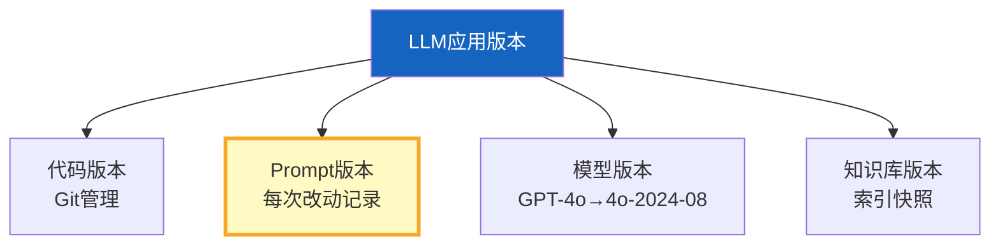

# LLM 应用版本管理与灰度发布

> LLM 应用的"版本"不只是代码——还有 Prompt 版本、模型版本、知识库版本。一个 Prompt 改动可能让效果骤降。版本管理和灰度发布让变更可控、可回滚。

---

## 一、LLM 应用的四维版本



---

## 二、Prompt 版本管理

```python
from dataclasses import dataclass, field
from datetime import datetime
from typing import Optional

@dataclass
class PromptVersion:
    """Prompt版本。"""
    version: str
    prompt_text: str
    description: str
    created_at: str = field(default_factory=lambda: datetime.now().isoformat())
    created_by: str = ""
    status: str = "draft"  # draft/testing/active/archived
    metrics: dict = field(default_factory=dict)  # 评估指标

class PromptRegistry:
    """Prompt版本注册表。"""

    def __init__(self):
        self.versions: dict[str, list[PromptVersion]] = &#123;&#125;  # &#123;prompt_name: [versions]&#125;

    def register(self, name: str, version: PromptVersion):
        """注册新版本。"""
        if name not in self.versions:
            self.versions[name] = []
        self.versions[name].append(version)

    def get_active(self, name: str) -> Optional[PromptVersion]:
        """获取当前活跃版本。"""
        versions = self.versions.get(name, [])
        for v in reversed(versions):
            if v.status == "active":
                return v
        return None

    def get_version(self, name: str, version: str) -> Optional[PromptVersion]:
        """获取指定版本。"""
        for v in self.versions.get(name, []):
            if v.version == version:
                return v
        return None

    def activate(self, name: str, version: str):
        """激活指定版本（其他设为archived）。"""
        for v in self.versions.get(name, []):
            if v.version == version:
                v.status = "active"
            elif v.status == "active":
                v.status = "archived"

    def rollback(self, name: str):
        """回滚到上一个版本。"""
        versions = self.versions.get(name, [])
        # 找到当前活跃版本
        active_idx = None
        for i, v in enumerate(versions):
            if v.status == "active":
                active_idx = i
                break

        if active_idx is not None and active_idx > 0:
            versions[active_idx].status = "archived"
            versions[active_idx - 1].status = "active"
            return versions[active_idx - 1]
        return None
```

---

## 三、灰度发布策略

```mermaid
graph TB
    subgraph 灰度 &#123;"灰度发布流程"&#125;
        S1["新版本上线<br/>5%流量"] --> S2["观察指标<br/>错误率/延迟/满意度"]
        S2 --> OK1&#123;"指标正常？"&#125;
        OK1 -->|是| S3["扩大到20%"]
        OK1 -->|否| ROLLBACK["回滚到旧版本"]
        S3 --> OK2&#123;"指标正常？"&#125;
        OK2 -->|是| S4["扩大到50%"]
        OK2 -->|否| ROLLBACK
        S4 --> OK3&#123;"指标正常？"&#125;
        OK3 -->|是| S5["100%全量"]
        OK3 -->|否| ROLLBACK
    end

    style S1 fill:#E3F2FD
    style ROLLBACK fill:#FFCDD2,stroke:#C62828,stroke-width:3px
    style S5 fill:#C8E6C9,stroke:#2E7D32,stroke-width:3px
```

```python
class GrayscaleRelease:
    """灰度发布管理器。"""

    STAGES = [
        &#123;"percent": 5, "duration_minutes": 30&#125;,
        &#123;"percent": 20, "duration_minutes": 60&#125;,
        &#123;"percent": 50, "duration_minutes": 120&#125;,
        &#123;"percent": 100, "duration_minutes": 0&#125;,
    ]

    def __init__(self):
        self.current_stage = 0
        self.old_version: str = ""
        self.new_version: str = ""
        self.metrics_history: list[dict] = []

    def should_route_to_new(self, user_id: str) -> bool:
        """决定是否将用户路由到新版本。"""
        if self.current_stage >= len(self.STAGES):
            return True

        target_percent = self.STAGES[self.current_stage]["percent"]

        # 基于用户ID的确定性哈希（同一用户始终路由到同一版本）
        hash_val = hash(user_id) % 100
        return hash_val < target_percent

    def check_metrics(self, current_metrics: dict, baseline_metrics: dict) -> dict:
        """检查灰度指标是否正常。"""
        checks = &#123;
            "error_rate": current_metrics.get("error_rate", 0) <= baseline_metrics.get("error_rate", 0) * 1.5,
            "p95_latency": current_metrics.get("p95_latency", 0) <= baseline_metrics.get("p95_latency", 0) * 1.3,
            "satisfaction": current_metrics.get("satisfaction", 0) >= baseline_metrics.get("satisfaction", 0) * 0.9,
        &#125;

        all_passed = all(checks.values())

        return &#123;
            "passed": all_passed,
            "checks": checks,
            "current": current_metrics,
            "baseline": baseline_metrics,
            "action": "proceed" if all_passed else "rollback",
        &#125;

    def advance_stage(self):
        """推进到下一阶段。"""
        if self.current_stage < len(self.STAGES) - 1:
            self.current_stage += 1

    def rollback(self):
        """回滚。"""
        self.current_stage = 0
        # 交换版本
        self.old_version, self.new_version = self.new_version, self.old_version
```

---

## 四、A/B 测试

```python
class ABTestFramework:
    """A/B测试框架。"""

    def __init__(self):
        self.experiments: dict[str, dict] = &#123;&#125;

    def create_experiment(
        self,
        name: str,
        variants: dict[str, str],  # &#123;variant_id: prompt_version&#125;
        traffic_split: dict[str, float] = None,  # &#123;variant_id: percent&#125;
    ):
        """创建A/B实验。"""
        if traffic_split is None:
            traffic_split = &#123;k: 1.0 / len(variants) for k in variants&#125;

        self.experiments[name] = &#123;
            "variants": variants,
            "traffic_split": traffic_split,
            "results": &#123;k: &#123;"count": 0, "positive": 0&#125; for k in variants&#125;,
            "status": "running",
        &#125;

    def assign_variant(self, experiment: str, user_id: str) -> str:
        """为用户分配实验变体。"""
        exp = self.experiments.get(experiment)
        if not exp or exp["status"] != "running":
            return "control"

        hash_val = hash(user_id) % 100
        cumulative = 0
        for variant, percent in exp["traffic_split"].items():
            cumulative += percent * 100
            if hash_val < cumulative:
                return variant
        return "control"

    def record_result(self, experiment: str, variant: str, positive: bool):
        """记录实验结果。"""
        exp = self.experiments.get(experiment)
        if exp and variant in exp["results"]:
            exp["results"][variant]["count"] += 1
            if positive:
                exp["results"][variant]["positive"] += 1

    def get_results(self, experiment: str) -> dict:
        """获取实验结果。"""
        exp = self.experiments.get(experiment)
        if not exp:
            return &#123;&#125;

        results = &#123;&#125;
        for variant, data in exp["results"].items():
            count = data["count"]
            positive = data["positive"]
            results[variant] = &#123;
                "total": count,
                "positive": positive,
                "positive_rate": round(positive / count, 4) if count > 0 else 0,
                "prompt_version": exp["variants"][variant],
            &#125;
        return results
```

---

## 五、最佳实践

| 实践 | 说明 | 优先级 |
|------|------|--------|
| Prompt变更必须灰度 | 不能直接全量替换 | ★★★ |
| 灰度从5%开始 | 小流量验证 | ★★★ |
| 指标异常立即回滚 | 不犹豫 | ★★★ |
| A/B测试需足够样本 | 至少1000请求 | ★★☆ |
| Prompt有版本历史 | 可追溯每次变更 | ★★☆ |
| 模型版本要记录 | 不同模型效果不同 | ★★☆ |

---

## 六、检查清单

| 检查项 | 状态 |
|--------|------|
| 有Prompt版本管理 | ☐ |
| 有灰度发布流程 | ☐ |
| 有A/B测试框架 | ☐ |
| 有回滚机制 | ☐ |
| 有指标对比基线 | ☐ |
