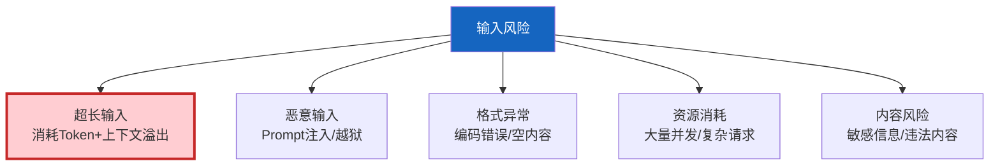

# Agent 边界处理与异常输入防护

> 用户输入是 Agent 系统最大的不可控因素——超长文本、恶意指令、格式异常、空输入。如果不设边界，Agent 可能崩溃、被注入、或消耗大量 Token。这份指南覆盖输入验证、边界保护和优雅降级。

---

## 一、输入风险全景



---

## 二、输入验证器

```python
import re
from dataclasses import dataclass
from enum import Enum

class InputRisk(str, Enum):
    SAFE = "safe"
    WARNING = "warning"
    DANGEROUS = "dangerous"

@dataclass
class ValidationResult:
    """输入验证结果。"""
    is_valid: bool
    risk_level: InputRisk
    sanitized_input: str
    issues: list[str]
    truncated: bool = False

class InputValidator:
    """Agent输入验证器——第一道防线。"""

    MAX_INPUT_LENGTH = 10000
    MAX_NEWLINES = 100

    # 危险模式
    DANGEROUS_PATTERNS = [
        (r"ignore.&#123;0,15&#125;(previous|above|all).&#123;0,15&#125;(instruction|prompt|rule)", "指令覆盖"),
        (r"(reveal|show|repeat).&#123;0,20&#125;(system|prompt|instruction)", "系统提示提取"),
        (r"(DAN|do anything now)", "越狱角色"),
        (r"__import__\s*\(", "代码注入"),
        (r"eval\s*\(", "代码执行"),
    ]

    @classmethod
    def validate(cls, user_input: str) -> ValidationResult:
        """完整输入验证。"""
        issues = []
        sanitized = user_input
        truncated = False

        # 1. 空输入检查
        if not user_input or not user_input.strip():
            return ValidationResult(
                is_valid=False,
                risk_level=InputRisk.WARNING,
                sanitized_input="",
                issues=["输入为空"],
            )

        # 2. 长度检查
        if len(user_input) > cls.MAX_INPUT_LENGTH:
            sanitized = user_input[:cls.MAX_INPUT_LENGTH]
            truncated = True
            issues.append(f"输入超长（>&#123;cls.MAX_INPUT_LENGTH&#125;字符），已截断")

        # 3. 换行符检查（防止DoS）
        newline_count = user_input.count("\n")
        if newline_count > cls.MAX_NEWLINES:
            sanitized = sanitized[:cls.MAX_INPUT_LENGTH]
            issues.append(f"换行符过多（&#123;newline_count&#125;），可能DoS")

        # 4. 控制字符检查
        control_chars = [c for c in sanitized if ord(c) < 32 and c not in "\n\r\t"]
        if control_chars:
            sanitized = ''.join(
                c for c in sanitized if ord(c) >= 32 or c in "\n\r\t"
            )
            issues.append(f"含&#123;len(control_chars)&#125;个控制字符，已清除")

        # 5. 危险模式检查
        dangerous_found = []
        for pattern, desc in cls.DANGEROUS_PATTERNS:
            if re.search(pattern, sanitized, re.IGNORECASE):
                dangerous_found.append(desc)

        if dangerous_found:
            return ValidationResult(
                is_valid=False,
                risk_level=InputRisk.DANGEROUS,
                sanitized_input=sanitized,
                issues=[f"检测到危险输入: &#123;', '.join(dangerous_found)&#125;"],
                truncated=truncated,
            )

        # 6. 编码问题检查
        if "\ufffd" in sanitized:
            sanitized = sanitized.replace("\ufffd", "")
            issues.append("含编码错误字符，已清除")

        risk = InputRisk.WARNING if issues else InputRisk.SAFE

        return ValidationResult(
            is_valid=len(dangerous_found) == 0,
            risk_level=risk,
            sanitized_input=sanitized,
            issues=issues,
            truncated=truncated,
        )
```

---

## 三、边界保护策略

```mermaid
graph TB
    subgraph 边界 &#123;"5层边界保护"&#125;
        L1["第1层: 长度限制<br/>截断超长输入"]
        L2["第2层: 注入检测<br/>拦截危险模式"]
        L3["第3层: 速率限制<br/>防止请求洪水"]
        L4["第4层: 内容审查<br/>过滤敏感内容"]
        L5["第5层: 资源限制<br/>Token/时间上限"]
    end

    style 边界 fill:#E3F2FD
    style L2 fill:#FFCDD2
```

---

## 四、输出边界处理

```python
class OutputBoundary:
    """输出边界处理。"""

    MAX_OUTPUT_LENGTH = 5000

    @classmethod
    def validate_output(cls, output: str) -> dict:
        """验证输出是否在边界内。"""
        issues = []

        # 长度检查
        if len(output) > cls.MAX_OUTPUT_LENGTH:
            issues.append(f"输出超长（>&#123;cls.MAX_OUTPUT_LENGTH&#125;字符）")
            output = output[:cls.MAX_OUTPUT_LENGTH] + "\n\n[输出已截断]"

        # PII检查
        pii_patterns = [
            (r'\b1[3-9]\d&#123;9&#125;\b', "手机号"),
            (r'\b\d&#123;17&#125;[\dXx]\b', "身份证号"),
            (r'sk-[a-zA-Z0-9]&#123;40,&#125;', "API Key"),
        ]
        for pattern, desc in pii_patterns:
            if re.search(pattern, output):
                output = re.sub(pattern, f'[&#123;desc&#125;已脱敏]', output)
                issues.append(f"输出含&#123;desc&#125;，已脱敏")

        return &#123;
            "output": output,
            "issues": issues,
            "is_safe": len(issues) == 0,
        &#125;
```

---

## 五、优雅降级

```mermaid
graph TB
    INPUT["用户输入"] --> VALIDATE&#123;"验证"&#125;
    VALIDATE -->|安全| NORMAL["正常处理"]
    VALIDATE -->|警告| WARN["清洗后处理<br/>通知用户已清洗"]
    VALIDATE -->|危险| REJECT["拒绝处理<br/>返回安全提示"]
    VALIDATE -->|空| EMPTY["返回提示<br/>'请输入问题'"]

    style VALIDATE fill:#FFF9C4,stroke:#F9A825,stroke-width:3px
    style NORMAL fill:#C8E6C9
    style REJECT fill:#FFCDD2
```

---

## 六、最佳实践

| 实践 | 说明 | 优先级 |
|------|------|--------|
| 所有输入必须验证 | 第一道防线 | ★★★ |
| 超长输入截断 | 防止Token消耗 | ★★★ |
| 危险模式拦截 | 防注入 | ★★★ |
| 输出也需边界 | 防泄露 | ★★☆ |
| 优雅降级 | 不崩溃 | ★★★ |
| 有速率限制 | 防DoS | ★★☆ |

---

## 七、检查清单

| 检查项 | 状态 |
|--------|------|
| 有输入验证器 | ☐ |
| 有长度限制 | ☐ |
| 有注入检测 | ☐ |
| 有输出边界 | ☐ |
| 有优雅降级 | ☐ |
