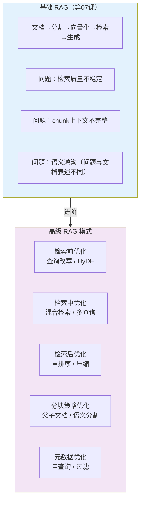
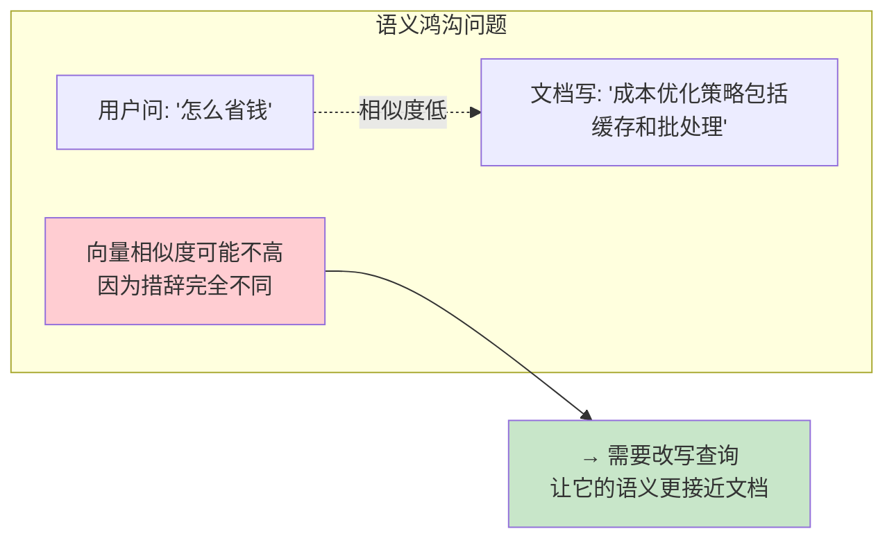
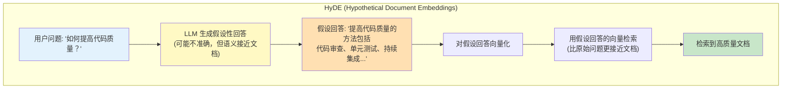
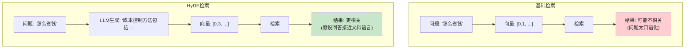
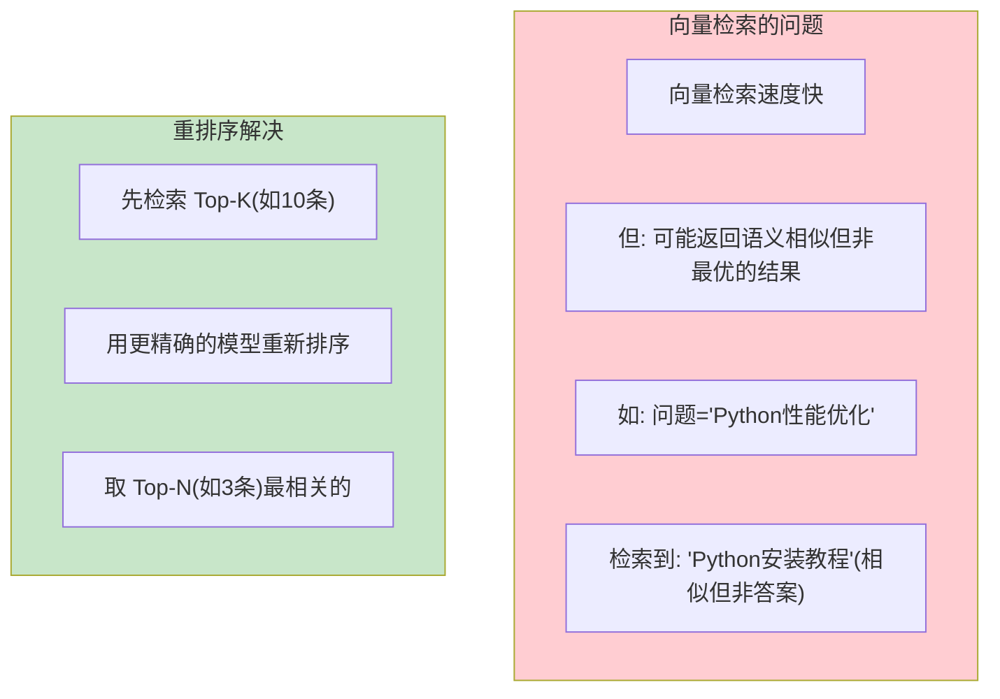
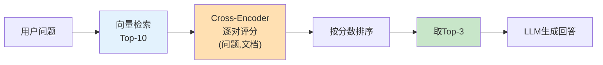
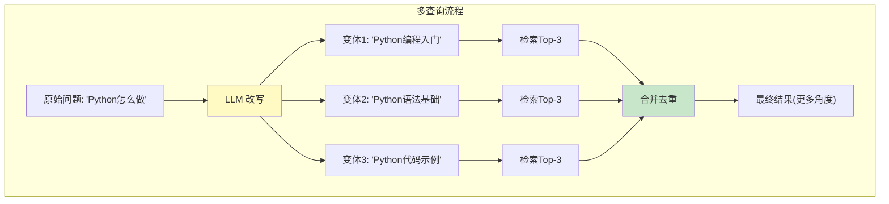
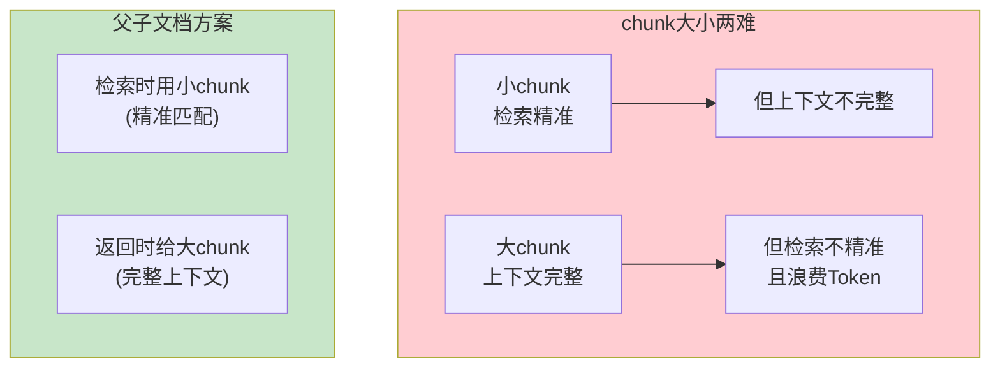
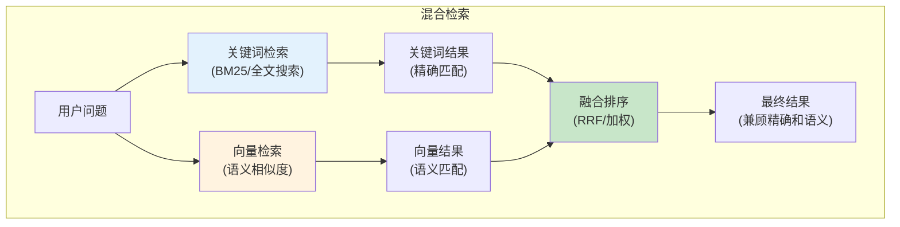

# 高级 RAG 模式

> 基础 RAG 只是起点。这一篇覆盖工业级 RAG 的进阶模式：重排序、HyDE、混合检索、父子文档、自查询等。

---

## 一、基础 RAG 的局限与进阶方向



## 二、检索前优化：查询改写

### 2.1 问题：语义鸿沟



### 2.2 查询改写

```python
from langchain_openai import ChatOpenAI
from langchain_core.prompts import ChatPromptTemplate
from langchain_core.output_parsers import StrOutputParser

llm = ChatOpenAI(model="gpt-4o-mini", temperature=0)

rewrite_prompt = ChatPromptTemplate.from_template(
    """请将以下问题改写为更适合检索的查询。提取关键概念，使用更正式的表达。

原始问题：&#123;question&#125;

改写后的查询（只输出查询，不要解释）："""
)

rewrite_chain = rewrite_prompt | llm | StrOutputParser()

# 使用
original = "怎么省钱"
rewritten = rewrite_chain.invoke(&#123;"question": original&#125;)
# "成本优化 降低费用 节约开支 成本控制策略"
```

## 三、HyDE（假设性文档嵌入）

### 3.1 原理



### 3.2 代码实现

```python
from langchain_openai import ChatOpenAI, OpenAIEmbeddings
from langchain_core.prompts import ChatPromptTemplate
from langchain_core.output_parsers import StrOutputParser

llm = ChatOpenAI(model="gpt-4o-mini", temperature=0)
embeddings = OpenAIEmbeddings()

def hyde_retrieve(question: str, vectorstore, k: int = 3):
    """用HyDE方式检索"""
    # Step 1: 让LLM生成假设性回答
    prompt = ChatPromptTemplate.from_template(
        "请简要回答这个问题（不需要完全准确）：\n&#123;question&#125;"
    )
    chain = prompt | llm | StrOutputParser()
    hypothetical_answer = chain.invoke(&#123;"question": question&#125;)

    # Step 2: 对假设性回答向量化
    hyde_vector = embeddings.embed_query(hypothetical_answer)

    # Step 3: 用假设回答的向量检索
    results = vectorstore.similarity_search_by_vector(hyde_vector, k=k)

    return results

# 使用
results = hyde_retrieve("怎么省钱", vectorstore, k=3)
```

### 3.3 基础检索 vs HyDE 对比



## 四、检索后优化：重排序（Reranking）

### 4.1 为什么需要重排序



### 4.2 使用 Cross-Encoder 重排序

```python
from langchain_community.cross_encoders import HuggingFaceCrossEncoder
from langchain.retrievers.document_compressors import CrossEncoderReranker
from langchain.retrievers import ContextualCompressionRetriever

# 加载重排序模型（本地运行，免费）
reranker_model = HuggingFaceCrossEncoder(
    model_name="BAAI/bge-reranker-base"  # 中英文都支持
)

# 创建重排序器
reranker = CrossEncoderReranker(
    model=reranker_model,
    top_n=3  # 从Top-K中选出最优的3条
)

# 包装检索器
compression_retriever = ContextualCompressionRetriever(
    base_compressor=reranker,
    base_retriever=vectorstore.as_retriever(search_kwargs=&#123;"k": 10&#125;)  # 先检索10条
)

# 使用：先检索10条，重排序后返回最优3条
results = compression_retriever.invoke("Python性能优化")
```

### 4.3 重排序流程



## 五、多查询检索（Multi-Query）



```python
from langchain.retrievers.multi_query import MultiQueryRetriever

retriever = MultiQueryRetriever.from_llm(
    retriever=vectorstore.as_retriever(search_kwargs=&#123;"k": 3&#125;),
    llm=llm,
)

# 自动用LLM从多个角度改写问题，分别检索后合并
results = retriever.invoke("Python怎么做")
```

## 六、父子文档检索

### 6.1 问题：chunk大小两难



### 6.2 实现

```python
from langchain.storage import InMemoryStore
from langchain_text_splitters import RecursiveCharacterTextSplitter
from langchain.retrievers import ParentDocumentRetriever

# 父文档分割器（大块，用于返回完整上下文）
parent_splitter = RecursiveCharacterTextSplitter(chunk_size=2000)

# 子文档分割器（小块，用于精准检索）
child_splitter = RecursiveCharacterTextSplitter(chunk_size=400)

# 存储父文档
store = InMemoryStore()

# 创建父子文档检索器
retriever = ParentDocumentRetriever(
    vectorstore=vectorstore,        # 子文档的向量库
    docstore=store,                  # 父文档的存储
    child_splitter=child_splitter,
    parent_splitter=parent_splitter,
)

# 添加文档
retriever.add_documents(documents)

# 检索：用小chunk匹配，返回大chunk
results = retriever.invoke("查询问题")
# 返回的是父文档（2000字符的大块），但匹配用的是子文档（400字符的小块）
```

## 七、混合检索（Hybrid Search）



```python
from langchain_community.retrievers import BM25Retriever
from langchain.retrievers import EnsembleRetriever

# 关键词检索（BM25）
bm25_retriever = BM25Retriever.from_documents(chunks)
bm25_retriever.k = 3

# 向量检索
vector_retriever = vectorstore.as_retriever(search_kwargs=&#123;"k": 3&#125;)

# 混合检索（加权融合）
ensemble_retriever = EnsembleRetriever(
    retrievers=[bm25_retriever, vector_retriever],
    weights=[0.4, 0.6]  # 关键词40%，向量60%
)

# 使用
results = ensemble_retriever.invoke("查询问题")
```

## 八、模式选择决策

```mermaid
graph TD
    Q&#123;"RAG效果不好?"&#125;
    Q -->|"检索不到"| Q1&#123;"问题与文档措辞差异大?"&#125;
    Q -->|"检索到但不相关"| Q2&#123;"结果太多噪声?"&#125;
    Q -->|"上下文不完整"| Q3&#123;"chunk太小?"&#125;
    Q -->|"漏检关键词"| Q4&#123;"需要精确匹配?"&#125;

    Q1 -->|"是"| HYDE["✅ HyDE<br/>生成假设回答检索"]
    Q1 -->|"否"| REWRITE["✅ 查询改写"]

    Q2 -->|"是"| RERANK["✅ 重排序<br/>先检索多→精排少"]
    Q2 -->|"否"| MQ["✅ 多查询<br/>多角度检索"]

    Q3 -->|"是"| PARENT["✅ 父子文档<br/>小块检索大块返回"]
    Q3 -->|"否"| BIGGER["增大chunk_size"]

    Q4 -->|"是"| HYBRID["✅ 混合检索<br/>关键词+向量"]
    Q4 -->|"否"| MQ

    style HYDE fill:#C8E6C9
    style RERANK fill:#C8E6C9
    style PARENT fill:#C8E6C9
    style HYBRID fill:#C8E6C9
```

## 九、高级 RAG 完整管线

```python
# 综合应用多种高级模式的RAG管线

def advanced_rag_pipeline(question: str, vectorstore, llm):
    """完整的高级RAG管线"""

    # Step 1: 查询改写
    rewrite_chain = (
        ChatPromptTemplate.from_template(
            "将问题改写为检索友好的查询：\n&#123;question&#125;\n只输出改写后的查询。"
        ) | llm | StrOutputParser()
    )
    rewritten = rewrite_chain.invoke(&#123;"question": question&#125;)

    # Step 2: 多查询检索 + 重排序
    from langchain.retrievers.multi_query import MultiQueryRetriever
    retriever = MultiQueryRetriever.from_llm(
        retriever=vectorstore.as_retriever(search_kwargs=&#123;"k": 5&#125;),
        llm=llm,
    )
    raw_results = retriever.invoke(rewritten)

    # Step 3: 去重
    seen = set()
    unique_results = []
    for doc in raw_results:
        if doc.page_content not in seen:
            seen.add(doc.page_content)
            unique_results.append(doc)

    # Step 4: 限制数量
    top_results = unique_results[:4]

    # Step 5: 生成回答
    context = "\n\n".join(d.page_content for d in top_results)
    answer_chain = (
        ChatPromptTemplate.from_template(
            "基于以下背景知识回答。只基于背景知识，不知道就说不知道。\n\n背景知识：\n&#123;context&#125;\n\n问题：&#123;question&#125;"
        ) | llm | StrOutputParser()
    )
    answer = answer_chain.invoke(&#123;
        "context": context,
        "question": question,  # 用原始问题生成回答
    &#125;)

    return &#123;
        "answer": answer,
        "sources": [d.metadata.get("source", "未知") for d in top_results],
        "rewritten_query": rewritten,
        "num_results": len(top_results),
    &#125;
```

## 十、各模式效果对比

| 模式 | 检索质量提升 | 实现复杂度 | 延迟增加 | 适用场景 |
|------|-------------|-----------|----------|----------|
| 查询改写 | 中 | 低 | +1次LLM调用 | 口语化问题 |
| HyDE | 中高 | 中 | +1次LLM调用 | 问题与文档语义差距大 |
| 重排序 | 高 | 中 | +模型推理 | 检索结果噪声多 |
| 多查询 | 中 | 低 | +1次LLM调用 | 需要多角度覆盖 |
| 父子文档 | 中 | 中 | 无额外 | chunk大小两难 |
| 混合检索 | 高 | 中 | 无额外 | 关键词+语义都需要 |
