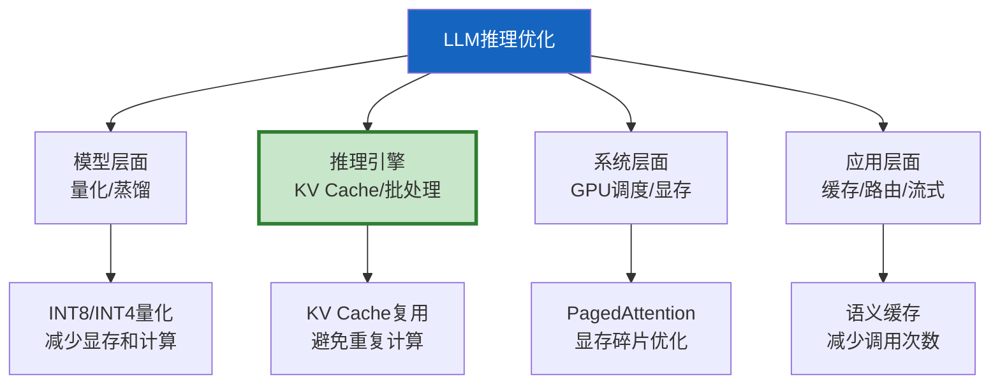

# LLM 推理优化与部署加速

> 调用 LLM API 时我们无法控制推理速度，但自己部署开源模型时，推理优化是核心技能。KV Cache、推测解码、量化、批处理——这些技术可以让推理速度提升 2-10 倍。

---

## 一、推理优化全景



---

## 二、KV Cache

```mermaid
graph TB
    subgraph 无KVCache &#123;"无KV Cache"&#125;
        T1["Token 1"] --> CALC1["计算QKV"]
        T2["Token 2"] --> CALC2["重新计算所有QKV"]
        T3["Token 3"] --> CALC3["重新计算所有QKV"]
    end

    subgraph 有KVCache &#123;"有KV Cache"&#125;
        T4["Token 1"] --> CACHE1["计算+缓存KV"]
        T5["Token 2"] --> CACHE2["复用缓存+只算新Token"]
        T6["Token 3"] --> CACHE3["复用缓存+只算新Token"]
    end

    style 无KVCache fill:#FFCDD2
    style 有KVCache fill:#C8E6C9
```

```python
class KVCacheExplainer:
    """KV Cache原理说明。

    Transformer生成时：
    - 每生成一个Token，需要计算之前所有Token的Key和Value
    - KV Cache保存已计算的Key和Value
    - 新Token只需计算自己的QKV，与缓存中的KV做attention
    - 复杂度从O(n²)降到O(n)

    应用场景：
    1. 流式输出：每个Token复用之前的KV
    2. 对话续接：同一对话复用之前轮的KV（需prefix cache）
    3. 批处理：不同请求的KV独立缓存
    """

    @staticmethod
    def memory_estimate(
        num_layers: int = 32,
        num_heads: int = 32,
        head_dim: int = 128,
        seq_length: int = 4096,
        batch_size: int = 1,
        dtype_bytes: int = 2,  # FP16
    ) -> dict:
        """估算KV Cache显存占用。"""
        # 每层每头的KV各占seq_length * head_dim * dtype_bytes
        per_layer = 2 * num_heads * head_dim * seq_length * dtype_bytes  # K和V各一份
        total = per_layer * num_layers * batch_size

        return &#123;
            "model_params": &#123;
                "layers": num_layers, "heads": num_heads,
                "head_dim": head_dim, "dtype_bytes": dtype_bytes,
            &#125;,
            "seq_length": seq_length,
            "batch_size": batch_size,
            "kv_cache_bytes": total,
            "kv_cache_gb": round(total / 1e9, 2),
            "note": "KV Cache随序列长度线性增长",
        &#125;
```

---

## 三、推测解码

```mermaid
graph TB
    subgraph 推测 &#123;"推测解码(Speculative Decoding)"&#125;
        D["草稿模型<br/>(小/快)"] -->|"生成N个Token"| DRAFT["草稿Token序列"]
        T["目标模型<br/>(大/准)"] -->|"并行验证"| VERIFY["验证N个Token"]
        VERIFY --> ACCEPT["接受正确的<br/>拒绝错误的"]
        ACCEPT --> CONTINUE["从第一个错误处继续"]
    end

    style D fill:#E3F2FD
    style T fill:#FFF9C4,stroke:#F9A825,stroke-width:3px
```

```python
class SpeculativeDecodingExplainer:
    """推测解码原理。

    核心思想：
    1. 用小模型（快）先猜N个Token
    2. 用大模型（准）一次性验证这N个Token
    3. 大模型可以并行验证（比逐个生成快）
    4. 接受正确的Token，从第一个错误处重新开始

    效果：如果小模型猜对率高，可加速2-3倍
    成本：多一次小模型推理，但大模型并行验证更高效
    """

    @staticmethod
    def estimate_speedup(
        draft_accept_rate: float = 0.7,
        draft_tokens: int = 4,
        target_speed_ratio: float = 0.3,  # 草稿模型是大模型的3倍快
    ) -> dict:
        """估算加速效果。"""
        # 每轮：草稿模型生成N个 + 目标模型验证1次
        # 传统：目标模型生成N个 = N次
        # 推测：草稿N次 + 目标1次（并行验证）
        expected_accepted = draft_tokens * draft_accept_rate
        # 推测解码每轮产出 expected_accepted 个Token
        # 传统每轮产出1个Token
        # 加速比 ≈ expected_accepted / (draft_tokens * target_speed_ratio + 1)
        speedup = expected_accepted / (draft_tokens * target_speed_ratio + 1)

        return &#123;
            "draft_accept_rate": f"&#123;draft_accept_rate * 100&#125;%",
            "draft_tokens": draft_tokens,
            "expected_accepted_per_round": round(expected_accepted, 1),
            "estimated_speedup": f"&#123;speedup:.2f&#125;x",
        &#125;
```

---

## 四、模型量化

```mermaid
graph TB
    subgraph 量化 &#123;"量化方案对比"&#125;
        FP16["FP16<br/>原始精度<br/>显存: 100%"]
        INT8["INT8<br/>精度损失<1%<br/>显存: 50%"]
        INT4["INT4<br/>精度损失2-5%<br/>显存: 25%"]
        GPTQ["GPTQ<br/>训练后量化<br/>INT4效果好"]
        AWQ["AWQ<br/>激活感知量化<br/>INT4最优"]
    end

    style FP16 fill:#E3F2FD
    style INT8 fill:#FFF9C4
    style AWQ fill:#C8E6C9,stroke:#2E7D32,stroke-width:3px
```

```python
class QuantizationGuide:
    """量化方案指南。"""

    SCENARIOS = &#123;
        "fp16": &#123;
            "desc": "原始精度，效果最好",
            "memory": "14B模型需28GB显存",
            "speed": "1x基准",
            "use_case": "有足够GPU资源",
        &#125;,
        "int8": &#123;
            "desc": "精度损失<1%，显存减半",
            "memory": "14B模型需14GB显存",
            "speed": "1.5-2x加速",
            "use_case": "消费级GPU部署",
        &#125;,
        "int4_awq": &#123;
            "desc": "精度损失2-5%，显存1/4",
            "memory": "14B模型需7GB显存",
            "speed": "2-3x加速",
            "use_case": "单卡部署大模型",
            "recommended": True,
        &#125;,
        "int4_gptq": &#123;
            "desc": "GPTQ训练后量化",
            "memory": "同INT4",
            "speed": "2-3x加速",
            "use_case": "需要高质量量化",
        &#125;,
    &#125;

    @classmethod
    def recommend(cls, gpu_memory_gb: int, model_size: str = "14B") -> str:
        """根据GPU显存推荐量化方案。"""
        if gpu_memory_gb >= 80:
            return "fp16"  # A100 80GB够用
        elif gpu_memory_gb >= 24:
            return "int8"  # RTX 4090
        elif gpu_memory_gb >= 8:
            return "int4_awq"  # 消费级
        else:
            return "int4_awq + CPU offloading"
```

---

## 五、部署方案对比

```python
class DeploymentOptions:
    """LLM部署方案对比。"""

    OPTIONS = &#123;
        "vllm": &#123;
            "desc": "高吞吐推理引擎",
            "pros": ["PagedAttention", "连续批处理", "兼容OpenAI API"],
            "cons": ["需要GPU", "配置复杂"],
            "speed": "最快（生产推荐）",
            "command": "python -m vllm.entrypoints.openai.api_server --model model_path --quantization awq",
        &#125;,
        "ollama": &#123;
            "desc": "本地部署最简单",
            "pros": ["一行命令", "自动量化", "跨平台"],
            "cons": ["并发能力弱", "不支持批处理"],
            "speed": "中等（开发推荐）",
            "command": "ollama run qwen2.5:14b",
        &#125;,
        "sglang": &#123;
            "desc": "推理速度最快",
            "pros": ["RadixAttention", "推测解码", "极低延迟"],
            "cons": ["较新", "生态不如vLLM"],
            "speed": "极快",
            "command": "python -m sglang.launch_server --model-path model_path",
        &#125;,
        "llama_cpp": &#123;
            "desc": "CPU推理",
            "pros": ["无需GPU", "轻量", "GGUF格式"],
            "cons": ["速度慢", "精度可能损失"],
            "speed": "慢（但能用）",
            "command": "llama-server -m model.gguf --port 8080",
        &#125;,
    &#125;

    @classmethod
    def recommend(cls, use_case: str = "production") -> dict:
        """推荐部署方案。"""
        if use_case == "production":
            return cls.OPTIONS["vllm"]
        elif use_case == "development":
            return cls.OPTIONS["ollama"]
        elif use_case == "low_latency":
            return cls.OPTIONS["sglang"]
        elif use_case == "cpu_only":
            return cls.OPTIONS["llama_cpp"]
        return cls.OPTIONS["vllm"]
```

---

## 六、连续批处理

```mermaid
graph TB
    subgraph 静态 &#123;"静态批处理"&#125;
        S1["请求A(3Token)"] --> BATCH1["等满4个"] --> EXEC1["执行"]
        S2["请求B(3Token)"] --> BATCH1
        S3["请求C(100Token)"] --> BATCH1
        S4["请求D(3Token)"] --> BATCH1
        NOTE1["❌ 等最长的C完成才能下一批"]
    end

    subgraph 连续 &#123;"连续批处理(vLLM)"&#125;
        C1["请求A"] --> DYN["动态加入/退出"]
        C2["请求B"] --> DYN
        C3["请求C(长)"] --> DYN
        NOTE2["✅ A完成后立即加入新请求<br/>不等C完成"]
    end

    style 静态 fill:#FFCDD2
    style 连续 fill:#C8E6C9
```

---

## 七、最佳实践

| 优化项 | 加速效果 | 实施难度 | 优先级 |
|--------|----------|----------|--------|
| KV Cache | 2-5x | 引擎内置 | ★★★ |
| AWQ INT4量化 | 2-3x | 低 | ★★★ |
| 连续批处理 | 3-10x吞吐 | 中 | ★★★ |
| 推测解码 | 2-3x | 高 | ★★☆ |
| vLLM部署 | 综合最优 | 中 | ★★★ |
| 语义缓存 | 100%(命中时) | 中 | ★★☆ |

---

## 八、检查清单

| 检查项 | 状态 |
|--------|------|
| 理解KV Cache原理 | ☐ |
| 理解推测解码原理 | ☐ |
| 知道量化方案选择 | ☐ |
| 能选部署方案 | ☐ |
| 理解连续批处理 | ☐ |
