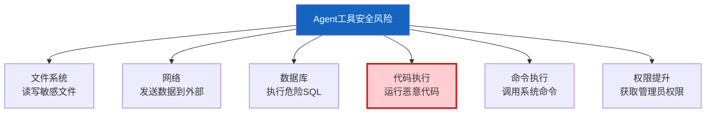

# Agent 安全沙箱深度指南

> 知识库 134 讲了代码执行沙箱的基础。这份指南深入 Agent 工具调用的安全隔离——不只是代码执行，还有文件访问、网络请求、数据库操作的全面隔离。

---

## 一、Agent 工具安全风险



---

## 二、三层隔离架构

```mermaid
graph TB
    subgraph 三层 &#123;"三层隔离"&#125;
        L1["第1层: 工具级隔离<br/>每个工具有独立权限"]
        L2["第2层: 进程级隔离<br/>工具在子进程执行"]
        L3["第3层: 容器级隔离<br/>工具在Docker容器中"]
    end

    style 三层 fill:#E3F2FD
    style L3 fill:#C8E6C9,stroke:#2E7D32,stroke-width:3px
```

---

## 三、工具级权限控制

```python
from dataclasses import dataclass, field
from enum import Enum
from typing import Callable, Any
import re

class Permission(str, Enum):
    READ_FILE = "read_file"
    WRITE_FILE = "write_file"
    NETWORK = "network"
    DATABASE = "database"
    EXECUTE = "execute"
    SYSTEM = "system"

@dataclass
class ToolSecurityPolicy:
    """工具安全策略。"""
    tool_name: str
    allowed_permissions: list[Permission] = field(default_factory=list)
    file_paths_allowed: list[str] = field(default_factory=list)  # 允许访问的路径
    network_whitelist: list[str] = field(default_factory=list)  # 允许的网络地址
    max_execution_time: int = 30  # 最大执行时间(秒)
    require_approval: bool = False  # 是否需要人工审批

class ToolSecurityEnforcer:
    """工具安全执行器。"""

    # 默认策略
    DEFAULT_POLICIES = &#123;
        "search_web": ToolSecurityPolicy(
            tool_name="search_web",
            allowed_permissions=[Permission.NETWORK],
            network_whitelist=["api.tavily.com", "api.serpapi.com"],
            max_execution_time=10,
        ),
        "execute_code": ToolSecurityPolicy(
            tool_name="execute_code",
            allowed_permissions=[Permission.EXECUTE],
            file_paths_allowed=["/tmp/sandbox/"],
            max_execution_time=30,
            require_approval=False,
        ),
        "send_email": ToolSecurityPolicy(
            tool_name="send_email",
            allowed_permissions=[Permission.NETWORK],
            max_execution_time=15,
            require_approval=True,  # 发邮件需审批
        ),
        "database_query": ToolSecurityPolicy(
            tool_name="database_query",
            allowed_permissions=[Permission.DATABASE],
            max_execution_time=10,
        ),
    &#125;

    @classmethod
    def check_permission(cls, tool_name: str, action: str, **kwargs) -> dict:
        """检查工具操作是否被允许。"""
        policy = cls.DEFAULT_POLICIES.get(tool_name)
        if not policy:
            return &#123;"allowed": False, "reason": "工具未注册安全策略"&#125;

        # 检查权限
        required_perm = cls._action_to_permission(action)
        if required_perm and required_perm not in policy.allowed_permissions:
            return &#123;"allowed": False, "reason": f"工具无&#123;required_perm.value&#125;权限"&#125;

        # 检查文件路径
        if "file_path" in kwargs:
            file_path = kwargs["file_path"]
            if policy.file_paths_allowed:
                if not any(file_path.startswith(p) for p in policy.file_paths_allowed):
                    return &#123;"allowed": False, "reason": f"文件路径&#123;file_path&#125;不在允许范围"&#125;

        # 检查网络地址
        if "url" in kwargs:
            url = kwargs["url"]
            if policy.network_whitelist:
                if not any(w in url for w in policy.network_whitelist):
                    return &#123;"allowed": False, "reason": f"URL不在白名单"&#125;

        # 检查是否需要审批
        if policy.require_approval:
            return &#123;"allowed": False, "require_approval": True, "reason": "此操作需要人工审批"&#125;

        return &#123;"allowed": True&#125;

    @staticmethod
    def _action_to_permission(action: str) -> Permission | None:
        """将操作映射到权限。"""
        mapping = &#123;
            "read": Permission.READ_FILE,
            "write": Permission.WRITE_FILE,
            "network": Permission.NETWORK,
            "execute": Permission.EXECUTE,
            "database": Permission.DATABASE,
        &#125;
        return mapping.get(action)
```

---

## 四、SQL 安全过滤

```python
class SQLSecurityFilter:
    """SQL安全过滤器。"""

    FORBIDDEN_KEYWORDS = [
        "DROP", "TRUNCATE", "ALTER", "CREATE", "GRANT", "REVOKE",
        "SHUTDOWN", "EXEC", "XP_", "SP_",
    ]

    FORBIDDEN_PATTERNS = [
        (r";\s*\w+", "多语句执行"),
        (r"--", "SQL注释"),
        (r"/\*.*\*/", "块注释"),
        (r"UNION\s+SELECT", "UNION注入"),
        (r"INTO\s+OUTFILE", "文件写入"),
        (r"LOAD_FILE", "文件读取"),
    ]

    @classmethod
    def validate(cls, sql: str) -> dict:
        """验证SQL安全性。"""
        upper_sql = sql.upper()
        issues = []

        # 检查禁止的关键词
        for kw in cls.FORBIDDEN_KEYWORDS:
            if kw in upper_sql:
                issues.append(f"禁止的关键词: &#123;kw&#125;")

        # 检查危险模式
        for pattern, desc in cls.FORBIDDEN_PATTERNS:
            if re.search(pattern, upper_sql):
                issues.append(f"危险模式: &#123;desc&#125;")

        return &#123;
            "is_safe": len(issues) == 0,
            "issues": issues,
            "action": "execute" if not issues else "block",
        &#125;

    @classmethod
    def sanitize(cls, sql: str) -> str:
        """净化SQL（只允许SELECT）。"""
        upper = sql.strip().upper()
        if not upper.startswith("SELECT"):
            raise ValueError("只允许SELECT查询")
        return sql
```

---

## 五、审计日志

```python
class ToolAuditLogger:
    """工具调用审计日志。"""

    def __init__(self):
        self.logs: list[dict] = []

    def log_call(
        self,
        tool_name: str,
        args: dict,
        result: str,
        allowed: bool,
        user_id: str = "",
    ):
        """记录工具调用。"""
        self.logs.append(&#123;
            "timestamp": datetime.now().isoformat(),
            "tool": tool_name,
            "args": str(args)[:200],  # 截断
            "result_preview": str(result)[:100],
            "allowed": allowed,
            "user_id": user_id,
        &#125;)

    def get_blocked_calls(self) -> list[dict]:
        """获取被阻止的调用。"""
        return [l for l in self.logs if not l["allowed"]]
```

---

## 六、最佳实践

| 实践 | 说明 | 优先级 |
|------|------|--------|
| 每个工具有安全策略 | 最小权限原则 | ★★★ |
| 代码执行必须沙箱 | Docker容器隔离 | ★★★ |
| 高危操作需审批 | 发邮件/删除需确认 | ★★★ |
| SQL只允许SELECT | 禁止DML/DDL | ★★★ |
| 网络白名单 | 只允许已知API | ★★☆ |
| 文件路径限制 | 只允许临时目录 | ★★☆ |

---

## 七、检查清单

| 检查项 | 状态 |
|--------|------|
| 有工具安全策略 | ☐ |
| 有权限检查 | ☐ |
| 有SQL过滤 | ☐ |
| 有审计日志 | ☐ |
| 高危操作有审批 | ☐ |
