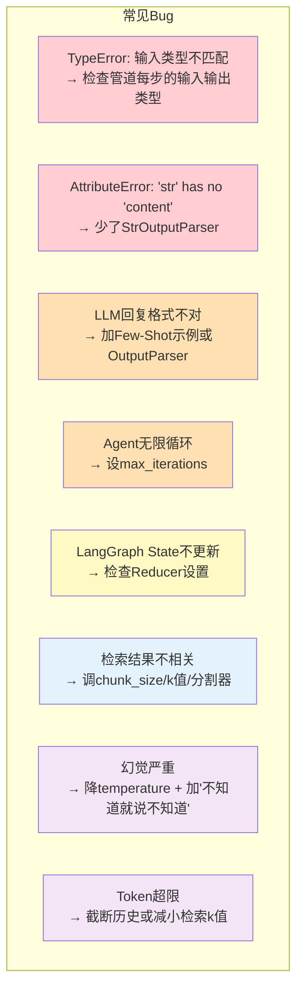
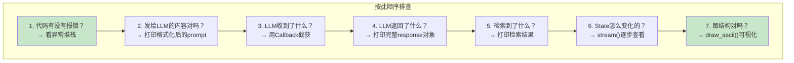

# 调试工具箱

> LLM 应用调试比传统软件更难——输出不确定、链路复杂。这份工具箱给你系统化的调试方法论。

---

## 一、LLM 应用的调试挑战

```mermaid
graph TB
    subgraph 传统软件调试
        T1["输入固定"]
        T2["执行路径确定"]
        T3["可以用断点"]
        T4["错误有明确堆栈"]
    end

    subgraph LLM应用调试 ["LLM 应用调试"]
        L1["输入相同但输出可能不同"]
        L2["执行路径可能动态(Agent)"]
        L3["没有断点(LLM在远程执行)"]
        L4["错误可能是"模型理解错误"而非代码错误"]
    end

    style 传统软件调试 fill:#C8E6C9
    style LLM应用调试 fill:#FFE0B2
```

## 二、调试方法论：分层定位

```mermaid
graph TB
    subgraph 调试分层 ["分层定位法"]
        L4["Layer 4: 业务逻辑错误<br/>回答不符合预期"] --> Q4
        L3["Layer 3: LLM输出错误<br/>格式/内容/幻觉"] --> Q3
        L2["Layer 2: 数据流错误<br/>上下文/历史/检索结果"] --> Q2
        L1["Layer 1: 代码错误<br/>异常/类型/参数"] --> Q1
    end

    Q1&#123;"代码报错?"&#125;
    Q1 -->|"是"| FIX_CODE["修代码"]
    Q1 -->|"否"| Q2&#123;"数据对吗?"&#125;
    Q2 -->|"检索结果不对"| FIX_RAG["调RAG参数"]
    Q2 -->|"历史消息不对"| FIX_MEM["查Memory配置"]
    Q2 -->|"数据没问题"| Q3&#123;"LLM输出对吗?"&#125;
    Q3 -->|"格式不对"| FIX_FMT["加OutputParser/Few-Shot"]
    Q3 -->|"内容不对"| FIX_PROMPT["调Prompt"]
    Q3 -->|"幻觉"| FIX_HALL["加约束/降temperature"]
    Q3 -->|"输出没问题"| Q4&#123;"业务逻辑对吗?"&#125;
    Q4 -->|"路由错误"| FIX_ROUTE["查条件边"]
    Q4 -->|"流程错误"| FIX_FLOW["查图结构"]

    style FIX_CODE fill:#C8E6C9
    style FIX_RAG fill:#E3F2FD
    style FIX_PROMPT fill:#FFF9C4
    style FIX_HALL fill:#FFE0B2
```

## 三、工具一：逐步执行法

```python
# 不要一次性运行整个Chain，分步执行看每一步的输出

from langchain_openai import ChatOpenAI
from langchain_core.prompts import ChatPromptTemplate
from langchain_core.output_parsers import StrOutputParser

llm = ChatOpenAI(model="gpt-4o-mini")
prompt = ChatPromptTemplate.from_template("解释&#123;concept&#125;")
parser = StrOutputParser()

# ❌ 不好：直接运行完整Chain，出错不知道哪步问题
# result = (prompt | llm | parser).invoke(&#123;"concept": "AI"&#125;)

# ✅ 好：分步执行
print("=== Step 1: Prompt ===")
prompt_output = prompt.invoke(&#123;"concept": "AI"&#125;)
print(f"类型: &#123;type(prompt_output)&#125;")
print(f"内容: &#123;prompt_output&#125;")
print()

print("=== Step 2: LLM ===")
llm_output = llm.invoke(prompt_output)
print(f"类型: &#123;type(llm_output)&#125;")
print(f"content: &#123;llm_output.content&#125;")
print(f"usage: &#123;llm_output.usage_metadata&#125;")
print()

print("=== Step 3: Parser ===")
parser_output = parser.invoke(llm_output)
print(f"类型: &#123;type(parser_output)&#125;")
print(f"内容: &#123;parser_output&#125;")
```

## 四、工具二：打印发送给 LLM 的实际内容

```python
# 最常见的bug：你以为发了X给LLM，实际发了Y

# 方法1：format_prompt查看
prompt = ChatPromptTemplate.from_messages([
    ("system", "你是&#123;role&#125;"),
    ("human", "&#123;question&#125;"),
])

# 打印实际格式化后的消息
formatted = prompt.invoke(&#123;"role": "老师", "question": "1+1?"&#125;)
for msg in formatted.to_messages():
    print(f"[&#123;msg.type&#125;] &#123;msg.content&#125;")

# 方法2：用Callback截获
from langchain_core.callbacks import BaseCallbackHandler

class DebugCallback(BaseCallbackHandler):
    def on_llm_start(self, serialized, prompts, **kwargs):
        print("\n" + "="*50)
        print("📤 发送给LLM的内容:")
        print("="*50)
        for p in prompts:
            print(p)
        print("="*50 + "\n")

    def on_llm_end(self, response, **kwargs):
        print("\n" + "="*50)
        print("📥 LLM返回的内容:")
        print("="*50)
        print(response.generations[0][0].text)
        if response.llm_output:
            print(f"Token: &#123;response.llm_output.get('token_usage', &#123;&#125;)&#125;")
        print("="*50 + "\n")

# 使用
llm = ChatOpenAI(model="gpt-4o-mini", callbacks=[DebugCallback()])
response = llm.invoke("你好")
```

## 五、工具三：LangSmith 追踪

```mermaid
graph TB
    subgraph LangSmith调试流程
        C["代码运行"] --> T["自动上报Trace"]
        T --> W["LangSmith界面查看"]
        W --> A["分析每步输入输出"]
        A --> D&#123;"发现问题在哪?"&#125;
        D -->|"Prompt问题"| P["修Prompt"]
        D -->|"检索问题"| R["调RAG"]
        D -->|"状态问题"| S["查State/Reducer"]
    end

    style W fill:#FFF9C4
    style A fill:#C8E6C9
```

配置 LangSmith 后，每次调用的完整链路自动上报，可以在 Web 界面逐步查看。

## 六、工具四：LangGraph 调试

### 6.1 打印每步的 State

```python
# LangGraph：用stream()查看每步State变化
app = graph.compile()

for event in app.stream(
    &#123;"input": "hello"&#125;,
    config=&#123;"configurable": &#123;"thread_id": "debug_001"&#125;&#125;
):
    # 每个event是一个 &#123;node_name: state_update&#125; 字典
    for node_name, state_update in event.items():
        print(f"\n--- 节点: &#123;node_name&#125; ---")
        for key, value in state_update.items():
            # 截断长文本
            val_str = str(value)
            if len(val_str) > 200:
                val_str = val_str[:200] + "..."
            print(f"  &#123;key&#125;: &#123;val_str&#125;")
```

### 6.2 可视化图结构

```python
# 打印ASCII图
print(app.get_graph().draw_ascii())

# 在Jupyter中显示图片
# from IPython.display import Image
# Image(app.get_graph().draw_mermaid_png())
```

### 6.3 查看完整 State

```python
# 获取当前State（配合checkpointer）
from langgraph.checkpoint.memory import MemorySaver

app = graph.compile(checkpointer=MemorySaver())
config = &#123;"configurable": &#123;"thread_id": "debug_001"&#125;&#125;

# 执行
result = app.invoke(&#123;"input": "hello"&#125;, config=config)

# 查看最终State
state = app.get_state(config)
print("当前State:")
for key, value in state.values.items():
    print(f"  &#123;key&#125;: &#123;str(value)[:200]&#125;")

print(f"\n下一步: &#123;state.next&#125;")

# 查看State历史
print("\nState历史:")
for hist_state in app.get_state_history(config):
    print(f"  Step: &#123;hist_state.config['configurable'].get('checkpoint_id', '?')[:16]&#125;...")
    print(f"  Next: &#123;hist_state.next&#125;")
```

## 七、工具五：RAG 调试

```python
def debug_rag(vectorstore, question: str, k: int = 5):
    """RAG调试函数：查看检索到了什么"""
    print(f"\n&#123;'='*50&#125;")
    print(f"调试RAG检索")
    print(f"问题: &#123;question&#125;")
    print(f"&#123;'='*50&#125;\n")

    # 检索
    results = vectorstore.similarity_search_with_score(question, k=k)

    print(f"检索到 &#123;len(results)&#125; 条结果:\n")

    for i, (doc, score) in enumerate(results, 1):
        print(f"--- 结果 &#123;i&#125; (相似度分数: &#123;score:.4f&#125;) ---")
        print(f"来源: &#123;doc.metadata.get('source', '未知')&#125;")
        print(f"内容: &#123;doc.page_content[:200]&#125;...")
        print()

    # 如果结果不理想，给出建议
    if not results:
        print("❌ 没有检索到任何结果！")
        print("可能原因: 知识库为空，或Embedding模型不匹配")
    elif results[0][1] > 2.0:  # FAISS的分数越低越相似
        print("⚠️ 最佳结果相似度分数较高（相似度低）")
        print("建议: 1)调整chunk_size 2)尝试HyDE 3)检查文档质量")

# 使用
debug_rag(vectorstore, "什么是LangChain", k=5)
```

## 八、常见 Bug 速查表



## 九、调试检查清单


