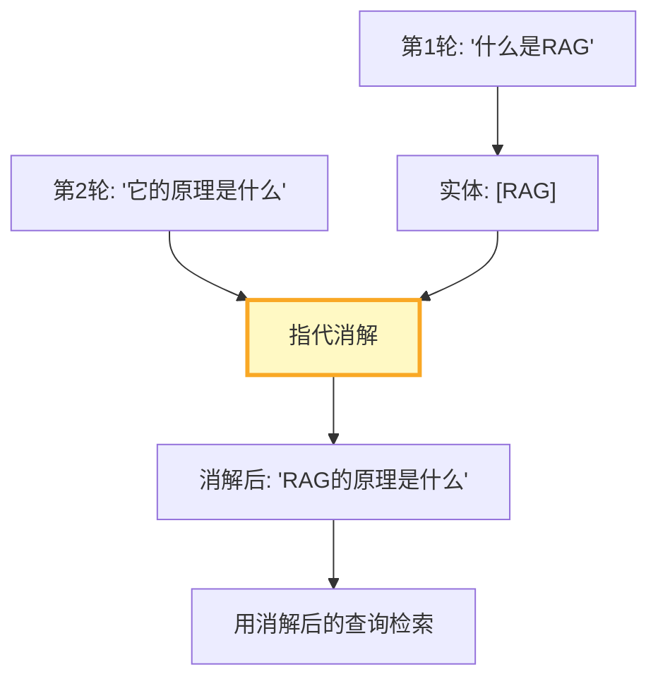

# RAG 多轮对话上下文管理深度

> 用户第一轮问"什么是RAG"，第二轮问"它和微调有什么区别"——"它"指什么？多轮对话的指代消解和上下文延续是 RAG 的核心挑战。

---

## 一、多轮对话的挑战

```mermaid
graph TB
    subgraph 挑战 &#123;"多轮对话3个挑战"&#125;
        C1["指代消解<br/>'它'指什么?"]
        C2["上下文累积<br/>对话越来越长"]
        C3["话题切换<br/>从RAG跳到部署"]
    end

    style 挑战 fill:#FFCDD2
```

---

## 二、对话上下文管理

```python
from dataclasses import dataclass, field
from datetime import datetime
from typing import Optional

@dataclass
class ConversationTurn:
    """对话一轮。"""
    turn_id: int
    user_message: str
    assistant_response: str
    retrieved_docs: list[str] = field(default_factory=list)
    entities: list[str] = field(default_factory=list)  # 本轮涉及的实体
    topic: str = ""

class ConversationContext:
    """对话上下文管理器。

    管理多轮对话的上下文：
    1. 指代消解——"它"→具体实体
    2. 上下文摘要——超限时压缩
    3. 话题追踪——检测话题切换
    """

    def __init__(self, max_turns: int = 10):
        self.turns: list[ConversationTurn] = []
        self.max_turns = max_turns
        self.summary: str = ""  # 历史摘要

    def add_turn(self, turn: ConversationTurn):
        """添加一轮对话。"""
        self.turns.append(turn)
        if len(self.turns) > self.max_turns:
            # 触发摘要压缩
            old_turns = self.turns[:len(self.turns) // 2]
            self.turns = self.turns[len(self.turns) // 2:]
            self._update_summary(old_turns)

    def _update_summary(self, old_turns: list[ConversationTurn]):
        """更新历史摘要。"""
        summary_parts = []
        for turn in old_turns:
            summary_parts.append(
                f"第&#123;turn.turn_id&#125;轮: 用户问了'&#123;turn.user_message[:50]&#125;'，"
                f"回答涉及&#123;turn.entities&#125;"
            )
        self.summary = "; ".join(summary_parts)

    def get_context_for_retrieval(self, current_query: str) -> str:
        """为检索构建上下文查询。

        关键：消除指代词，补全上下文。
        """
        if not self.turns:
            return current_query

        last_turn = self.turns[-1]

        # 检查是否包含指代词
        pronouns = ["它", "它们", "这个", "那个", "上面", "前面"]
        has_pronoun = any(p in current_query for p in pronouns)

        if has_pronoun:
            # 用上一轮的实体补全
            entities = last_turn.entities or [last_turn.user_message[:20]]
            # 构建消解后的查询
            resolved = current_query
            for pronoun in pronouns:
                if pronoun in resolved:
                    resolved = resolved.replace(pronoun, entities[0])
                    break
            return resolved

        return current_query

    def get_context_for_llm(self) -> str:
        """为LLM生成构建上下文。"""
        parts = []
        if self.summary:
            parts.append(f"[历史摘要] &#123;self.summary&#125;")

        recent_turns = self.turns[-3:]  # 最近3轮
        for turn in recent_turns:
            parts.append(f"用户: &#123;turn.user_message[:100]&#125;")
            parts.append(f"助手: &#123;turn.assistant_response[:100]&#125;")

        return "\n".join(parts)

    def detect_topic_shift(self, current_query: str) -> bool:
        """检测话题切换。"""
        if not self.turns:
            return False

        last_topic = self.turns[-1].topic
        if not last_topic:
            return False

        # 简化：关键词重叠度
        last_words = set(last_topic.lower().split())
        current_words = set(current_query.lower().split())
        overlap = len(last_words & current_words)

        return overlap == 0 and len(current_words) > 3
```

---

## 三、指代消解



---

## 四、与 LangGraph 集成

```python
from langgraph.graph import StateGraph, START, END
from typing import TypedDict, Annotated
from langgraph.graph.message import add_messages

class RAGConversationState(TypedDict):
    messages: Annotated[list, add_messages]
    current_query: str
    resolved_query: str       # 消解后的查询
    context: str              # 对话上下文
    retrieved_docs: list[str]

async def resolve_query_node(state: RAGConversationState) -> dict:
    """查询消解节点。"""
    context = ConversationContext()  # 从状态恢复
    current_query = state["messages"][-1].content
    resolved = context.get_context_for_retrieval(current_query)
    return &#123;"resolved_query": resolved&#125;

async def retrieve_node(state: RAGConversationState) -> dict:
    """用消解后的查询检索。"""
    query = state.get("resolved_query", state["messages"][-1].content)
    # 检索...
    return &#123;"retrieved_docs": [f"文档: &#123;query&#125;"]&#125;

async def generate_node(state: RAGConversationState) -> dict:
    """带上下文生成。"""
    context = ConversationContext()  # 从状态恢复
    context_text = context.get_context_for_llm()
    # 生成...
    return &#123;&#125;

def build_rag_conversation_graph():
    graph = StateGraph(RAGConversationState)
    graph.add_node("resolve", resolve_query_node)
    graph.add_node("retrieve", retrieve_node)
    graph.add_node("generate", generate_node)
    graph.add_edge(START, "resolve")
    graph.add_edge("resolve", "retrieve")
    graph.add_edge("retrieve", "generate")
    graph.add_edge("generate", END)
    return graph.compile(checkpointer=MemorySaver())
```

---

## 五、最佳实践

| 实践 | 说明 | 优先级 |
|------|------|--------|
| 检索前消解指代 | 否则检索到错误内容 | ★★★ |
| 超限时摘要压缩 | 防止上下文膨胀 | ★★★ |
| 检测话题切换 | 切换时清理旧上下文 | ★★☆ |
| 保留最近3轮原文 | 平衡上下文和Token | ★★☆ |
| 实体追踪 | 为消解提供依据 | ★★☆ |

---

## 六、检查清单

| 检查项 | 状态 |
|--------|------|
| 有对话上下文管理 | ☐ |
| 有指代消解 | ☐ |
| 有历史摘要 | ☐ |
| 有话题切换检测 | ☐ |
