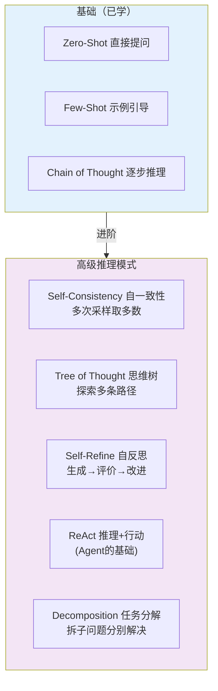
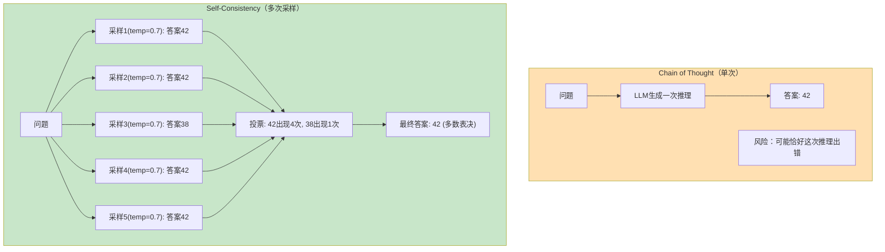
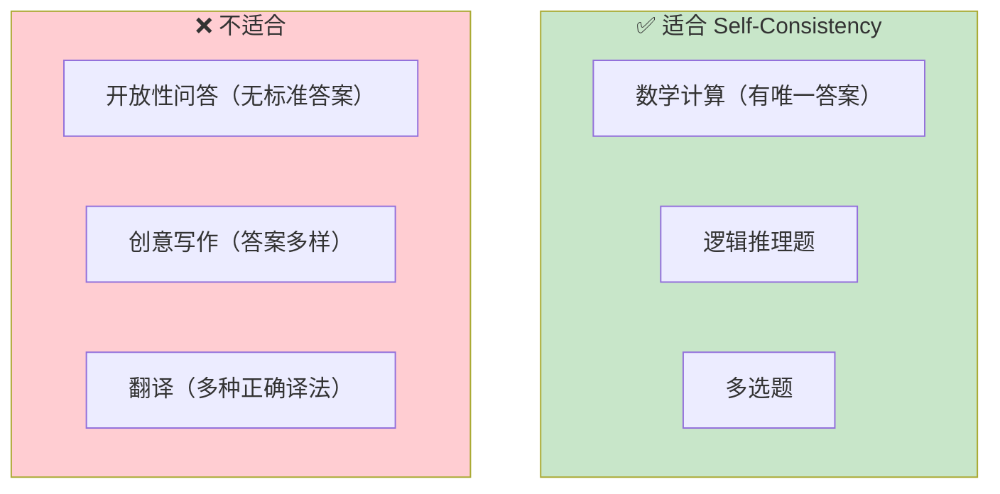
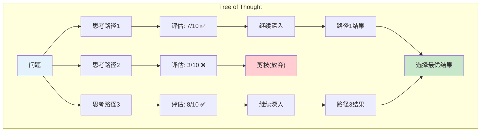
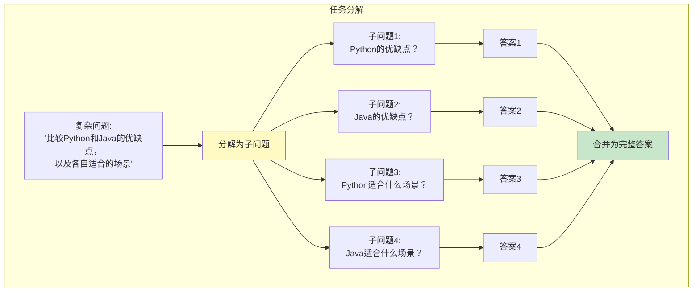

# 高级 Prompt 技巧

> 超越 Chain of Thought——掌握自一致性、思维树、自反思等进阶推理模式。

---

## 一、进阶技巧全景



## 二、Self-Consistency（自一致性）

### 2.1 原理



### 2.2 代码实现

```python
from langchain_openai import ChatOpenAI
from langchain_core.prompts import ChatPromptTemplate
from collections import Counter

llm = ChatOpenAI(model="gpt-4o-mini", temperature=0.7)  # 高temperature增加多样性

prompt = ChatPromptTemplate.from_template(
    """请一步步解决以下数学问题。在最后一行写"答案：X"。

问题：&#123;question&#125;"""
)

def self_consistency(question: str, n_samples: int = 5) -> str:
    """自一致性：多次采样取多数答案"""
    chain = prompt | llm
    answers = []

    for i in range(n_samples):
        response = chain.invoke(&#123;"question": question&#125;)
        # 提取最后一行的答案
        for line in response.content.split("\n"):
            if "答案" in line or "answer" in line.lower():
                answers.append(line.strip())
                break
        else:
            answers.append(response.content[-50:])  # 取最后50字符

    # 投票
    counter = Counter(answers)
    most_common = counter.most_common(1)[0]

    print(f"采样结果:")
    for i, ans in enumerate(answers, 1):
        print(f"  采样&#123;i&#125;: &#123;ans&#125;")
    print(f"\n多数表决: &#123;most_common[0]&#125; (出现&#123;most_common[1]&#125;/&#123;n_samples&#125;次)")

    return most_common[0]

# 使用
result = self_consistency("一个班有32个学生，男生比女生多4人，男生有多少人？", n_samples=5)
```

### 2.3 适用场景



## 三、Tree of Thought（思维树）

### 3.1 原理



### 3.2 简化实现（用 LangGraph）

```python
from typing import TypedDict, Annotated
from operator import add
from langchain_openai import ChatOpenAI
from langchain_core.prompts import ChatPromptTemplate
from langchain_core.output_parsers import StrOutputParser
from langgraph.graph import StateGraph, START, END

llm = ChatOpenAI(model="gpt-4o-mini", temperature=0.7)

class ToTState(TypedDict):
    problem: str
    thoughts: Annotated[list, add]   # 生成的多条思考
    evaluation: str                   # 评估结果
    best_solution: str                 # 最优解答

def generate_thoughts_node(state: ToTState) -> dict:
    """生成多条思考路径"""
    prompt = ChatPromptTemplate.from_template(
        "针对以下问题，提出3种不同的解决思路，每种2-3句话：\n&#123;problem&#125;"
    )
    chain = prompt | llm | StrOutputParser()
    result = chain.invoke(&#123;"problem": state["problem"]&#125;)
    return &#123;"thoughts": [result]&#125;

def evaluate_node(state: ToTState) -> dict:
    """评估各条思路"""
    thoughts = "\n".join(state.get("thoughts", []))
    prompt = ChatPromptTemplate.from_template(
        """评估以下解决思路，选择最优的一条：

思路：
&#123;thoughts&#125;

问题：&#123;problem&#125;

请选择最优思路并给出完整解决方案。"""
    )
    chain = prompt | llm | StrOutputParser()
    result = chain.invoke(&#123;"thoughts": thoughts, "problem": state["problem"]&#125;)
    return &#123;"best_solution": result, "evaluation": "completed"&#125;

# 构建图
graph = StateGraph(ToTState)
graph.add_node("generate", generate_thoughts_node)
graph.add_node("evaluate", evaluate_node)
graph.add_edge(START, "generate")
graph.add_edge("generate", "evaluate")
graph.add_edge("evaluate", END)

app = graph.compile()

# 使用
result = app.invoke(&#123;"problem": "如何减少城市交通拥堵？"&#125;)
print(result["best_solution"])
```

## 四、Self-Refine（自反思改进）

### 4.1 原理

```mermaid
graph TB
    subgraph SelfRefine ["Self-Refine 循环"]
        GEN["1. 生成初稿<br/>LLM生成回答"]
        GEN --> CRIT["2. 自我评价<br/>LLM评价自己的回答"]
        CRIT --> CHECK&#123;"评分合格?"&#125;
        CHECK -->|"否"| REFINE["3. 改进<br/>基于评价修改"]
        REFINE --> CRIT
        CHECK -->|"是"| DONE["✅ 输出最终版本"]
    end

    style GEN fill:#E3F2FD
    style CRIT fill:#FFF9C4
    style REFINE fill:#FFE0B2
    style DONE fill:#C8E6C9
```

### 4.2 代码实现

```python
from langchain_openai import ChatOpenAI
from langchain_core.prompts import ChatPromptTemplate
from langchain_core.output_parsers import StrOutputParser

llm = ChatOpenAI(model="gpt-4o-mini", temperature=0)

def self_refine(question: str, max_rounds: int = 3) -> str:
    """自反思改进"""
    # Step 1: 生成初稿
    gen_prompt = ChatPromptTemplate.from_template("回答问题：&#123;question&#125;")
    draft = (gen_prompt | llm | StrOutputParser()).invoke(&#123;"question": question&#125;)
    print(f"初稿: &#123;draft[:100]&#125;...")

    for round_num in range(max_rounds):
        # Step 2: 自我评价
        eval_prompt = ChatPromptTemplate.from_template(
            """评价以下回答的质量。1-5分。指出具体问题。

问题：&#123;question&#125;
回答：&#123;answer&#125;

评价（格式：分数: X/5, 问题: ...）："""
        )
        evaluation = (eval_prompt | llm | StrOutputParser()).invoke(&#123;
            "question": question, "answer": draft
        &#125;)
        print(f"\n第&#123;round_num+1&#125;轮评价: &#123;evaluation[:100]&#125;...")

        # 检查是否合格
        if "5/5" in evaluation or "5/5" in evaluation.replace(" ", ""):
            print("\n✅ 评价满分，输出最终版本")
            break

        # Step 3: 改进
        refine_prompt = ChatPromptTemplate.from_template(
            """根据评价意见改进回答。

原问题：&#123;question&#125;
原回答：&#123;answer&#125;
评价意见：&#123;evaluation&#125;

请输出改进后的回答："""
        )
        draft = (refine_prompt | llm | StrOutputParser()).invoke(&#123;
            "question": question, "answer": draft, "evaluation": evaluation
        &#125;)
        print(f"改进后: &#123;draft[:100]&#125;...")

    return draft

# 使用
result = self_refine("解释什么是递归，给一个Python示例")
```

## 五、Decomposition（任务分解）

### 5.1 原理



### 5.2 代码实现

```python
def decompose_and_solve(question: str, llm) -> str:
    """分解任务并分别解决"""
    # Step 1: 分解问题
    decompose_prompt = ChatPromptTemplate.from_template(
        "将以下复杂问题分解为2-4个简单的子问题。每行一个，用数字编号。\n\n问题：&#123;question&#125;\n\n子问题："
    )
    sub_questions_text = (decompose_prompt | llm | StrOutputParser()).invoke(
        &#123;"question": question&#125;
    )

    # 解析子问题
    sub_questions = [
        line.strip() for line in sub_questions_text.split("\n")
        if line.strip() and line.strip()[0].isdigit()
    ]

    print(f"分解为 &#123;len(sub_questions)&#125; 个子问题:")
    for sq in sub_questions:
        print(f"  &#123;sq&#125;")

    # Step 2: 分别解决每个子问题
    answers = []
    for sq in sub_questions:
        # 去掉编号前缀
        clean_sq = sq.split(".", 1)[-1].strip() if "." in sq else sq
        answer_prompt = ChatPromptTemplate.from_template("简洁回答：&#123;question&#125;")
        answer = (answer_prompt | llm | StrOutputParser()).invoke(&#123;"question": clean_sq&#125;)
        answers.append(&#123;"question": sq, "answer": answer&#125;)

    # Step 3: 合并答案
    combined = "\n\n".join(
        f"&#123;a['question']&#125;\n&#123;a['answer']&#125;" for a in answers
    )

    merge_prompt = ChatPromptTemplate.from_template(
        "将以下各子问题的回答合并为一份连贯、完整的答案：\n\n&#123;combined&#125;\n\n完整答案："
    )
    final = (merge_prompt | llm | StrOutputParser()).invoke(&#123;"combined": combined&#125;)

    return final

# 使用
result = decompose_and_solve(
    "比较Python和Java在Web开发中的优缺点，以及各自适合的场景", llm
)
```

## 六、技巧选择决策

```mermaid
graph TD
    Q&#123;"问题类型?"&#125;
    Q -->|"有唯一答案的推理题<br/>(数学/逻辑)"| SC["✅ Self-Consistency<br/>多次采样取多数"]
    Q -->|"需要探索多种方案<br/>(创意/策略)"| TOT["✅ Tree of Thought<br/>探索多条路径"]
    Q -->|"需要高质量输出<br/>(写作/代码)"| REFINE["✅ Self-Refine<br/>生成→评价→改进"]
    Q -->|"复杂多步问题"| DECOMP["✅ Decomposition<br/>拆子问题分别解决"]
    Q -->|"需要外部信息"| REACT["✅ ReAct<br/>(用Agent)"]
    Q -->|"简单问题"| BASIC["→ 基础CoT即可"]

    style SC fill:#C8E6C9
    style TOT fill:#C8E6C9
    style REFINE fill:#C8E6C9
    style DECOMP fill:#C8E6C9
    style REACT fill:#C8E6C9
    style BASIC fill:#E3F2FD
```

## 七、成本与效果对比

| 技巧 | LLM调用次数 | 效果提升 | 延迟 | 适用场景 |
|------|-----------|----------|------|----------|
| 基础CoT | 1次 | 基线 | 低 | 大多数推理 |
| Self-Consistency | 5-10次 | +10-20% | 高 | 有标准答案的推理 |
| Tree of Thought | 3-5次 | +15-25% | 中高 | 策略/创意 |
| Self-Refine | 2-6次 | +10-20% | 中 | 写作/代码 |
| Decomposition | N+1次 | +15-30% | 中高 | 复杂多步问题 |

> 💡 效果提升是以增加 LLM 调用次数和延迟为代价的。简单问题不需要这些高级技巧。
