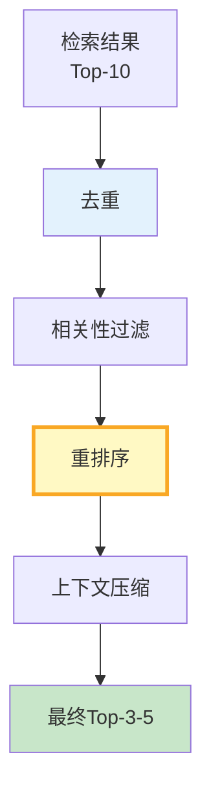

# RAG 检索后处理与过滤深度

> 检索回 Top-10 文档不等于全部有用——可能有过时的、重复的、不相关的。检索后处理是"去粗取精"的关键步骤。

---

## 一、后处理流程



---

## 二、实现

```python
from langchain_core.documents import Document
from dataclasses import dataclass
import hashlib
from typing import Optional

@dataclass
class PostProcessConfig:
    """后处理配置。"""
    deduplicate: bool = True
    min_relevance: float = 0.5      # 最低相关度
    max_results: int = 5            # 最终返回数
    enable_rerank: bool = True
    compress_context: bool = True
    max_context_tokens: int = 2000

class RetrievalPostProcessor:
    """检索后处理器。"""

    def __init__(self, config: PostProcessConfig = PostProcessConfig()):
        self.config = config

    def process(self, documents: list[Document], query: str) -> list[Document]:
        """完整后处理流程。"""
        docs = documents

        # 1. 去重
        if self.config.deduplicate:
            docs = self._deduplicate(docs)

        # 2. 相关性过滤
        docs = self._filter_by_relevance(docs, query)

        # 3. 重排序（简化版：按内容长度和关键词匹配）
        if self.config.enable_rerank:
            docs = self._rerank(docs, query)

        # 4. 截断
        docs = docs[:self.config.max_results]

        # 5. 上下文压缩
        if self.config.compress_context:
            docs = self._compress(docs)

        return docs

    @staticmethod
    def _deduplicate(docs: list[Document]) -> list[Document]:
        """去重——基于内容hash。"""
        seen = set()
        result = []
        for doc in docs:
            h = hashlib.md5(doc.page_content[:200].encode()).hexdigest()
            if h not in seen:
                seen.add(h)
                result.append(doc)
        return result

    @staticmethod
    def _filter_by_relevance(docs: list[Document], query: str) -> list[Document]:
        """相关性过滤——关键词重叠度。"""
        query_words = set(query.lower().split())
        if not query_words:
            return docs

        filtered = []
        for doc in docs:
            doc_words = set(doc.page_content.lower().split())
            overlap = len(query_words & doc_words)
            if overlap > 0:  # 至少有一个关键词匹配
                doc.metadata["relevance_score"] = overlap / len(query_words)
                filtered.append(doc)

        return filtered if filtered else docs  # 如果全过滤了就返回原始

    @staticmethod
    def _rerank(docs: list[Document], query: str) -> list[Document]:
        """重排序——按相关度分数排序。"""
        return sorted(
            docs,
            key=lambda d: d.metadata.get("relevance_score", 0),
            reverse=True,
        )

    @staticmethod
    def _compress(docs: list[Document]) -> list[Document]:
        """压缩——截断过长的文档。"""
        result = []
        total_length = 0
        for doc in docs:
            content = doc.page_content
            if total_length + len(content) > 2000:
                # 截断
                remaining = 2000 - total_length
                if remaining > 100:
                    content = content[:remaining] + "..."
                else:
                    break
            result.append(Document(page_content=content, metadata=doc.metadata))
            total_length += len(content)
        return result
```

---

## 三、后处理效果评估

```python
class PostProcessEvaluator:
    """后处理效果评估器。"""

    @staticmethod
    def compare(docs_before: list[Document], docs_after: list[Document]) -> dict:
        """对比前后处理效果。"""
        return &#123;
            "before_count": len(docs_before),
            "after_count": len(docs_after),
            "removed": len(docs_before) - len(docs_after),
            "before_avg_length": round(
                sum(len(d.page_content) for d in docs_before) / max(len(docs_before), 1)
            ),
            "after_avg_length": round(
                sum(len(d.page_content) for d in docs_after) / max(len(docs_after), 1)
            ),
            "reduction_ratio": round(1 - len(docs_after) / max(len(docs_before), 1), 4),
        &#125;
```

---

## 四、最佳实践

| 实践 | 说明 | 优先级 |
|------|------|--------|
| 必须去重 | 减少冗余 | ★★★ |
| 相关性过滤 | 去除不相关 | ★★★ |
| 重排序精排 | 提升Top-K质量 | ★★★ |
| 上下文压缩 | 控制Token | ★★☆ |
| 最终3-5个最佳 | 不需太多 | ★★☆ |

---

## 五、检查清单

| 检查项 | 状态 |
|--------|------|
| 有去重处理 | ☐ |
| 有相关性过滤 | ☐ |
| 有重排序 | ☐ |
| 有上下文压缩 | ☐ |
