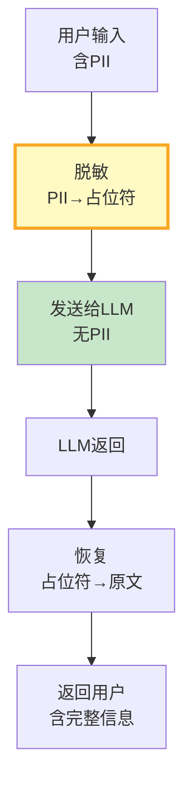

# LLM 应用数据脱敏与 PII 防护

> 用户输入可能包含手机号、身份证、银行卡——这些数据发到 LLM API 是隐私风险。数据脱敏在发送前替换敏感信息，回答后恢复。

---

## 一、脱敏流程



---

## 二、PII 检测与脱敏

```python
import re
from dataclasses import dataclass, field
from typing import Optional

@dataclass
class PIIPattern:
    """PII模式。"""
    name: str
    pattern: str
    replacement: str
    description: str

PII_PATTERNS = [
    PIIPattern(
        name="手机号",
        pattern=r'\b1[3-9]\d&#123;9&#125;\b',
        replacement="[PHONE]",
        description="中国大陆手机号",
    ),
    PIIPattern(
        name="身份证号",
        pattern=r'\b\d&#123;17&#125;[\dXx]\b',
        replacement="[ID_CARD]",
        description="18位身份证号",
    ),
    PIIPattern(
        name="邮箱",
        pattern=r'[\w.+-]+@[\w-]+\.[\w.-]+',
        replacement="[EMAIL]",
        description="电子邮箱",
    ),
    PIIPattern(
        name="银行卡号",
        pattern=r'\b\d&#123;16,19&#125;\b',
        replacement="[BANK_CARD]",
        description="银行卡号",
    ),
    PIIPattern(
        name="API Key",
        pattern=r'sk-[a-zA-Z0-9]&#123;40,&#125;',
        replacement="[API_KEY]",
        description="OpenAI API Key",
    ),
    PIIPattern(
        name="GitHub Token",
        pattern=r'ghp_[a-zA-Z0-9]&#123;36&#125;',
        replacement="[GITHUB_TOKEN]",
        description="GitHub Token",
    ),
    PIIPattern(
        name="IP地址",
        pattern=r'\b\d&#123;1,3&#125;\.\d&#123;1,3&#125;\.\d&#123;1,3&#125;\.\d&#123;1,3&#125;\b',
        replacement="[IP]",
        description="IP地址",
    ),
]

class PIIMasker:
    """PII脱敏器。"""

    def __init__(self, patterns: list[PIIPattern] = None):
        self.patterns = patterns or PII_PATTERNS
        self.mapping: dict[str, str] = &#123;&#125;  # 占位符→原文

    def mask(self, text: str) -> str:
        """脱敏：替换PII为占位符。"""
        masked = text
        self.mapping.clear()

        for pattern in self.patterns:
            matches = re.finditer(pattern.pattern, masked)
            for i, match in enumerate(matches):
                original = match.group()
                placeholder = f"&#123;pattern.replacement&#125;_&#123;len(self.mapping)&#125;"
                self.mapping[placeholder] = original
                masked = masked.replace(original, placeholder, 1)

        return masked

    def unmask(self, text: str) -> str:
        """恢复：占位符→原文。"""
        result = text
        for placeholder, original in self.mapping.items():
            result = result.replace(placeholder, original)
        return result

    def detect(self, text: str) -> list[dict]:
        """检测PII但不替换。"""
        findings = []
        for pattern in self.patterns:
            matches = re.findall(pattern.pattern, text)
            if matches:
                findings.append(&#123;
                    "type": pattern.name,
                    "count": len(matches),
                    "description": pattern.description,
                &#125;)
        return findings

    def get_stats(self) -> dict:
        """获取脱敏统计。"""
        return &#123;
            "total_masked": len(self.mapping),
            "by_type": &#123;&#125;,
        &#125;


class PIILoggger:
    """PII检测日志——记录发现了什么PII但不记录原文。"""

    def __init__(self):
        self.logs: list[dict] = []

    def log_detection(self, user_id: str, findings: list[dict]):
        """记录PII检测结果（不含原文）。"""
        self.logs.append(&#123;
            "user_id": user_id,
            "findings": findings,
            "timestamp": __import__("datetime").datetime.now().isoformat(),
        &#125;)

    def get_stats(self) -> dict:
        """统计哪些PII最常出现。"""
        from collections import Counter
        all_types = []
        for log in self.logs:
            for finding in log["findings"]:
                all_types.append(finding["type"])
        return &#123;
            "total_logs": len(self.logs),
            "pii_type_distribution": dict(Counter(all_types)),
        &#125;
```

---

## 三、与 LLM 调用集成

```python
class SecureLLMWrapper:
    """安全LLM调用包装器。

    在发送给LLM前自动脱敏，
    在返回后自动恢复。
    """

    def __init__(self, llm, masker: PIIMasker = None):
        self.llm = llm
        self.masker = masker or PIIMasker()
        self.logger = PIILoggger()

    async def invoke(self, messages: list) -> str:
        """安全调用——自动脱敏+恢复。"""
        from langchain_core.messages import HumanMessage, SystemMessage

        # 1. 脱敏所有用户消息
        masked_messages = []
        for msg in messages:
            if isinstance(msg, HumanMessage):
                # 检测PII
                findings = self.masker.detect(msg.content)
                if findings:
                    self.logger.log_detection("unknown", findings)

                # 脱敏
                masked_content = self.masker.mask(msg.content)
                masked_messages.append(HumanMessage(content=masked_content))
            else:
                masked_messages.append(msg)

        # 2. 调用LLM（发送的是脱敏后的内容）
        response = await self.llm.ainvoke(masked_messages)

        # 3. 恢复占位符
        restored_content = self.masker.unmask(response.content)

        # 返回恢复后的响应
        from langchain_core.messages import AIMessage
        return AIMessage(content=restored_content)
```

---

## 四、最佳实践

| 实践 | 说明 | 优先级 |
|------|------|--------|
| 发LLM前必须脱敏 | PII不离开系统 | ★★★ |
| 日志不记录原文 | 防二次泄露 | ★★★ |
| 7种PII全覆盖 | 手机/身份证/邮箱/卡号/Key/Token/IP | ★★★ |
| 回答后恢复占位符 | 用户体验不受影响 | ★★☆ |
| 统计PII出现频率 | 发现高风险场景 | ★☆☆ |

---

## 五、检查清单

| 检查项 | 状态 |
|--------|------|
| 有PII脱敏器 | ☐ |
| 有7种PII模式 | ☐ |
| 有安全LLM包装器 | ☐ |
| 有PII检测日志 | ☐ |
