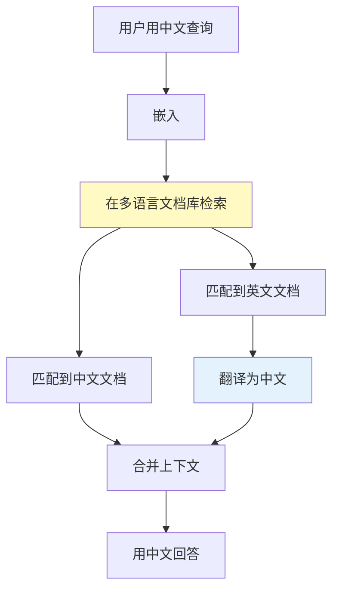

# Agent 多语言处理深度

> Agent 服务全球用户——中文、英文、日文同时输入。检测语言、切换模型、翻译上下文、保持一致性，是国际化 Agent 的核心能力。

---

## 一、多语言处理流程

```mermaid
graph TB
    INPUT["用户输入"] --> DETECT["语言检测"]
    DETECT --> ROUTE&#123;"语言路由"&#125;
    ROUTE -->|中文| ZH["中文Pipeline<br/>BGE嵌入+中文Prompt"]
    ROUTE -->|英文| EN["英文Pipeline<br/>OpenAI嵌入+英文Prompt"]
    ROUTE -->|其他| FALLBACK["默认<br/>多语言模型"]
    ZH & EN & FALLBACK --> RESPONSE["用检测到的语言回答"]

    style DETECT fill:#FFF9C4,stroke:#F9A825,stroke-width:3px
    style RESPONSE fill:#C8E6C9
```

---

## 二、语言检测

```python
import re
from dataclasses import dataclass
from enum import Enum

class Language(str, Enum):
    CHINESE = "zh"
    ENGLISH = "en"
    JAPANESE = "ja"
    KOREAN = "ko"
    ARABIC = "ar"
    MIXED = "mixed"
    UNKNOWN = "unknown"

@dataclass
class LanguageDetectionResult:
    """语言检测结果。"""
    language: Language
    confidence: float
    detected_by: str  # rule / model

class LanguageDetector:
    """语言检测器。"""

    @staticmethod
    def detect(text: str) -> LanguageDetectionResult:
        """检测文本语言。"""
        if not text.strip():
            return LanguageDetectionResult(Language.UNKNOWN, 0, "empty")

        # 按Unicode范围统计
        chinese_chars = sum(1 for c in text if '\u4e00' <= c <= '\u9fff')
        japanese_chars = sum(1 for c in text if '\u3040' <= c <= '\u30ff')
        korean_chars = sum(1 for c in text if '\uac00' <= c <= '\ud7af')
        arabic_chars = sum(1 for c in text if '\u0600' <= c <= '\u06ff')
        ascii_chars = sum(1 for c in text if c.isascii() and c.isalpha())

        total = max(sum([chinese_chars, japanese_chars, korean_chars, arabic_chars, ascii_chars]), 1)

        # 取最多的
        counts = &#123;
            Language.CHINESE: chinese_chars,
            Language.JAPANESE: japanese_chars,
            Language.KOREAN: korean_chars,
            Language.ARABIC: arabic_chars,
            Language.ENGLISH: ascii_chars,
        &#125;

        best_lang = max(counts, key=counts.get)
        best_count = counts[best_lang]
        confidence = best_count / total

        # 多语言混合
        non_zero = sum(1 for c in counts.values() if c > 0 and c / total > 0.2)
        if non_zero > 1:
            return LanguageDetectionResult(Language.MIXED, confidence, "rule")

        return LanguageDetectionResult(best_lang, round(confidence, 2), "rule")
```

---

## 三、多语言 RAG

```python
class MultilingualRAG:
    """多语言RAG系统。"""

    LANGUAGE_CONFIG = &#123;
        Language.CHINESE: &#123;
            "embedding_model": "BAAI/bge-large-zh",
            "system_prompt": "你是专业的AI助手。用中文回答。",
        &#125;,
        Language.ENGLISH: &#123;
            "embedding_model": "text-embedding-3-small",
            "system_prompt": "You are a professional AI assistant. Answer in English.",
        &#125;,
        Language.JAPANESE: &#123;
            "embedding_model": "text-embedding-3-small",
            "system_prompt": "あなたはプロのAIアシスタントです。日本語で答えてください。",
        &#125;,
    &#125;

    @classmethod
    def get_config(cls, lang: Language) -> dict:
        """获取语言配置。"""
        return cls.LANGUAGE_CONFIG.get(lang, cls.LANGUAGE_CONFIG[Language.ENGLISH])

    @staticmethod
    def build_prompt(user_input: str, lang: Language, context: str = "") -> str:
        """构建多语言Prompt。"""
        config = MultilingualRAG.get_config(lang)
        system = config["system_prompt"]

        lang_instruction = &#123;
            Language.CHINESE: "请用中文回答以下问题。",
            Language.ENGLISH: "Please answer the following question in English.",
            Language.JAPANESE: "以下の質問に日本語で答えてください。",
            Language.KOREAN: "다음 질문에 한국어로 답해주세요.",
            Language.ARABIC: "الرجاء الإجابة على السؤال التالي بالعربية.",
        &#125;.get(lang, "Please answer in English.")

        prompt = f"&#123;system&#125;\n\n&#123;lang_instruction&#125;"
        if context:
            prompt += f"\n\n参考信息:\n&#123;context[:2000]&#125;"
        prompt += f"\n\n问题: &#123;user_input&#125;"
        return prompt
```

---

## 四、跨语言检索



---

## 五、最佳实践

| 实践 | 说明 | 优先级 |
|------|------|--------|
| 中文用BGE嵌入 | 中文最强 | ★★★ |
| 检测语言后选配置 | 不同语言不同模型 | ★★★ |
| 用用户语言回答 | 不要中英混杂 | ★★★ |
| 跨语言检索需统一嵌入 | 多语言嵌入模型 | ★★☆ |

---

## 六、检查清单

| 检查项 | 状态 |
|--------|------|
| 有语言检测 | ☐ |
| 有多语言配置 | ☐ |
| 有多语言Prompt | ☐ |
