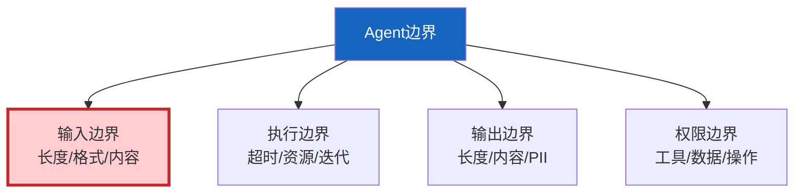

# Agent 边界与异常输入处理深度

> 用户输入是最大的不可控因素——超长文本、恶意指令、格式异常、空输入。不设边界，Agent 会崩溃、被注入、消耗大量 Token。

---

## 一、边界类型



---

## 二、输入边界处理

```python
import re
from dataclasses import dataclass
from enum import Enum

class InputRiskLevel(str, Enum):
    SAFE = "safe"
    WARNING = "warning"
    DANGEROUS = "dangerous"

@dataclass
class InputBoundary:
    """输入边界配置。"""
    max_length: int = 10000
    max_newlines: int = 100
    max_repeated_chars: int = 500
    blocked_patterns: list = None

    def __post_init__(self):
        if self.blocked_patterns is None:
            self.blocked_patterns = [
                (r"ignore.&#123;0,15&#125;(previous|above|all).&#123;0,15&#125;(instruction|prompt)", "指令覆盖"),
                (r"(DAN|do anything now)", "越狱"),
                (r"__import__\s*\(", "代码注入"),
                (r"eval\s*\(", "代码执行"),
            ]

class InputBoundaryChecker:
    """输入边界检查器。"""

    def __init__(self, boundary: InputBoundary = InputBoundary()):
        self.boundary = boundary

    def check(self, user_input: str) -> dict:
        """完整边界检查。"""
        issues = []
        sanitized = user_input
        truncated = False

        # 1. 空输入
        if not user_input.strip():
            return &#123;"valid": False, "risk": InputRiskLevel.WARNING, "issues": ["空输入"], "sanitized": ""&#125;

        # 2. 长度限制
        if len(user_input) > self.boundary.max_length:
            sanitized = user_input[:self.boundary.max_length]
            truncated = True
            issues.append(f"输入超长（>&#123;self.boundary.max_length&#125;），已截断")

        # 3. 换行符过多（DoS）
        if user_input.count("\n") > self.boundary.max_newlines:
            sanitized = sanitized[:self.boundary.max_length]
            issues.append(f"换行符过多，可能DoS")

        # 4. 重复字符检测
        for i in range(len(user_input) - self.boundary.max_repeated_chars):
            char = user_input[i]
            if user_input[i:i+self.boundary.max_repeated_chars] == char * self.boundary.max_repeated_chars:
                issues.append(f"检测到&#123;self.boundary.max_repeated_chars&#125;+重复字符'&#123;char&#125;'")
                break

        # 5. 危险模式
        dangerous = []
        for pattern, desc in self.boundary.blocked_patterns:
            if re.search(pattern, sanitized, re.IGNORECASE):
                dangerous.append(desc)
                sanitized = re.sub(pattern, "[已过滤]", sanitized, flags=re.IGNORECASE)

        if dangerous:
            return &#123;
                "valid": False,
                "risk": InputRiskLevel.DANGEROUS,
                "issues": [f"危险模式: &#123;', '.join(dangerous)&#125;"],
                "sanitized": sanitized,
            &#125;

        risk = InputRiskLevel.WARNING if issues else InputRiskLevel.SAFE
        return &#123;
            "valid": True,
            "risk": risk,
            "issues": issues,
            "sanitized": sanitized,
            "truncated": truncated,
        &#125;


class ExecutionBoundary:
    """执行边界控制。"""

    def __init__(self, max_iterations: int = 15, max_total_time: int = 60, max_tool_calls: int = 10):
        self.max_iterations = max_iterations
        self.max_time = max_total_time
        self.max_tool_calls = max_tool_calls

    def check(self, current_iterations: int, elapsed_time: float, tool_call_count: int) -> dict:
        """检查执行边界。"""
        if current_iterations >= self.max_iterations:
            return &#123;"exceeded": True, "reason": f"超过最大迭代次数&#123;self.max_iterations&#125;"&#125;
        if elapsed_time >= self.max_time:
            return &#123;"exceeded": True, "reason": f"超过最大执行时间&#123;self.max_time&#125;秒"&#125;
        if tool_call_count >= self.max_tool_calls:
            return &#123;"exceeded": True, "reason": f"超过最大工具调用次数&#123;self.max_tool_calls&#125;"&#125;
        return &#123;"exceeded": False&#125;
```

---

## 三、优雅降级

```python
class GracefulDegradation:
    """优雅降级处理器。"""

    @staticmethod
    def handle_input_risk(risk_result: dict) -> dict:
        """根据输入风险等级降级。"""
        risk = risk_result.get("risk", InputRiskLevel.SAFE)

        if risk == InputRiskLevel.SAFE:
            return &#123;"action": "process", "input": risk_result["sanitized"]&#125;

        elif risk == InputRiskLevel.WARNING:
            return &#123;
                "action": "process_with_warning",
                "input": risk_result["sanitized"],
                "message": "输入已清洗" + ("（已截断）" if risk_result.get("truncated") else ""),
            &#125;

        elif risk == InputRiskLevel.DANGEROUS:
            return &#123;
                "action": "reject",
                "input": "",
                "message": f"输入包含危险内容: &#123;', '.join(risk_result.get('issues', []))&#125;",
            &#125;

        return &#123;"action": "process", "input": risk_result.get("sanitized", "")&#125;
```

---

## 四、最佳实践

| 实践 | 说明 | 优先级 |
|------|------|--------|
| 输入长度限制 | 防Token消耗 | ★★★ |
| 危险模式检测 | 防注入 | ★★★ |
| 最大迭代次数 | 防死循环 | ★★★ |
| 最大执行时间 | 防卡住 | ★★★ |
| 优雅降级 | 不崩溃 | ★★★ |
| 重复字符检测 | 防DoS | ★★☆ |

---

## 五、检查清单

| 检查项 | 状态 |
|--------|------|
| 有输入边界检查器 | ☐ |
| 有执行边界控制 | ☐ |
| 有优雅降级 | ☐ |
