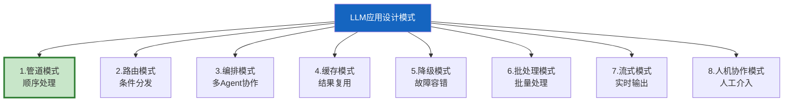
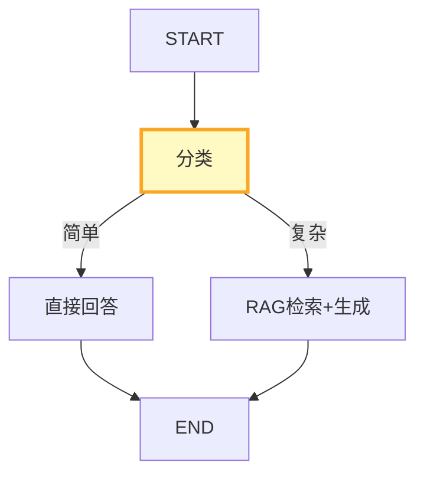
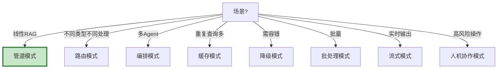

# LLM 应用设计模式全集深度

> 知识库 40 讲了 287 行基础。这篇深入——LLM 应用的架构设计模式有哪些，每种模式解决什么问题，如何选择。

---

## 一、8 种设计模式



---

## 二、管道模式

```python
from langgraph.graph import StateGraph, START, END
from typing import TypedDict, Annotated
from langgraph.graph.message import add_messages

class PipelineState(TypedDict):
    messages: Annotated[list, add_messages]
    query: str
    retrieved_docs: list
    context: str
    answer: str

class PipelinePattern:
    """管道模式：查询→检索→重排序→生成。

    最经典的RAG模式。
    每步处理上一步输出，线性流转。
    """

    @staticmethod
    def build(llm, vectorstore):
        graph = StateGraph(PipelineState)

        async def retrieve(state):
            docs = await vectorstore.asimilarity_search(state["query"], k=5)
            return &#123;"retrieved_docs": docs&#125;

        async def assemble(state):
            context = "\n".join(d.page_content for d in state["retrieved_docs"])
            return &#123;"context": context[:2000]&#125;

        async def generate(state):
            from langchain_core.messages import HumanMessage
            prompt = f"基于以下信息回答:\n&#123;state['context']&#125;\n\n问题: &#123;state['query']&#125;"
            response = await llm.ainvoke([HumanMessage(content=prompt)])
            return &#123;"answer": response.content, "messages": [response]&#125;

        graph.add_node("retrieve", retrieve)
        graph.add_node("assemble", assemble)
        graph.add_node("generate", generate)
        graph.add_edge(START, "retrieve")
        graph.add_edge("retrieve", "assemble")
        graph.add_edge("assemble", "generate")
        graph.add_edge("generate", END)
        return graph.compile()
```

---

## 三、路由模式

```python
class RoutingPattern:
    """路由模式：根据输入特征分发到不同处理路径。

    简单问题→快速模型
    复杂问题→完整RAG
    闲聊→直接回答
    """

    @staticmethod
    def build(llm, vectorstore):
        graph = StateGraph(PipelineState)

        async def classify(state):
            query = state["query"]
            if len(query) < 15 or any(w in query for w in ["你好", "谢谢"]):
                return &#123;"route": "direct"&#125;
            elif any(w in query for w in ["最新", "今天"]):
                return &#123;"route": "web_search"&#125;
            return &#123;"route": "rag"&#125;

        async def direct_answer(state):
            from langchain_core.messages import HumanMessage
            response = await llm.ainvoke([HumanMessage(content=state["query"])])
            return &#123;"answer": response.content&#125;

        async def rag_answer(state):
            docs = await vectorstore.asimilarity_search(state["query"], k=5)
            context = "\n".join(d.page_content for d in docs)
            from langchain_core.messages import HumanMessage
            response = await llm.ainvoke([HumanMessage(
                content=f"基于以下信息回答:\n&#123;context[:2000]&#125;\n\n问题: &#123;state['query']&#125;"
            )])
            return &#123;"answer": response.content&#125;

        def route(state):
            return state.get("route", "rag")

        graph.add_node("classify", classify)
        graph.add_node("direct", direct_answer)
        graph.add_node("rag", rag_answer)

        graph.add_edge(START, "classify")
        graph.add_conditional_edges("classify", route, &#123;
            "direct": "direct",
            "web_search": "rag",
            "rag": "rag",
        &#125;)
        graph.add_edge("direct", END)
        graph.add_edge("rag", END)
        return graph.compile()
```



---

## 四、人机协作模式

```python
from langgraph.types import interrupt, Command

class HumanInLoopPattern:
    """人机协作模式：Agent执行→人工审批→继续。

    适用于：高风险操作（发邮件/删除/支付）。
    """

    @staticmethod
    def build(llm):
        from langgraph.checkpoint.memory import MemorySaver

        class HumanLoopState(TypedDict):
            messages: Annotated[list, add_messages]
            task: str
            draft: str
            approved: bool
            final: str

        async def generate_draft(state):
            from langchain_core.messages import HumanMessage
            response = await llm.ainvoke([HumanMessage(content=state["task"])])
            return &#123;"draft": response.content&#125;

        async def human_review(state):
            approval = interrupt(&#123;
                "type": "review",
                "draft": state["draft"][:500],
                "question": "是否批准？",
            &#125;)
            return &#123;"approved": approval.get("approved", False)&#125;

        async def execute(state):
            if state.get("approved"):
                return &#123;"final": state["draft"]&#125;
            return &#123;"final": "被拒绝"&#125;

        graph = StateGraph(HumanLoopState)
        graph.add_node("draft", generate_draft)
        graph.add_node("review", human_review)
        graph.add_node("execute", execute)
        graph.add_edge(START, "draft")
        graph.add_edge("draft", "review")
        graph.add_edge("review", "execute")
        graph.add_edge("execute", END)
        return graph.compile(checkpointer=MemorySaver())
```

---

## 五、模式选型



---

## 六、最佳实践

| 模式 | 场景 | 优先级 |
|------|------|--------|
| 管道模式 | 标准RAG | ★★★ |
| 路由模式 | 多类型查询 | ★★★ |
| 人机协作 | 高风险操作 | ★★☆ |
| 缓存模式 | 重复查询多 | ★★☆ |
| 模式可组合 | 管道+路由+缓存 | ★★☆ |

---

## 七、检查清单

| 检查项 | 状态 |
|--------|------|
| 理解8种模式 | ☐ |
| 能实现管道模式 | ☐ |
| 能实现路由模式 | ☐ |
| 能实现人机协作 | ☐ |
