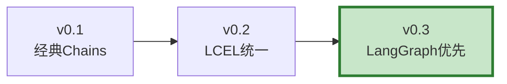

# LLM 应用版本演进与生态最新

> LangChain 和 LangGraph 迭代极快——v0.1 到 v0.3 架构大变，新工具不断涌现。这份指南带你了解最新生态。

---

## 一、LangChain 版本演进



| 版本 | 核心变化 | 迁移建议 |
|------|----------|----------|
| v0.1 | 经典 Chains、AgentExecutor | 已废弃 |
| v0.2 | LCEL 统一接口、Runnable | 迁移到 LCEL |
| v0.3 | LangGraph 优先、废弃旧 Agent | 迁移到 LangGraph |

---

## 二、迁移指南

```python
# v0.1 旧写法（已废弃）
# from langchain.chains import RetrievalQA
# chain = RetrievalQA.from_chain_type(llm=llm, retriever=retriever)

# v0.3 新写法（LangGraph）
from langgraph.prebuilt import create_react_agent
agent = create_react_agent(llm, tools, checkpointer=MemorySaver())

# v0.1 旧Agent
# from langchain.agents import AgentExecutor, create_openai_tools_agent
# executor = AgentExecutor(agent=agent, tools=tools)

# v0.3 新Agent
from langgraph.prebuilt import create_react_agent
agent = create_react_agent(llm, tools)
```

---

## 三、最新生态工具

```python
class Ecosystem2025:
    """2025年LLM开发生态。"""

    FRAMEWORKS = &#123;
        "langchain": &#123;"version": "0.3+", "status": "活跃", "定位": "通用LLM开发"&#125;,
        "langgraph": &#123;"version": "0.2+", "status": "活跃", "定位": "图式编排"&#125;,
        "langsmith": &#123;"version": "最新", "status": "活跃", "定位": "可观测性"&#125;,
        "langgraph_cloud": &#123;"version": "最新", "status": "活跃", "定位": "托管部署"&#125;,
    &#125;

    NEW_TOOLS = &#123;
        "create_react_agent": "预构建ReAct Agent",
        "ToolNode": "批量工具执行",
        "Command": "高级状态控制",
        "interrupt": "人机交互中断",
        "astream_events": "事件级流式",
        "RemoveMessage": "消息清理",
        "MemorySaver/PostgresSaver": "检查点持久化",
        "Store": "跨线程长期记忆",
    &#125;

    RECOMMENDED_STACK = &#123;
        "开发": "LangChain 0.3 + LangGraph + LangSmith",
        "部署": "LangGraph Cloud / Docker自托管",
        "监控": "LangSmith + Prometheus + Grafana",
        "测试": "RAGAS + pytest-asyncio",
        "安全": "OWASP LLM Top10 + 红队测试",
    &#125;
```

---

## 四、最佳实践

| 实践 | 说明 | 优先级 |
|------|------|--------|
| 用LangGraph替代旧Agent | AgentExecutor已废弃 | ★★★ |
| LCEL替代旧Chains | Runnable统一接口 | ★★★ |
| 用create_react_agent | 预构建Agent最简方式 | ★★★ |
| 关注版本更新 | 框架迭代快 | ★★☆ |
| LangSmith标配 | 可观测性必备 | ★★☆ |

---

## 五、检查清单

| 检查项 | 状态 |
|--------|------|
| 知道v0.3是当前版本 | ☐ |
| 能迁移旧Agent到LangGraph | ☐ |
| 了解最新生态工具 | ☐ |
