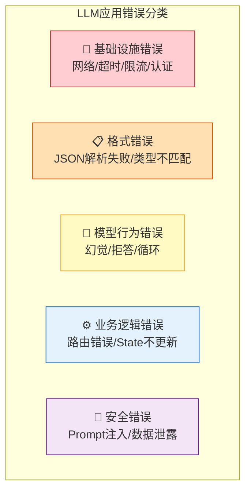
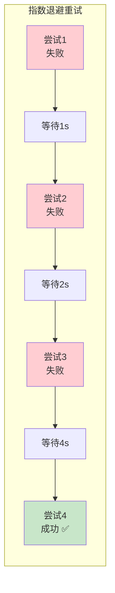
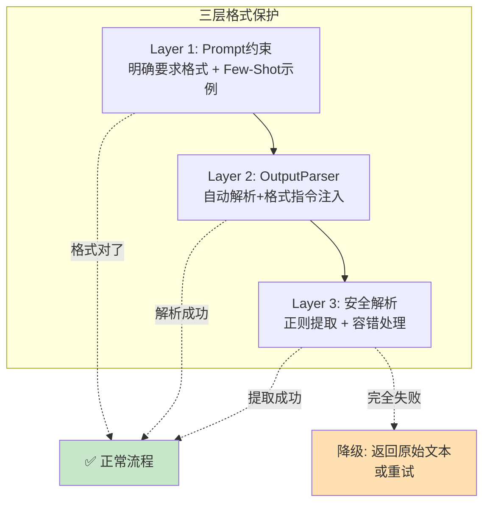
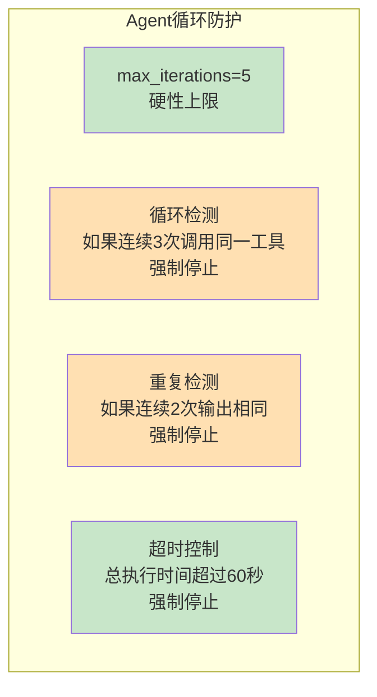
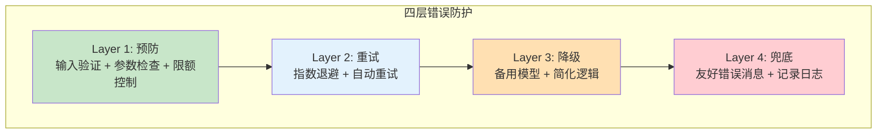

# 错误处理最佳实践

> LLM 应用的错误与传统软件不同：API 限流、超时、格式错误、幻觉。这份指南给你系统化的错误处理方法论。

---

## 一、错误分类全景



## 二、基础设施错误处理

### 2.1 常见基础设施错误

| 错误类型 | 原因 | 处理策略 |
|----------|------|----------|
| RateLimitError | API调用频率超限 | 指数退避重试 |
| Timeout | 请求超时 | 设超时+重试 |
| AuthenticationError | API Key无效 | 启动时验证 |
| ConnectionError | 网络不通 | 重试+降级备用 |
| ServiceUnavailable | 服务端不可用 | 切换备用模型 |

### 2.2 重试与指数退避

```python
import time
from langchain_openai import ChatOpenAI

# 方式一：LangChain内置重试
llm = ChatOpenAI(
    model="gpt-4o-mini",
    max_retries=3,       # 自动重试3次
    timeout=30,          # 超时30秒
)

# 方式二：手动实现指数退避（更灵活）
def invoke_with_backoff(func, *args, max_retries=5, base_delay=1, **kwargs):
    """带指数退避的调用"""
    for attempt in range(max_retries):
        try:
            return func(*args, **kwargs)
        except Exception as e:
            if attempt == max_retries - 1:
                raise  # 最后一次尝试失败，抛出异常
            delay = base_delay * (2 ** attempt)  # 1, 2, 4, 8, 16秒
            print(f"⚠️ 第&#123;attempt+1&#125;次失败: &#123;e&#125;，&#123;delay&#125;秒后重试...")
            time.sleep(delay)

# 使用
result = invoke_with_backoff(llm.invoke, "你好")
```

### 2.3 指数退避可视化



### 2.4 多模型降级

```python
from langchain_openai import ChatOpenAI
from langchain_anthropic import ChatAnthropic
from langchain_ollama import ChatOllama

class ResilientLLM:
    """多模型降级：主→备→兜底"""
    def __init__(self):
        self.models = [
            ("OpenAI", ChatOpenAI(model="gpt-4o-mini", max_retries=2, timeout=30)),
            ("Claude", ChatAnthropic(model="claude-3-5-sonnet-20241022", max_retries=2)),
            ("Ollama", ChatOllama(model="qwen2")),  # 本地兜底
        ]

    def invoke(self, messages):
        errors = []
        for name, llm in self.models:
            try:
                return llm.invoke(messages)
            except Exception as e:
                errors.append(f"&#123;name&#125;: &#123;e&#125;")
                print(f"⚠️ &#123;name&#125;失败，切换备用模型...")
                continue
        raise Exception(f"所有模型不可用: &#123;errors&#125;")

# 使用
llm = ResilientLLM()
response = llm.invoke("你好")  # 自动降级
```

### 2.5 降级决策流程

```mermaid
graph TD
    CALL["调用LLM"] --> TRY1&#123;"主模型<br/>(OpenAI)"&#125;
    TRY1 -->|"成功"| OK["返回结果 ✅"]
    TRY1 -->|"失败"| TRY2&#123;"备用模型<br/>(Claude)"&#125;
    TRY2 -->|"成功"| OK
    TRY2 -->|"失败"| TRY3&#123;"兜底模型<br/>(Ollama本地)"&#125;
    TRY3 -->|"成功"| OK
    TRY3 -->|"失败"| FAIL["❌ 所有模型不可用<br/>返回预设错误消息"]

    style OK fill:#C8E6C9
    style FAIL fill:#FFCDD2
```

## 三、格式错误处理

### 3.1 JSON 解析失败

```python
import json
from langchain_core.output_parsers import JsonOutputParser

def safe_json_parse(text: str) -> dict:
    """安全解析JSON，处理LLM输出不合规的情况"""
    # 尝试直接解析
    try:
        return json.loads(text)
    except json.JSONDecodeError:
        pass

    # 尝试提取JSON块
    import re
    json_match = re.search(r'```json\s*(.*?)\s*```', text, re.DOTALL)
    if json_match:
        try:
            return json.loads(json_match.group(1))
        except json.JSONDecodeError:
            pass

    # 尝试找到第一个&#123;和最后一个&#125;
    start = text.find('&#123;')
    end = text.rfind('&#125;')
    if start != -1 and end != -1:
        try:
            return json.loads(text[start:end+1])
        except json.JSONDecodeError:
            pass

    # 所有方法都失败
    raise ValueError(f"无法解析JSON: &#123;text[:100]&#125;...")

# 使用
result = safe_json_parse('```json\n&#123;"name": "张三", "age": 25&#125;\n```')
```

### 3.2 格式错误的分层处理



### 3.3 with_structured_output（最可靠）

```python
from pydantic import BaseModel, Field

class PersonInfo(BaseModel):
    name: str = Field(description="姓名")
    age: int = Field(description="年龄")
    hobbies: list[str] = Field(description="爱好列表")

# with_structured_output 使用模型原生的结构化输出能力
# 比OutputParser更可靠，因为模型在生成时就遵循schema
structured_llm = llm.with_structured_output(PersonInfo)

result = structured_llm.invoke("张三今年28岁，喜欢打篮球和看电影")
# result 直接是 PersonInfo 对象，不需要解析
print(result.name)   # "张三"
print(result.age)    # 28
```

## 四、模型行为错误处理

### 4.1 幻觉检测

```python
def detect_hallucination(answer: str, context: str) -> bool:
    """简单的幻觉检测"""
    # 如果回答中包含上下文没有的关键信息，可能是幻觉
    answer_sentences = answer.split("。")
    context_lower = context.lower()

    unsupported = []
    for sentence in answer_sentences:
        # 提取句子中的关键词
        if len(sentence) < 5:
            continue
        # 简单检查：句子是否能在上下文中找到依据
        keywords = sentence[:20]  # 取前20字符作为关键词
        if keywords.lower() not in context_lower:
            unsupported.append(sentence)

    return len(unsupported) > 0

# 更可靠的方式：用LLM评估
def llm_hallucination_check(question: str, answer: str, context: str) -> dict:
    """用LLM检测幻觉"""
    prompt = f"""判断回答中是否有上下文不支持的信息。

问题：&#123;question&#125;
上下文：&#123;context&#125;
回答：&#123;answer&#125;

如果有上下文不支持的信息，列出具体哪句话。
如果全部有据可查，回复"无幻觉"。
"""
    response = llm.invoke(prompt)
    has_hallucination = "无幻觉" not in response.content
    return &#123;"has_hallucination": has_hallucination, "detail": response.content&#125;
```

### 4.2 Agent 无限循环防护



```python
from langchain.agents import create_tool_calling_agent, AgentExecutor

agent_executor = AgentExecutor(
    agent=agent,
    tools=tools,
    verbose=True,
    max_iterations=5,              # 硬性上限
    handle_parsing_errors=True,    # 解析错误自动重试
    early_stopping_method="generate",  # 达上限时让LLM尽力生成回答
)
```

### 4.3 空回复处理

```python
def handle_empty_response(response, llm, max_retry=2):
    """处理LLM返回空内容的情况"""
    for attempt in range(max_retry):
        if response.content and len(response.content.strip()) > 0:
            return response

        print(f"⚠️ 空回复，重试&#123;attempt+1&#125;...")
        response = llm.invoke("请回答上一个问题")

    return response
```

## 五、LangGraph 中的错误处理

### 5.1 节点级错误处理

```python
from langgraph.graph import StateGraph, START, END

def safe_node(state):
    """带错误处理的节点"""
    try:
        # 正常处理
        result = process(state)
        return &#123;"result": result, "error": ""&#125;
    except Exception as e:
        # 记录错误到State
        return &#123;
            "result": "",
            "error": f"&#123;type(e).__name__&#125;: &#123;str(e)&#125;",
        &#125;

def error_handler_node(state):
    """错误处理节点"""
    error = state.get("error", "")
    if error:
        return &#123;"result": f"处理出错: &#123;error&#125;", "error": ""&#125;
    return &#123;&#125;

# 图中加入错误处理分支
graph.add_conditional_edges(
    "process",
    lambda state: "error_handler" if state.get("error") else "next",
    &#123;"error_handler": "error_handler", "next": "next_node"&#125;
)
```

### 5.2 LangGraph 错误处理流程

```mermaid
graph TB
    START([START]) --> NODE["处理节点<br/>(try-catch)"]
    NODE --> CHECK&#123;"有错误?"&#125;
    CHECK -->|"无"| NEXT["正常继续"]
    CHECK -->|"有"| HANDLER["错误处理节点<br/>记录错误到State"]
    HANDLER --> DECIDE&#123;"可恢复?"&#125;
    DECIDE -->|"是"| RETRY["重试节点"]
    RETRY --> NODE
    DECIDE -->|"否"| FALLBACK["降级回答<br/>返回友好错误消息"]
    FALLBACK --> END([END])
    NEXT --> END

    style NODE fill:#E3F2FD
    style CHECK fill:#FFF9C4
    style HANDLER fill:#FFCDD2
    style FALLBACK fill:#FFE0B2
    style NEXT fill:#C8E6C9
```

## 六、全局错误处理策略



```python
# 全局错误处理包装器
def safe_llm_call(func, *args, **kwargs):
    """全局安全的LLM调用包装器"""
    try:
        result = func(*args, **kwargs)
        # 检查空回复
        if hasattr(result, 'content') and not result.content.strip():
            return &#123;"success": False, "error": "空回复", "result": None&#125;
        return &#123;"success": True, "error": None, "result": result&#125;
    except Exception as e:
        error_type = type(e).__name__
        if "RateLimit" in error_type:
            return &#123;"success": False, "error": "请求过于频繁，请稍后重试", "result": None&#125;
        elif "Timeout" in error_type:
            return &#123;"success": False, "error": "请求超时，请稍后重试", "result": None&#125;
        elif "Auth" in error_type:
            return &#123;"success": False, "error": "认证失败，请检查API Key", "result": None&#125;
        else:
            return &#123;"success": False, "error": f"服务暂时不可用: &#123;str(e)&#125;", "result": None&#125;

# 使用
result = safe_llm_call(llm.invoke, "你好")
if result["success"]:
    print(result["result"].content)
else:
    print(f"❌ &#123;result['error']&#125;")
```

## 七、用户友好的错误消息

```python
# 错误消息映射表
ERROR_MESSAGES = &#123;
    "RateLimitError": "您的请求过于频繁，请稍等片刻再试。",
    "Timeout": "请求超时了，请检查网络后重试。",
    "AuthenticationError": "API密钥无效，请联系管理员。",
    "ConnectionError": "无法连接到服务器，请检查网络。",
    "ServiceUnavailableError": "AI服务暂时不可用，正在切换备用服务...",
    "JSONParseError": "数据格式异常，正在重新处理...",
    "EmptyResponse": "AI未返回有效内容，请尝试换一种问法。",
    "ContextLengthExceeded": "对话内容过长，请开启新对话。",
&#125;

def get_friendly_error(error: Exception) -> str:
    """获取用户友好的错误消息"""
    error_type = type(error).__name__
    for key, msg in ERROR_MESSAGES.items():
        if key.lower() in error_type.lower() or key.lower() in str(error).lower():
            return msg
    return "服务暂时不可用，请稍后重试。"
```
