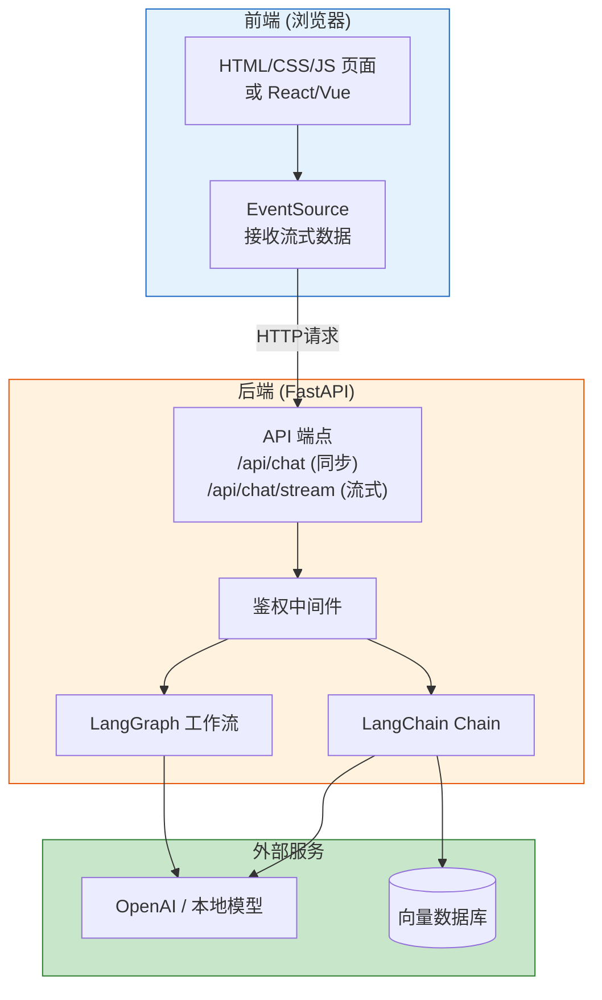
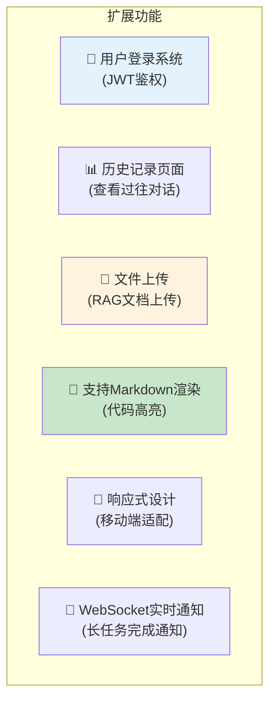

# 前后端集成教程

> 把你的 LangChain/LangGraph 应用变成一个有界面的 Web 应用。从零搭建 FastAPI 后端 + 前端页面。

---

## 一、整体架构



## 二、后端实现（FastAPI）

### 2.1 项目结构

```
web_app/
├── .env
├── requirements.txt
├── server.py          ← FastAPI 后端
├── chain.py           ← LangChain 逻辑
├── graph.py           ← LangGraph 工作流（可选）
└── static/
    ├── index.html      ← 前端页面
    ├── style.css
    └── app.js
```

### 2.2 后端代码

```python
# server.py
import os
from dotenv import load_dotenv
from fastapi import FastAPI, Request, HTTPException
from fastapi.responses import StreamingResponse, FileResponse
from fastapi.staticfiles import StaticFiles
from pydantic import BaseModel
from langchain_openai import ChatOpenAI
from langchain_core.prompts import ChatPromptTemplate, MessagesPlaceholder
from langchain_core.output_parsers import StrOutputParser
from langchain_core.messages import HumanMessage, AIMessage
from langchain_community.chat_message_histories import SQLChatMessageHistory
from langchain_core.runnables.history import RunnableWithMessageHistory

load_dotenv()
app = FastAPI(title="LangChain Web App")

# 静态文件
app.mount("/static", StaticFiles(directory="static"), name="static")

# ========== LLM 和 Chain ==========

llm = ChatOpenAI(model="gpt-4o-mini", temperature=0.7)

prompt = ChatPromptTemplate.from_messages([
    ("system", "你是一个友好、有帮助的AI助手。用简洁的中文回答。"),
    MessagesPlaceholder(variable_name="history"),
    ("human", "&#123;input&#125;"),
])

chain = prompt | llm | StrOutputParser()

# ========== 对话历史管理 ==========

store_db = "sqlite:///chat.db"

def get_session_history(session_id: str):
    return SQLChatMessageHistory(
        session_id=session_id,
        connection_string=store_db,
    )

chain_with_history = RunnableWithMessageHistory(
    chain,
    get_session_history,
    input_messages_key="input",
    history_messages_key="history",
)

# ========== API 端点 ==========

class ChatRequest(BaseModel):
    message: str
    session_id: str = "default"

@app.get("/")
async def index():
    """返回前端页面"""
    return FileResponse("static/index.html")

@app.post("/api/chat")
async def chat(req: ChatRequest):
    """同步聊天端点"""
    try:
        response = chain_with_history.invoke(
            &#123;"input": req.message&#125;,
            config=&#123;"configurable": &#123;"session_id": req.session_id&#125;&#125;,
        )
        return &#123;"answer": response, "session_id": req.session_id&#125;
    except Exception as e:
        raise HTTPException(status_code=500, detail=str(e))

@app.post("/api/chat/stream")
async def chat_stream(req: ChatRequest):
    """流式聊天端点（SSE）"""
    async def generate():
        try:
            async for chunk in chain_with_history.astream(
                &#123;"input": req.message&#125;,
                config=&#123;"configurable": &#123;"session_id": req.session_id&#125;&#125;,
            ):
                yield f"data: &#123;chunk&#125;\n\n"
        except Exception as e:
            yield f"data: [ERROR] &#123;str(e)&#125;\n\n"

    return StreamingResponse(generate(), media_type="text/event-stream")

@app.delete("/api/history/&#123;session_id&#125;")
async def clear_history(session_id: str):
    """清除对话历史"""
    history = get_session_history(session_id)
    history.clear()
    return &#123;"status": "cleared"&#125;

# 运行: uvicorn server:app --reload --port 8000
```

## 三、前端实现

### 3.1 HTML 页面

```html
<!-- static/index.html -->
<!DOCTYPE html>
<html lang="zh">
<head>
    <meta charset="UTF-8">
    <meta name="viewport" content="width=device-width, initial-scale=1.0">
    <title>LangChain AI 助手</title>
    <link rel="stylesheet" href="/static/style.css">
</head>
<body>
    <div class="container">
        <header>
            <h1>🤖 LangChain AI 助手</h1>
            <button id="clearBtn" onclick="clearHistory()">清空对话</button>
        </header>

        <div id="messages" class="messages">
            <div class="message ai">
                <div class="avatar">🤖</div>
                <div class="content">你好！我是AI助手，有什么可以帮你的？</div>
            </div>
        </div>

        <div class="input-area">
            <input type="text" id="userInput" placeholder="输入消息..." autocomplete="off"
                   onkeypress="if(event.key==='Enter') sendMessage()">
            <button onclick="sendMessage()">发送</button>
        </div>
    </div>
    <script src="/static/app.js"></script>
</body>
</html>
```

### 3.2 CSS 样式

```css
/* static/style.css */
* &#123; margin: 0; padding: 0; box-sizing: border-box; &#125;

body &#123;
    font-family: -apple-system, BlinkMacSystemFont, "Segoe UI", sans-serif;
    background: #f5f5f5;
    height: 100vh;
    display: flex;
&#125;

.container &#123;
    max-width: 800px;
    margin: 0 auto;
    width: 100%;
    display: flex;
    flex-direction: column;
    height: 100vh;
    background: white;
&#125;

header &#123;
    padding: 16px 20px;
    background: #1a1a2e;
    color: white;
    display: flex;
    justify-content: space-between;
    align-items: center;
&#125;

header h1 &#123; font-size: 18px; &#125;

#clearBtn &#123;
    background: rgba(255,255,255,0.2);
    color: white; border: none;
    padding: 6px 12px; border-radius: 6px; cursor: pointer;
    font-size: 13px;
&#125;
#clearBtn:hover &#123; background: rgba(255,255,255,0.3); &#125;

.messages &#123;
    flex: 1;
    overflow-y: auto;
    padding: 20px;
&#125;

.message &#123;
    display: flex;
    gap: 12px;
    margin-bottom: 16px;
&#125;

.avatar &#123;
    width: 36px; height: 36px;
    border-radius: 50%;
    display: flex; align-items: center; justify-content: center;
    font-size: 18px; flex-shrink: 0;
&#125;

.message.user .avatar &#123; background: #007AFF; &#125;
.message.ai .avatar &#123; background: #34C759; &#125;

.content &#123;
    padding: 10px 14px;
    border-radius: 12px;
    max-width: 70%;
    line-height: 1.6;
&#125;

.message.user .content &#123; background: #007AFF; color: white; &#125;
.message.ai .content &#123; background: #f0f0f0; &#125;

.input-area &#123;
    padding: 16px;
    border-top: 1px solid #e0e0e0;
    display: flex;
    gap: 10px;
&#125;

#userInput &#123;
    flex: 1;
    padding: 12px 16px;
    border: 1px solid #d0d0d0;
    border-radius: 8px;
    font-size: 15px;
    outline: none;
&#125;
#userInput:focus &#123; border-color: #007AFF; &#125;

button &#123;
    padding: 12px 24px;
    background: #007AFF;
    color: white;
    border: none;
    border-radius: 8px;
    cursor: pointer;
    font-size: 15px;
&#125;
button:hover &#123; background: #0056CC; &#125;
button:disabled &#123; background: #ccc; cursor: not-allowed; &#125;
```

### 3.3 JavaScript 逻辑

```javascript
// static/app.js
const sessionId = 'session_' + Date.now();

async function sendMessage() &#123;
    const input = document.getElementById('userInput');
    const message = input.value.trim();
    if (!message) return;

    // 添加用户消息到界面
    addMessage('user', message);
    input.value = '';
    input.disabled = true;

    // 创建AI消息占位
    const aiContent = addMessage('ai', '');
    const contentEl = aiContent.querySelector('.content');
    contentEl.textContent = '思考中...';

    try &#123;
        // 使用SSE流式接收
        const response = await fetch('/api/chat/stream', &#123;
            method: 'POST',
            headers: &#123; 'Content-Type': 'application/json' &#125;,
            body: JSON.stringify(&#123; message: message, session_id: sessionId &#125;),
        &#125;);

        const reader = response.body.getReader();
        const decoder = new TextDecoder();
        let firstChunk = true;

        while (true) &#123;
            const &#123; done, value &#125; = await reader.read();
            if (done) break;

            const text = decoder.decode(value);
            const lines = text.split('\n');

            for (const line of lines) &#123;
                if (line.startsWith('data: ')) &#123;
                    const chunk = line.slice(6);
                    if (chunk.startsWith('[ERROR]')) &#123;
                        contentEl.textContent = chunk;
                    &#125; else &#123;
                        if (firstChunk) &#123;
                            contentEl.textContent = '';
                            firstChunk = false;
                        &#125;
                        contentEl.textContent += chunk;
                    &#125;
                &#125;
            &#125;
        &#125;
    &#125; catch (error) &#123;
        contentEl.textContent = '❌ 请求失败: ' + error.message;
    &#125;

    input.disabled = false;
    input.focus();
&#125;

function addMessage(role, content) &#123;
    const messages = document.getElementById('messages');
    const msgDiv = document.createElement('div');
    msgDiv.className = 'message ' + role;
    msgDiv.innerHTML = `
        <div class="avatar">$&#123;role === 'user' ? '👤' : '🤖'&#125;</div>
        <div class="content">$&#123;escapeHtml(content)&#125;</div>
    `;
    messages.appendChild(msgDiv);
    messages.scrollTop = messages.scrollHeight;
    return msgDiv;
&#125;

function escapeHtml(text) &#123;
    const div = document.createElement('div');
    div.textContent = text;
    return div.innerHTML;
&#125;

async function clearHistory() &#123;
    await fetch('/api/history/' + sessionId, &#123; method: 'DELETE' &#125;);
    const messages = document.getElementById('messages');
    messages.innerHTML = '';
    addMessage('ai', '对话已清空，让我们重新开始吧！');
&#125;

// 回车发送
document.getElementById('userInput').focus();
```

## 四、数据流图

```mermaid
sequenceDiagram
    participant U as 浏览器
    participant F as FastAPI
    participant C as Chain
    participant L as LLM
    participant D as SQLite

    U->>F: POST /api/chat/stream &#123;message, session_id&#125;
    F->>D: 加载对话历史(session_id)
    D-->>F: 历史消息列表
    F->>C: astream(&#123;input, history&#125;)
    C->>L: 流式请求

    loop 逐Token返回
        L-->>C: chunk "你"
        C-->>F: yield "你"
        F-->>U: data: 你\n\n
        Note over U: 追加到页面
    end

    L-->>C: [DONE]
    C->>D: 保存完整对话历史
    C-->>F: 结束
    F-->>U: 关闭SSE连接
```



## 五、运行与部署

### 5.1 本地开发

```bash
# 安装依赖
pip install fastapi uvicorn langchain langchain-openai python-dotenv

# 配置
echo "OPENAI_API_KEY=你的密钥" > .env

# 运行
uvicorn server:app --reload --port 8000

# 打开浏览器
# http://localhost:8000
```

### 5.2 Docker 部署

```dockerfile
# Dockerfile
FROM python:3.11-slim
WORKDIR /app
COPY requirements.txt .
RUN pip install --no-cache-dir -r requirements.txt
COPY . .
EXPOSE 8000
CMD ["uvicorn", "server:app", "--host", "0.0.0.0", "--port", "8000"]
```

```bash
# 构建和运行
docker build -t langchain-webapp .
docker run -p 8000:8000 --env-file .env langchain-webapp
```

## 六、扩展方向


