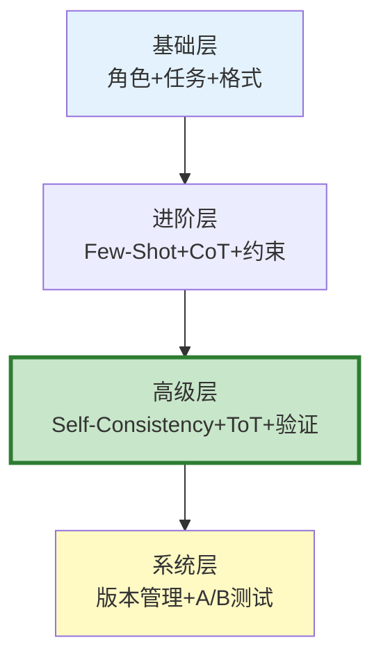

# 高级 Prompt 技巧最新

> 知识库 21 有 397 行、知识库 138 讲了 6 种进阶模式。这篇整合为完整的 Prompt 技巧速查——从基础到高级一目了然。

---

## 一、技巧层级



---

## 二、10 个高级技巧速查

```python
class AdvancedPromptTechniques:
    """10个高级Prompt技巧。"""

    TECHNIQUES = &#123;
        "1.角色定义": &#123;
            "原理": "给LLM定义角色，引导回答风格",
            "示例": "你是资深Python工程师，用专业但通俗的语言解释",
            "效果": "+20%",
        &#125;,
        "2.Few-Shot": &#123;
            "原理": "给几个示例引导输出格式和风格",
            "示例": "问题: 2+3=?\n答案: 5\n\n问题: 7*8=?\n答案: 56",
            "效果": "+30%",
        &#125;,
        "3.思维链(CoT)": &#123;
            "原理": "加'让我们一步步思考'触发推理",
            "示例": "问题: ...\n让我们一步步思考。\n",
            "效果": "+15-25%",
        &#125;,
        "4.自一致性": &#123;
            "原理": "同问题多次采样取多数答案",
            "示例": "temperature=0.7, 采样5次, 取多数",
            "效果": "+25-40%",
        &#125;,
        "5.思维树(ToT)": &#123;
            "原理": "生成多个思路→评估→选最优",
            "示例": "生成3个思路→评分→选最高分展开",
            "效果": "+30-50%",
        &#125;,
        "6.自我验证(CoV)": &#123;
            "原理": "生成答案→验证→修正",
            "示例": "答案生成→'检查以下答案是否有误'→修正",
            "效果": "+15-25%",
        &#125;,
        "7.问题分解": &#123;
            "原理": "复杂问题拆为子问题逐一回答",
            "示例": "'对比A和B'→拆为'A是什么''B是什么''异同'",
            "效果": "+20-30%",
        &#125;,
        "8.输出格式约束": &#123;
            "原理": "明确要求JSON/Markdown等格式",
            "示例": "'输出JSON: &#123;\"key\": \"value\"&#125;'",
            "效果": "+25%",
        &#125;,
        "9.负面约束": &#123;
            "原理": "明确不能做什么",
            "示例": "'不要编造信息''不要用英文'",
            "效果": "+10%",
        &#125;,
        "10.温度控制": &#123;
            "原理": "事实问答低温，创意高温",
            "示例": "事实: temp=0, 创意: temp=0.7",
            "效果": "关键",
        &#125;,
    &#125;

    @classmethod
    def recommend(cls, task_type: str) -> list[str]:
        """根据任务类型推荐技巧。"""
        recommendations = &#123;
            "事实问答": ["1.角色定义", "3.思维链", "6.自我验证", "10.温度控制"],
            "代码生成": ["1.角色定义", "2.Few-Shot", "8.输出格式约束"],
            "创意写作": ["2.Few-Shot", "10.温度控制"],
            "数学推理": ["3.思维链", "4.自一致性", "7.问题分解"],
            "分析对比": ["5.思维树", "7.问题分解", "6.自我验证"],
            "结构化提取": ["2.Few-Shot", "8.输出格式约束", "10.温度控制"],
        &#125;
        return recommendations.get(task_type, ["1.角色定义", "2.Few-Shot"])
```

---

## 三、选型决策

```mermaid
graph TB
    Q1["任务类型?"] --> Q2&#123;"需要推理?"&#125;
    Q2 -->|是| Q3&#123;"需高准确率?"&#125;
    Q3 -->|是| SC["自一致性"]
    Q3 -->|否| COT["CoT"]
    Q2 -->|否| Q4&#123;"需创意?"&#125;
    Q4 -->|是| TEMP["高温+Few-Shot"]
    Q4 -->|否| BASIC["角色+格式"]

    style SC fill:#C8E6C9
    style COT fill:#FFF9C4
```

---

## 四、最佳实践

| 技巧 | 场景 | 效果 | 成本 |
|------|------|------|------|
| CoT | 数学/逻辑 | +15-25% | 低(1次) |
| Self-Consistency | 高准确率需求 | +25-40% | 高(N次) |
| ToT | 探索性 | +30-50% | 高(多次) |
| CoV | 事实问答 | +15-25% | 中(3次) |
| 分解 | 复合问题 | +20-30% | 中 |

---

## 五、检查清单

| 检查项 | 状态 |
|--------|------|
| 知道10个技巧 | ☐ |
| 能按场景选技巧 | ☐ |
