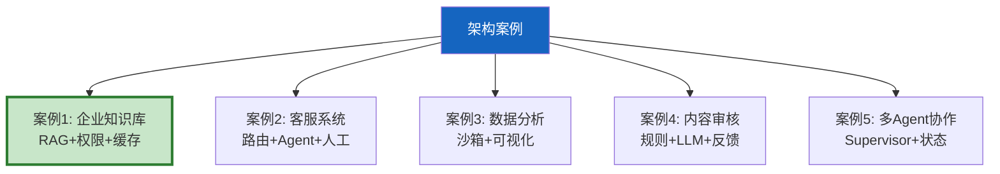

# LLM 应用架构案例研究最新

> 知识库 48 仅 198 行。这篇用 5 个真实场景的架构案例，展示如何把前面学的所有知识组合成完整系统。

---

## 一、5 个架构案例



---

## 二、案例详解

```python
class ArchitectureCases:
    """5个真实架构案例。"""

    CASES = &#123;
        "企业知识库": &#123;
            "场景": "企业内部文档问答",
            "架构": [
                "FastAPI → 语义缓存 → 模型路由 → RAG管线 → 权限过滤 → LLM生成",
                "离线ETL: 文档→清洗→分块→嵌入→向量库",
                "在线: 查询→缓存检查→检索→后处理→生成→引用溯源",
            ],
            "核心技术": ["RAG", "文档级权限", "语义缓存", "模型路由", "引用溯源"],
            "关键挑战": "权限控制+缓存一致性+数据新鲜度",
        &#125;,
        "智能客服": &#123;
            "场景": "7x24小时客户服务",
            "架构": [
                "用户消息→意图分类→路由(FAQ/投诉/人工)",
                "FAQ→RAG检索→生成",
                "投诉→对话状态跟踪→收集信息→处理",
                "无法处理→人工转接(携带上下文)",
            ],
            "核心技术": ["意图分类", "DST", "条件路由", "人工兜底", "满意度收集"],
            "关键挑战": "多轮对话管理+满意度追踪",
        &#125;,
        "数据分析助手": &#123;
            "场景": "自然语言查询数据",
            "架构": [
                "用户问题→NL2SQL→沙箱执行→可视化→解读",
                "代码执行在Docker沙箱中隔离",
                "结果用matplotlib生成图表",
            ],
            "核心技术": ["NL2SQL", "代码沙箱", "pandas/matplotlib", "安全隔离"],
            "关键挑战": "SQL安全+代码执行安全+可视化生成",
        &#125;,
        "内容审核": &#123;
            "场景": "UGC内容实时审核",
            "架构": [
                "内容→规则审核(关键词/正则)→LLM语义审核→置信度路由",
                "置信度>0.9→放行",
                "置信度<0.5→拒绝",
                "中间→转人工",
            ],
            "核心技术": ["规则过滤", "LLM审核", "置信度路由", "人工兜底"],
            "关键挑战": "误杀率控制+审核速度",
        &#125;,
        "多Agent协作": &#123;
            "场景": "复杂研究任务",
            "架构": [
                "Supervisor→研究Agent→分析Agent→批判Agent→写作Agent",
                "批判后可回到研究重新执行",
                "各Agent在State中共享产出",
            ],
            "核心技术": ["Supervisor模式", "条件路由", "状态共享", "质量检查循环"],
            "关键挑战": "Agent协调+状态一致性+循环检测",
        &#125;,
    &#125;

    @classmethod
    def get_case(cls, name: str) -> dict:
        return cls.CASES.get(name, &#123;"error": "案例不存在"&#125;)
```

---

## 三、架构选型决策

```mermaid
graph TB
    Q1["场景?"] --> Q2&#123;"需多步推理?"&#125;
    Q2 -->|否| SIMPLE["简单RAG管线"]
    Q2 -->|是| Q3&#123;"需多Agent?"&#125;
    Q3 -->|是| MULTI["多Agent协作"]
    Q3 -->|否| Q4&#123;"需人工审批?"&#125;
    Q4 -->|是| HUMAN["人机协作"]
    Q4 -->|否| AGENT["单Agent+工具"]

    style MULTI fill:#C8E6C9
    style HUMAN fill:#FFF9C4
```

---

## 四、最佳实践

| 案例 | 核心组件 | 关键挑战 |
|------|----------|----------|
| 企业知识库 | RAG+权限+缓存 | 数据新鲜度 |
| 智能客服 | 路由+DST+人工 | 多轮管理 |
| 数据分析 | NL2SQL+沙箱 | 安全隔离 |
| 内容审核 | 规则+LLM+路由 | 误杀率 |
| 多Agent | Supervisor+状态 | 协调一致性 |

---

## 五、检查清单

| 检查项 | 状态 |
|--------|------|
| 有5个架构案例 | ☐ |
| 有选型决策 | ☐ |
