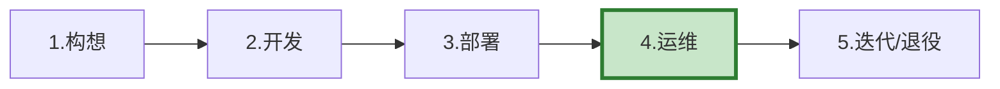
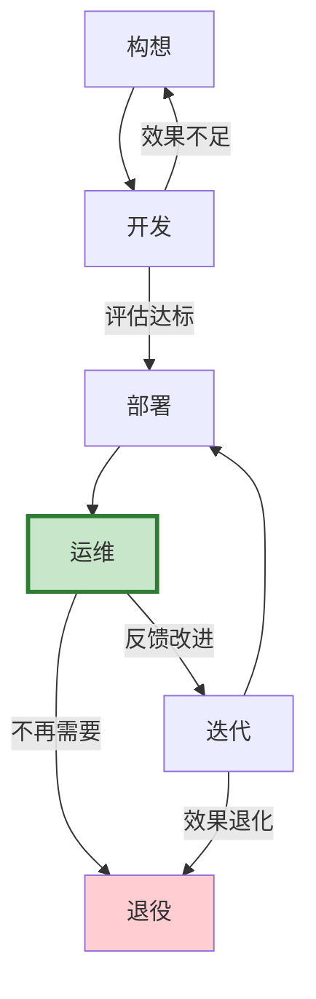

# LLM 应用全生命周期管理最新

> 知识库 50 仅 192 行。这篇讲透 LLM 应用从构想到下线的完整生命周期——开发、部署、运维、迭代、退役。

---

## 一、生命周期五阶段



---

## 二、各阶段详解

```python
class LifecycleStages:
    """LLM应用生命周期五阶段。"""

    STAGES = &#123;
        "1.构想": &#123;
            "活动": ["需求分析", "可行性评估", "技术选型", "架构设计"],
            "产出": ["需求文档", "架构设计文档", "技术选型决策"],
            "关键问题": "用LLM值得吗？传统方案不够吗？",
        &#125;,
        "2.开发": &#123;
            "活动": ["环境搭建", "Prompt开发", "RAG建库", "工具集成", "测试集构建"],
            "产出": ["可运行的Agent", "测试集", "评估基线"],
            "关键问题": "效果达标吗？测试集覆盖够吗？",
        &#125;,
        "3.部署": &#123;
            "活动": ["Docker化", "部署到staging", "灰度发布", "监控配置"],
            "产出": ["生产部署", "监控仪表盘", "告警规则"],
            "关键问题": "性能达标吗？安全合规吗？",
        &#125;,
        "4.运维": &#123;
            "活动": ["监控告警", "日志分析", "反馈收集", "问题排查", "容量管理"],
            "产出": ["运维报告", "SLO报告", "反馈分析"],
            "关键问题": "SLO达标吗？用户满意吗？成本可控吗？",
        &#125;,
        "5.迭代/退役": &#123;
            "活动": ["效果评估", "A/B测试新版本", "灰度上线", "旧版本下线"],
            "产出": ["版本变更", "评估报告", "退役计划"],
            "关键问题": "新版本更好吗？需要回滚吗？",
        &#125;,
    &#125;
```

---

## 三、阶段间流转



---

## 四、各阶段检查清单

```python
class LifecycleChecklist:
    """各阶段检查清单。"""

    CHECKS = &#123;
        "构想": [
            "需求清晰可量化",
            "LLM确实比传统方案好",
            "有预算估算",
            "有架构设计",
        ],
        "开发": [
            "环境配置完成",
            "Prompt/Prompt版本管理",
            "RAG知识库已建",
            "测试集≥50条",
            "评估基线已建立",
            "安全防护已实现",
        ],
        "部署": [
            "Docker镜像构建",
            "staging验证通过",
            "灰度发布配置",
            "监控告警配置",
            "SLO定义",
            "回滚方案",
        ],
        "运维": [
            "SLO达标",
            "告警正常",
            "反馈收集机制",
            "成本在预算内",
            "定期安全审计",
        ],
        "迭代": [
            "A/B测试验证",
            "灰度发布通过",
            "效果对比基线",
            "回滚能力验证",
        ],
    &#125;
```

---

## 五、最佳实践

| 阶段 | 关键实践 | 优先级 |
|------|----------|--------|
| 构想 | 先问"传统方案够不够" | ★★★ |
| 开发 | 测试集先行 | ★★★ |
| 部署 | 灰度+回滚 | ★★★ |
| 运维 | SLO驱动 | ★★★ |
| 迭代 | A/B验证才上线 | ★★☆ |

---

## 六、检查清单

| 检查项 | 状态 |
|--------|------|
| 知道五阶段 | ☐ |
| 有各阶段检查 | ☐ |
