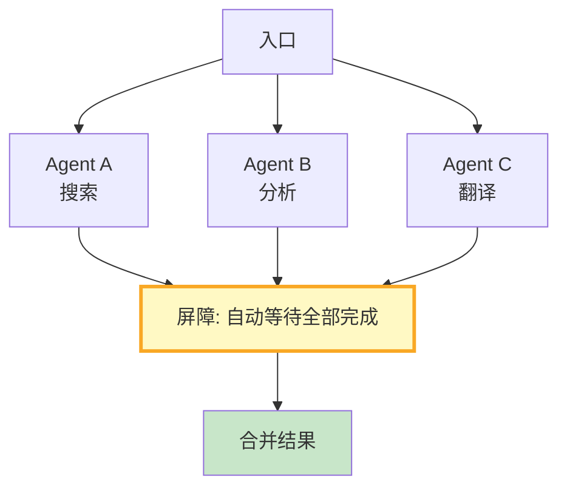

# LangGraph 并行与扇出最新

> 知识库 67 有 184 行。这篇讲透——Send API 并行执行、屏障等待和结果合并。

---

## 一、并行执行架构



---

## 二、实现

```python
from langgraph.graph import StateGraph, START, END
from typing import TypedDict, Annotated
from operator import add
import asyncio

class ParallelState(TypedDict):
    task: str
    results: Annotated[list[str], add]  # 并行结果自动追加

class ParallelExecutor:
    """并行执行器。"""

    @staticmethod
    def build(agent_a_handler, agent_b_handler, agent_c_handler):
        """构建并行图。"""
        graph = StateGraph(ParallelState)

        async def node_a(state):
            result = await agent_a_handler(state["task"])
            return &#123;"results": [result]&#125;

        async def node_b(state):
            result = await agent_b_handler(state["task"])
            return &#123;"results": [result]&#125;

        async def node_c(state):
            result = await agent_c_handler(state["task"])
            return &#123;"results": [result]&#125;

        async def merge(state):
            # 此时所有并行结果已在results中
            return &#123;"results": state["results"]&#125;

        graph.add_node("agent_a", node_a)
        graph.add_node("agent_b", node_b)
        graph.add_node("agent_c", node_c)
        graph.add_node("merge", merge)

        # 从START并行扇出到A/B/C
        graph.add_edge(START, "agent_a")
        graph.add_edge(START, "agent_b")
        graph.add_edge(START, "agent_c")

        # A/B/C都完成后到merge
        graph.add_edge("agent_a", "merge")
        graph.add_edge("agent_b", "merge")
        graph.add_edge("agent_c", "merge")
        graph.add_edge("merge", END)

        return graph.compile()


class ParallelTasks:
    """并行任务工具集。"""

    @staticmethod
    async def run_parallel(tasks: list[callable], *args) -> list:
        """并行执行多个异步任务。"""
        results = await asyncio.gather(*[t(*args) for t in tasks], return_exceptions=True)
        return [
            r if not isinstance(r, Exception) else f"错误: &#123;r&#125;"
            for r in results
        ]

    @staticmethod
    async def run_with_barrier(tasks: list[callable], timeout: float = 30) -> dict:
        """带屏障的并行执行——等全部完成或超时。"""
        try:
            results = await asyncio.wait_for(
                asyncio.gather(*tasks),
                timeout=timeout,
            )
            return &#123;"status": "completed", "results": results&#125;
        except asyncio.TimeoutError:
            return &#123;"status": "timeout", "results": []&#125;
```

---

## 三、最佳实践

| 实践 | 说明 | 优先级 |
|------|------|--------|
| 用add reducer | 并行结果自动追加 | ★★★ |
| 从START多边 | 实现并行扇出 | ★★★ |
| 有超时保护 | 防止某个任务卡住 | ★★★ |
| 并行结果合并 | 统一处理 | ★★☆ |
| 失败不影响其他 | return_exceptions | ★★☆ |

---

## 四、检查清单

| 检查项 | 状态 |
|--------|------|
| 有并行图构建 | ☐ |
| 有屏障执行 | ☐ |
