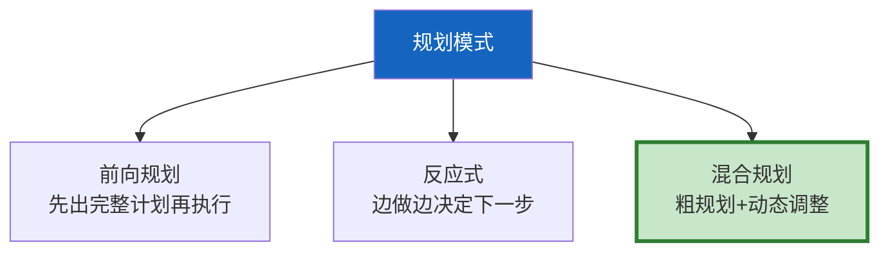

# Agent 规划与推理链最新

> 知识库 71 有 199 行、知识库 209 有深度。这篇整合为最新——规划模式、推理链管理和动态调整。

---

## 一、规划模式速查



---

## 二、实现

```python
from dataclasses import dataclass, field
from langchain_core.language_models import BaseChatModel
from langchain_core.messages import HumanMessage
import json, re

@dataclass
class PlanStep:
    """计划步骤。"""
    step_id: int
    action: str
    tool: str = ""
    depends_on: list[int] = field(default_factory=list)
    status: str = "pending"  # pending/done/failed

@dataclass
class ReasoningStep:
    """推理步骤。"""
    step_num: int
    observation: str = ""
    reasoning: str = ""
    action: str = ""
    confidence: float = 0.8

PLANNING_PROMPT = """为以下任务制定执行计划。

任务: &#123;goal&#125;
可用工具: &#123;tools&#125;

输出3-7个步骤的JSON:
```json
[&#123;&#123;"step_id": 1, "action": "...", "tool": "...", "depends_on": []&#125;&#125;]
```"""

class ForwardPlanner:
    """前向规划器。"""

    def __init__(self, llm: BaseChatModel):
        self.llm = llm

    async def create_plan(self, goal: str, tools: list[str]) -> list[PlanStep]:
        prompt = PLANNING_PROMPT.format(goal=goal, tools=tools)
        response = await self.llm.ainvoke([HumanMessage(content=prompt)])
        match = re.search(r'\[.*\]', response.content, re.DOTALL)
        if match:
            data = json.loads(match.group())
            return [PlanStep(**s) for s in data]
        return [PlanStep(step_id=1, action=goal)]

    async def replan(self, original_plan: list[PlanStep], failed_step: PlanStep) -> list[PlanStep]:
        """失败后重新规划。"""
        remaining = [s for s in original_plan if s.status == "pending" and s.step_id > failed_step.step_id]
        # 简化：返回剩余步骤
        return remaining


class ReasoningChain:
    """推理链管理器。"""

    def __init__(self):
        self.steps: list[ReasoningStep] = []

    def add(self, observation: str, reasoning: str, action: str):
        self.steps.append(ReasoningStep(
            step_num=len(self.steps) + 1,
            observation=observation[:200],
            reasoning=reasoning[:200],
            action=action[:100],
        ))

    def get_trace(self) -> str:
        """获取推理轨迹。"""
        lines = []
        for s in self.steps:
            lines.append(f"步骤&#123;s.step_num&#125;: 观察=&#123;s.observation[:50]&#125; → 推理=&#123;s.reasoning[:50]&#125; → 行动=&#123;s.action[:30]&#125;")
        return "\n".join(lines)

    def detect_loop(self) -> bool:
        """检测循环——连续3次相同action。"""
        if len(self.steps) < 3:
            return False
        recent = self.steps[-3:]
        return all(s.action == recent[0].action for s in recent)
```

---

## 三、最佳实践

| 实践 | 说明 | 优先级 |
|------|------|--------|
| 复杂任务先规划 | 减少跑偏 | ★★★ |
| 简单任务直接执行 | 不过度规划 | ★★★ |
| 失败后重新规划 | 不死板执行 | ★★★ |
| 推理链有记录 | 可追溯 | ★★☆ |
| 检测循环 | 防死循环 | ★★☆ |

---

## 四、检查清单

| 检查项 | 状态 |
|--------|------|
| 有前向规划器 | ☐ |
| 有推理链管理 | ☐ |
| 有循环检测 | ☐ |
