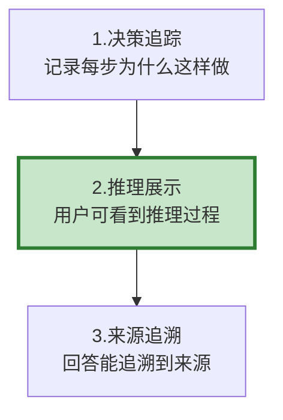

# Agent 决策可解释性最新

> 知识库 76 有 192 行、知识库 211 有深度。这篇整合为最新——决策追踪、推理展示和来源追溯。

---

## 一、可解释性三层



---

## 二、实现

```python
from dataclasses import dataclass, field
from datetime import datetime
from typing import Optional

@dataclass
class DecisionRecord:
    """决策记录。"""
    step: int
    decision: str
    reasoning: str
    alternatives: list[str] = field(default_factory=list)
    selected_reason: str = ""
    confidence: float = 0.8

class DecisionTracker:
    """决策追踪器。"""

    def __init__(self):
        self.decisions: list[DecisionRecord] = []

    def record(self, decision: str, reasoning: str, alternatives: list[str] = None, confidence: float = 0.8):
        self.decisions.append(DecisionRecord(
            step=len(self.decisions) + 1,
            decision=decision,
            reasoning=reasoning,
            alternatives=alternatives or [],
            confidence=confidence,
        ))

    def explanation(self) -> str:
        """生成决策解释。"""
        if not self.decisions:
            return "无决策记录"

        lines = ["## 决策过程"]
        for d in self.decisions:
            lines.append(f"\n### 步骤&#123;d.step&#125;: &#123;d.decision&#125;")
            lines.append(f"推理: &#123;d.reasoning&#125;")
            if d.alternatives:
                lines.append(f"备选: &#123;', '.join(d.alternatives)&#125;")
            lines.append(f"置信度: &#123;d.confidence:.0%&#125;")

        avg_conf = sum(d.confidence for d in self.decisions) / max(len(self.decisions), 1)
        if avg_conf < 0.6:
            lines.append("\n⚠️ 置信度较低，建议人工验证")

        return "\n".join(lines)


class SourceTracer:
    """来源追溯器。"""

    @staticmethod
    def trace(answer: str, sources: list[dict]) -> dict:
        """追溯答案中的信息来源。"""
        import re
        sentences = [s.strip() for s in re.split(r'[。.！!？?]', answer) if len(s.strip()) > 10]

        traced = []
        for sent in sentences:
            supporting = []
            for src in sources:
                common = set(sent.split()) & set(src.get("content", "").split())
                if len(common) > 3:
                    supporting.append(src.get("source", "未知"))
            traced.append(&#123;
                "statement": sent[:80],
                "sources": supporting[:3],
                "has_source": len(supporting) > 0,
            &#125;)

        supported = sum(1 for t in traced if t["has_source"])
        return &#123;
            "total_statements": len(traced),
            "supported": supported,
            "support_rate": round(supported / max(len(traced), 1), 4),
        &#125;
```

---

## 三、最佳实践

| 实践 | 说明 | 优先级 |
|------|------|--------|
| 每步决策记理由 | 不只记做了什么 | ★★★ |
| 低置信度标记 | 提醒验证 | ★★★ |
| 答案追溯来源 | 防幻觉 | ★★★ |
| 推理可折叠展示 | 不打扰用户 | ★★☆ |

---

## 四、检查清单

| 检查项 | 状态 |
|--------|------|
| 有决策追踪器 | ☐ |
| 有来源追溯 | ☐ |
