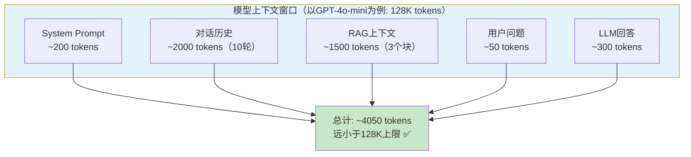
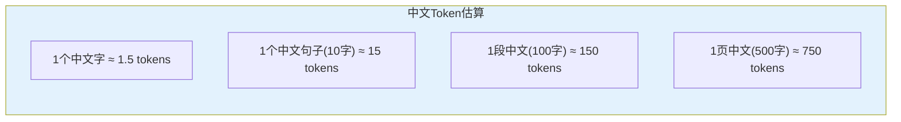

# 上下文窗口与 Token 管理

> 每个模型的上下文窗口有限。超出就报错或截断。这份指南教你管理 Token、截断历史、压缩上下文。

---

## 一、上下文窗口基础

### 1.1 什么是上下文窗口



### 1.2 各模型上下文窗口

| 模型 | 上下文窗口 | 约等于 |
|------|-----------|--------|
| GPT-4o-mini | 128K tokens | ~96,000 个中文字 |
| GPT-4o | 128K tokens | ~96,000 个中文字 |
| Claude 3.5 Sonnet | 200K tokens | ~150,000 个中文字 |
| Gemini 1.5 Pro | 2M tokens | ~1,500,000 个中文字 |
| 通义千问-max | 32K tokens | ~24,000 个中文字 |
| Ollama (Qwen2 7B) | 32K tokens | ~24,000 个中文字 |

### 1.3 超出窗口的后果

```mermaid
graph TB
    subgraph 超出窗口 ["超出上下文窗口的后果"&#125;
        E1["❌ 直接报错<br/>'maximum context length exceeded'<br/>(严格模型)"]
        E2["⚠️ 静默截断<br/>只保留最近的消息<br/>(部分模型)"]
        E3["⚠️ 性能下降<br/>上下文太长时回答质量降低<br/>(虽未超限但影响效果)"]
    end

    style E1 fill:#FFCDD2
    style E2 fill:#FFE0B2
    style E3 fill:#FFF9C4
```

## 二、Token 计算

### 2.1 计算单次调用的 Token

```python
from langchain_openai import ChatOpenAI
from langchain_core.messages import HumanMessage

llm = ChatOpenAI(model="gpt-4o-mini")
response = llm.invoke("你好")

# 查看 Token 使用量
usage = response.usage_metadata
print(f"输入Token: &#123;usage['input_tokens']&#125;")
print(f"输出Token: &#123;usage['output_tokens']&#125;")
print(f"总计Token: &#123;usage['total_tokens']&#125;")
```

### 2.2 预估 Token（不调用API）

```python
# 使用 tiktoken 库预估 Token（OpenAI模型专用）
import tiktoken

def count_tokens(text: str, model: str = "gpt-4o-mini") -> int:
    """预估文本的Token数量"""
    try:
        encoding = tiktoken.encoding_for_model(model)
    except KeyError:
        encoding = tiktoken.get_encoding("cl100k_base")
    return len(encoding.encode(text))

# 使用
text = "你好，今天天气怎么样？"
print(f"'&#123;text&#125;' = &#123;count_tokens(text)&#125; tokens")
# 约 8 tokens

# 预估对话历史总Token
history_tokens = sum(count_tokens(msg.content) for msg in chat_history)
print(f"对话历史: &#123;history_tokens&#125; tokens")
```

### 2.3 中文 Token 经验值



## 三、对话历史截断策略

### 3.1 问题：历史越长越贵

```mermaid
graph TB
    subgraph Token增长 ["对话轮数与Token消耗"&#125;
        R1["第1轮: 100 tokens"]
        R2["第2轮: 300 tokens"]
        R3["第5轮: 800 tokens"]
        R5["第10轮: 2000 tokens"]
        R10["第20轮: 5000 tokens"]
        R20["第50轮: 15000 tokens"]

        R1 --> R2 --> R3 --> R5 --> R10 --> R20
        Note["Token消耗线性增长<br/>成本也在增长"]
    end

    style Token增长 fill:#FFE0B2
```

### 3.2 策略一：窗口截断（最简单）

```python
from langchain_core.messages import HumanMessage, AIMessage

def truncate_history(messages: list, max_messages: int = 20) -> list:
    """只保留最近N条消息"""
    # 保留system消息（如果有）
    system_msgs = [m for m in messages if m.type == "system"]
    other_msgs = [m for m in messages if m.type != "system"]

    # 截断非system消息
    truncated = other_msgs[-max_messages:]

    return system_msgs + truncated

# 使用
history = truncate_history(chat_history, max_messages=10)
```

### 3.3 策略二：Token 感知截断

```python
import tiktoken

def truncate_by_tokens(messages: list, max_tokens: int = 4000) -> list:
    """按Token数截断，确保不超过上限"""
    encoding = tiktoken.get_encoding("cl100k_base")

    system_msgs = [m for m in messages if m.type == "system"]
    other_msgs = [m for m in messages if m.type != "system"]

    # 从后往前保留，直到超过Token上限
    kept = []
    current_tokens = sum(len(encoding.encode(m.content)) for m in system_msgs)

    for msg in reversed(other_msgs):
        msg_tokens = len(encoding.encode(msg.content))
        if current_tokens + msg_tokens > max_tokens:
            break
        kept.insert(0, msg)
        current_tokens += msg_tokens

    return system_msgs + kept
```

### 3.4 策略三：摘要压缩

```python
from langchain_openai import ChatOpenAI
from langchain_core.prompts import ChatPromptTemplate

def summarize_old_history(messages: list, llm, keep_recent: int = 6) -> list:
    """将旧对话压缩为摘要"""
    system_msgs = [m for m in messages if m.type == "system"]
    other_msgs = [m for m in messages if m.type != "system"]

    if len(other_msgs) <= keep_recent:
        return messages  # 不需要压缩

    # 分成旧消息和近期消息
    old_msgs = other_msgs[:-keep_recent]
    recent_msgs = other_msgs[-keep_recent:]

    # 生成摘要
    conversation_text = "\n".join(f"&#123;m.type&#125;: &#123;m.content&#125;" for m in old_msgs)
    prompt = ChatPromptTemplate.from_template(
        "将以下对话总结为简洁的要点（不超过200字）：\n&#123;conversation&#125;\n\n摘要："
    )
    summary = (prompt | llm).invoke(&#123;"conversation": conversation_text&#125;).content

    # 用摘要替换旧消息
    summary_msg = SystemMessage(content=f"之前对话摘要：&#123;summary&#125;")

    return system_msgs + [summary_msg] + recent_msgs
```

### 3.5 截断策略对比

```mermaid
graph TB
    subgraph 策略对比 ["三种截断策略对比"&#125;
        S1["窗口截断<br/>保留最近N条<br/>✅ 最简单<br/>❌ 丢失早期信息"]
        S2["Token截断<br/>按Token上限截断<br/>✅ 精确控制<br/>❌ 仍丢失早期信息"]
        S3["摘要压缩<br/>旧消息→摘要+近期<br/>✅ 保留关键信息<br/>❌ 增加LLM调用"]
    end

    style S1 fill:#E3F2FD
    style S2 fill:#FFF9C4
    style S3 fill:#C8E6C9
```

## 四、RAG 上下文管理

### 4.1 RAG 中的 Token 消耗

```mermaid
graph TB
    subgraph RAG调用Token ["一次RAG调用的Token构成"&#125;
        SP["System Prompt: ~150 tokens"]
        CTX["检索到的上下文: ~1500 tokens<br/>(3个chunk × 500 tokens)"]
        HIST["对话历史: ~500 tokens"]
        Q["用户问题: ~50 tokens"]
        A["LLM回答: ~300 tokens"]
    end

    SP & CTX & HIST & Q & A --> TOTAL["总计: ~2500 tokens/次"]

    NOTE["上下文(CTX)占60%<br/>是Token消耗的大头"]

    style RAG调用Token fill:#E3F2FD
    style TOTAL fill:#FFE0B2
    style NOTE fill:#C8E6C9
```

### 4.2 RAG 上下文优化

```python
def optimize_rag_context(docs: list, max_context_tokens: int = 2000) -> list:
    """优化RAG上下文：在Token限制内最大化信息量"""
    import tiktoken
    encoding = tiktoken.get_encoding("cl100k_base")

    kept_docs = []
    current_tokens = 0

    for doc in docs:  # docs已按相似度排序
        doc_tokens = len(encoding.encode(doc.page_content))
        if current_tokens + doc_tokens > max_context_tokens:
            break
        kept_docs.append(doc)
        current_tokens += doc_tokens

    return kept_docs

# 使用：先检索5个，再按Token限制筛选
raw_docs = vectorstore.similarity_search("query", k=5)
optimized_docs = optimize_rag_context(raw_docs, max_context_tokens=2000)
context = "\n".join(d.page_content for d in optimized_docs)
```

## 五、Token 管理决策树

```mermaid
graph TD
    Q&#123;"Token超限或想优化?"&#125;
    Q -->|"对话历史太长"| H1["截断策略"]
    Q -->|"RAG上下文太长"| R1["减少k值或chunk_size"]
    Q -->|"System Prompt太长"| P1["精简Prompt"]
    Q -->|"单次输出太长"| O1["设max_tokens"]

    H1 --> HQ&#123;"需要记住早期信息?"&#125;
    HQ -->|"否"| HS1["窗口截断<br/>保留最近N轮"]
    HQ -->|"是"| HS2["摘要压缩<br/>旧→摘要+近期→完整"]

    R1 --> RQ&#123;"检索质量?"&#125;
    RQ -->|"好"| RS1["减小k: 5→3"]
    RQ -->|"不好"| RS2["保持k但减小chunk_size"]

    style HS1 fill:#C8E6C9
    style HS2 fill:#C8E6C9
    style RS1 fill:#E3F2FD
    style RS2 fill:#FFF9C4
```

## 六、完整 Token 管理方案

```python
class TokenManager:
    """Token管理器：统一管理对话历史和上下文"""

    def __init__(self, max_input_tokens: int = 4000):
        self.max_input_tokens = max_input_tokens
        self.encoding = tiktoken.get_encoding("cl100k_base")

    def count_tokens(self, text: str) -> int:
        return len(self.encoding.encode(text))

    def count_messages_tokens(self, messages: list) -> int:
        return sum(self.count_tokens(m.content) for m in messages)

    def truncate_history(self, messages: list, keep_recent: int = 10) -> list:
        """截断历史到Token限制内"""
        system_msgs = [m for m in messages if m.type == "system"]
        other_msgs = [m for m in messages if m.type != "system"]

        system_tokens = self.count_messages_tokens(system_msgs)

        kept = []
        current_tokens = system_tokens

        for msg in reversed(other_msgs):
            msg_tokens = self.count_tokens(msg.content)
            if current_tokens + msg_tokens > self.max_input_tokens:
                break
            if len(kept) >= keep_recent:
                break
            kept.insert(0, msg)
            current_tokens += msg_tokens

        return system_msgs + kept

    def optimize_rag_context(self, docs: list, max_tokens: int = 2000) -> list:
        """优化RAG上下文"""
        kept = []
        current = 0
        for doc in docs:
            tokens = self.count_tokens(doc.page_content)
            if current + tokens > max_tokens:
                break
            kept.append(doc)
            current += tokens
        return kept

    def estimate_cost(self, input_tokens: int, output_tokens: int,
                      model: str = "gpt-4o-mini") -> float:
        """估算单次调用成本"""
        prices = &#123;
            "gpt-4o-mini": (0.15, 0.60),
            "gpt-4o": (2.50, 10.00),
        &#125;
        in_price, out_price = prices.get(model, (0.15, 0.60))
        return (input_tokens * in_price + output_tokens * out_price) / 1_000_000
```
