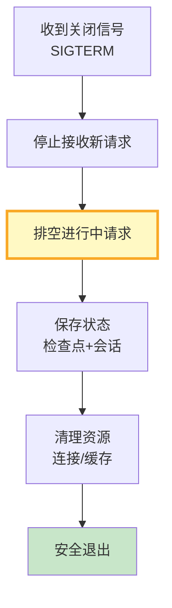

# LLM 应用优雅关闭与重启最新

> 知识库 84 有 192 行。这篇讲透——信号处理、请求排空、状态保存和零停机重启。

---

## 一、优雅关闭流程



---

## 二、实现

```python
import asyncio
import signal
from dataclasses import dataclass, field
from datetime import datetime

@dataclass
class GracefulShutdownConfig:
    """优雅关闭配置。"""
    drain_timeout: int = 30        # 排空超时(秒)
    save_state: bool = True        # 保存状态
    cleanup_resources: bool = True # 清理资源

class GracefulShutdownManager:
    """优雅关闭管理器。"""

    def __init__(self, config: GracefulShutdownConfig = GracefulShutdownConfig()):
        self.config = config
        self._active_requests: int = 0
        self._shutting_down: bool = False
        self._lock = asyncio.Lock()

    async def handle_request(self, request_handler: callable, *args):
        """处理请求——关闭时拒绝新请求。"""
        if self._shutting_down:
            return &#123;"error": "服务正在关闭", "code": 503&#125;

        async with self._lock:
            self._active_requests += 1

        try:
            return await request_handler(*args)
        finally:
            async with self._lock:
                self._active_requests -= 1

    async def shutdown(self, save_callback: callable = None):
        """优雅关闭。"""
        self._shutting_down = True
        print(f"[关闭] 停止接收新请求，等待&#123;self._active_requests&#125;个请求完成...")

        # 等待请求排空
        timeout = self.config.drain_timeout
        start = time.time()
        while self._active_requests > 0 and (time.time() - start) < timeout:
            await asyncio.sleep(0.5)

        # 保存状态
        if self.config.save_state and save_callback:
            await save_callback()

        print("[关闭] 清理资源...")
        # 清理资源（连接、缓存等）
        # ...

        print("[关闭] 安全退出")

    def register_signal_handlers(self, shutdown_callback: callable):
        """注册信号处理器。"""
        loop = asyncio.get_event_loop()
        for sig in (signal.SIGTERM, signal.SIGINT):
            loop.add_signal_handler(sig, lambda: asyncio.create_task(shutdown_callback()))
```

---

## 三、最佳实践

| 实践 | 说明 | 优先级 |
|------|------|--------|
| 停止接收新请求 | 关闭时拒绝503 | ★★★ |
| 排空进行中请求 | 不中断用户 | ★★★ |
| 保存检查点状态 | 重启后恢复 | ★★☆ |
| 有超时保护 | 不无限等待 | ★★★ |

---

## 四、检查清单

| 检查项 | 状态 |
|--------|------|
| 有优雅关闭管理器 | ☐ |
| 有信号处理 | ☐ |
