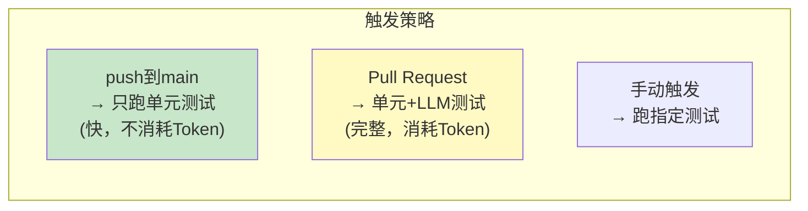
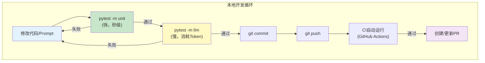

# CI/CD 与自动化测试

> 把 LLM 应用纳入持续集成流水线，确保每次改动不引入回归。

---

## 一、为什么 LLM 应用需要 CI/CD

```mermaid
graph TB
    subgraph 传统CI ["传统软件CI"&#125;
        T1["代码提交"] --> T2["运行单元测试"]
        T2 --> T3["代码质量检查"]
        T3 --> T4["部署"]
    end

    subgraph LLM应用CI ["LLM应用CI（额外需要）"&#125;
        L1["代码提交"] --> L2["单元测试<br/>(非LLM部分)"]
        L2 --> L3["LLM评估测试<br/>(固定测试集)"]
        L3 --> L4["Prompt回归测试"]
        L4 --> L5["部署"]
    end

    style 传统CI fill:#E3F2FD
    style LLM应用CI fill:#FFF3E0
```

## 二、测试策略分层

```mermaid
graph TB
    subgraph 测试金字塔 ["LLM应用测试金字塔"&#125;
        TOP["顶层: 人工评估<br/>抽样检查最终输出<br/>频率: 每次发布前"]
        MID["中层: LLM评估<br/>用LLM评价LLM输出<br/>频率: 每次PR"]
        BOT["底层: 单元测试<br/>测试非LLM逻辑<br/>频率: 每次提交"]
    end

    BOT --> MID --> TOP

    style BOT fill:#C8E6C9
    style MID fill:#FFF9C4
    style TOP fill:#FFE0B2
```

### 2.1 底层：单元测试（非LLM逻辑）

```python
# tests/test_utils.py
import pytest
from utils.token_manager import TokenManager

class TestTokenManager:
    def setup_method(self):
        self.tm = TokenManager(max_input_tokens=100)

    def test_count_tokens(self):
        count = self.tm.count_tokens("hello world")
        assert count > 0
        assert isinstance(count, int)

    def test_truncate_history(self):
        from langchain_core.messages import HumanMessage, AIMessage
        messages = [
            HumanMessage(content=f"消息&#123;i&#125;") for i in range(50)
        ]
        truncated = self.tm.truncate_history(messages, keep_recent=10)
        assert len(truncated) <= 10

    def test_optimize_rag_context(self):
        from langchain_core.documents import Document
        docs = [Document(page_content="测试" * 100) for _ in range(10)]
        optimized = self.tm.optimize_rag_context(docs, max_tokens=200)
        # 应该被截断到Token限制内
        total_tokens = sum(self.tm.count_tokens(d.page_content) for d in optimized)
        assert total_tokens <= 200

# 运行: pytest tests/test_utils.py -v
```

### 2.2 中层：LLM 评估测试

```python
# tests/test_llm_eval.py
import pytest
from chains.qa_chain import get_qa_chain
from chains.rag_chain import get_rag_chain

# 测试数据集
QA_TEST_CASES = [
    &#123;
        "question": "LangChain是什么？",
        "expected_keywords": ["框架", "LLM"],
        "expected_source": None,
    &#125;,
    &#123;
        "question": "RAG的步骤有哪些？",
        "expected_keywords": ["检索", "生成", "加载"],
        "expected_source": None,
    &#125;,
]

class TestQAChain:
    """问答链测试"""

    @pytest.fixture(scope="class")
    def chain(self):
        return get_qa_chain()

    @pytest.mark.parametrize("case", QA_TEST_CASES)
    def test_qa_keywords(self, chain, case):
        """测试回答包含期望关键词"""
        result = chain.invoke(&#123;"input": case["question"]&#125;)
        for keyword in case["expected_keywords"]:
            assert keyword in result, f"回答中缺少关键词: &#123;keyword&#125;\n回答: &#123;result&#125;"

    @pytest.mark.parametrize("case", QA_TEST_CASES)
    def test_qa_not_empty(self, chain, case):
        """测试回答不为空"""
        result = chain.invoke(&#123;"input": case["question"]&#125;)
        assert len(result.strip()) > 10

# 运行: pytest tests/test_llm_eval.py -v
# 注意：需要API Key，且会消耗Token
```

### 2.3 中层：Prompt 回归测试

```python
# tests/test_prompt_regression.py
import pytest

class TestPromptRegression:
    """Prompt回归测试：确保修改Prompt后不降低质量"""

    BASE_PROMPT_VERSION = "v1.0"

    @pytest.fixture
    def chain(self):
        from chains.qa_chain import get_qa_chain
        return get_qa_chain()

    def test_greeting(self, chain):
        """测试问候场景"""
        result = chain.invoke(&#123;"input": "你好"&#125;)
        assert "你好" in result or "您好" in result
        assert len(result) < 200  # 不应太长

    def test_unknown_question(self, chain):
        """测试未知问题"""
        result = chain.invoke(&#123;"input": "请告诉我宇宙的终极答案"&#125;)
        # 应该给出某种回答（不检查正确性，只检查格式）
        assert isinstance(result, str)
        assert len(result) > 5

    def test_chinese_quality(self, chain):
        """测试中文输出质量"""
        result = chain.invoke(&#123;"input": "什么是Python？"&#125;)
        # 检查是否是中文回答
        chinese_chars = sum(1 for c in result if '\u4e00' <= c <= '\u9fff')
        assert chinese_chars > 10, "回答中中文太少"
```

## 三、pytest 配置

### 3.1 pytest.ini

```ini
# pytest.ini
[pytest]
testpaths = tests
python_files = test_*.py
python_classes = Test*
python_functions = test_*
markers =
    unit: 单元测试（不调用LLM）
    llm: LLM测试（消耗Token）
    slow: 慢测试
addopts = -v --tb=short
```

### 3.2 conftest.py

```python
# tests/conftest.py
import pytest
import os
from dotenv import load_dotenv

load_dotenv()

def pytest_configure(config):
    """检查API Key"""
    if not os.getenv("OPENAI_API_KEY"):
        pytest.exit("⚠️ 未设置OPENAI_API_KEY，跳过LLM测试")

def pytest_collection_modifyitems(config, items):
    """自动标记"""
    for item in items:
        # 含'llm'的测试标记为llm
        if "llm" in item.nodeid.lower():
            item.add_marker(pytest.mark.llm)
        # 含'eval'的测试标记为slow
        if "eval" in item.nodeid.lower():
            item.add_marker(pytest.mark.slow)
```

### 3.3 分层运行

```bash
# 只运行单元测试（快，不消耗Token）
pytest tests/ -m unit

# 运行LLM测试（慢，消耗Token）
pytest tests/ -m llm

# 跳过慢测试
pytest tests/ -m "not slow"

# 运行全部
pytest tests/
```

## 四、GitHub Actions CI

### 4.1 CI 流水线

```mermaid
graph TB
    subgraph CI流水线 ["GitHub Actions CI"&#125;
        S1["1. Checkout<br/>拉取代码"]
        S2["2. Setup Python<br/>安装Python 3.11"]
        S3["3. Install deps<br/>pip install -r requirements.txt"]
        S4["4. Unit tests<br/>pytest -m unit<br/>(快，不消耗Token)"]
        S5["5. LLM tests<br/>pytest -m llm<br/>(可选，PR时运行)"]
        S6["6. Report<br/>生成测试报告"]
    end

    S1 --> S2 --> S3 --> S4 --> S5 --> S6

    style S4 fill:#C8E6C9
    style S5 fill:#FFF9C4
```

### 4.2 GitHub Actions 配置

```yaml
# .github/workflows/ci.yml
name: CI

on:
  push:
    branches: [main, develop]
  pull_request:
    branches: [main]

jobs:
  unit-tests:
    runs-on: ubuntu-latest
    steps:
      - uses: actions/checkout@v4

      - name: Setup Python
        uses: actions/setup-python@v5
        with:
          python-version: '3.11'

      - name: Install dependencies
        run: |
          pip install -r requirements.txt
          pip install pytest pytest-cov

      - name: Run unit tests
        run: pytest tests/ -m unit --cov=chains --cov=utils --cov-report=xml

      - name: Upload coverage
        uses: codecov/codecov-action@v4
        if: always()

  llm-tests:
    runs-on: ubuntu-latest
    if: github.event_name == 'pull_request'
    steps:
      - uses: actions/checkout@v4

      - name: Setup Python
        uses: actions/setup-python@v5
        with:
          python-version: '3.11'

      - name: Install dependencies
        run: pip install -r requirements.txt && pip install pytest

      - name: Run LLM tests
        env:
          OPENAI_API_KEY: $&#123;&#123; secrets.OPENAI_API_KEY &#125;&#125;
        run: pytest tests/ -m llm --tb=short

      - name: Comment PR with results
        if: always()
        uses: actions/github-script@v7
        with:
          script: |
            const conclusion = '$&#123;&#123; job.status &#125;&#125;' === 'success' ? '✅' : '❌'
            github.rest.issues.createComment(&#123;
              ...context.repo,
              issue_number: context.issue.number,
              body: `$&#123;conclusion&#125; LLM测试$&#123;&#123; job.status &#125;&#125;`
            &#125;)
```

### 4.3 CI 触发策略



## 五、质量门禁

```mermaid
graph TB
    subgraph 质量门禁 ["质量门禁规则"&#125;
        G1["单元测试: 100%通过<br/>否则阻止合并"]
        G2["代码覆盖率: ≥80%<br/>(非LLM部分)"]
        G3["LLM测试: 关键词检查通过<br/>(允许语义变化)"]
        G4["LLM测试: 回归检查通过<br/>(已知问题不重现)"]
    end

    style G1 fill:#FFCDD2
    style G2 fill:#FFE0B2
    style G3 fill:#FFF9C4
    style G4 fill:#C8E6C9
```

```yaml
# .github/workflows/quality-gate.yml
- name: Quality Gate
  run: |
    # 检查单元测试通过率
    pytest tests/ -m unit --tb=short
    if [ $? -ne 0 ]; then
      echo "❌ 单元测试未通过，阻止合并"
      exit 1
    fi

    # 检查覆盖率
    COVERAGE=$(pytest tests/ -m unit --cov=chains --cov-report=term | grep TOTAL | awk '&#123;print $NF&#125;' | tr -d '%')
    if [ $COVERAGE -lt 80 ]; then
      echo "⚠️ 覆盖率 $&#123;COVERAGE&#125;% 低于 80%"
      exit 1
    fi

    echo "✅ 质量门禁通过"
```

## 六、本地开发工作流



### 本地快捷脚本

```bash
#!/bin/bash
# scripts/test.sh - 本地测试快捷脚本

echo "🏃 运行单元测试..."
pytest tests/ -m unit --tb=short

if [ $? -ne 0 ]; then
    echo "❌ 单元测试失败"
    exit 1
fi

echo "🤖 运行LLM测试（需要API Key）..."
pytest tests/ -m llm --tb=short -x  # -x: 第一个失败就停止

if [ $? -ne 0 ]; then
    echo "⚠️ LLM测试有失败"
    read -p "是否继续提交？(y/N) " -n 1 -r
    if [[ ! $REPLY =~ ^[Yy]$ ]]; then
        exit 1
    fi
fi

echo "✅ 所有测试通过"
```
