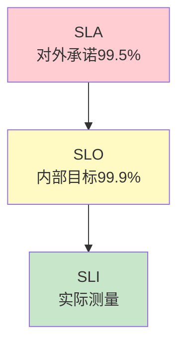

# LLM 应用 SLO 与告警最新

> 知识库 89 有 180 行、知识库 178 有深度。这篇整合为最新——SLI/SLO/错误预算和告警规则。

---

## 一、SLA/SLO/SLI 三层



---

## 二、实现

```python
from dataclasses import dataclass, field
from collections import defaultdict
from datetime import datetime, timedelta

@dataclass
class SLIMetric:
    """SLI指标。"""
    name: str
    target: float
    current: float = 0

LLM_SLIS = &#123;
    "availability": SLIMetric("可用性", 0.999),
    "latency_p95": SLIMetric("P95延迟", 3000),
    "error_rate": SLIMetric("错误率", 0.01),
    "quality_score": SLIMetric("质量评分", 0.85),
&#125;

class ErrorBudgetManager:
    """错误预算管理器。"""

    @staticmethod
    def calculate(slo_target: float = 0.999, window_days: int = 30) -> dict:
        error_ratio = 1 - slo_target
        total_minutes = window_days * 24 * 60
        budget_minutes = error_ratio * total_minutes
        return &#123;
            "slo": f"&#123;slo_target*100&#125;%",
            "budget_minutes": round(budget_minutes, 1),
            "window_days": window_days,
        &#125;

    @staticmethod
    def check_usage(slo: float, downtime_minutes: float, window_days: int = 30) -> dict:
        budget = ErrorBudgetManager.calculate(slo, window_days)
        total = budget["budget_minutes"]
        remaining = total - downtime_minutes
        usage_pct = (downtime_minutes / total) * 100 if total > 0 else 100

        if usage_pct >= 100:
            action = "冻结新功能，专注稳定性"
            status = "exhausted"
        elif usage_pct >= 80:
            action = "谨慎发布"
            status = "warning"
        else:
            action = "可正常发布"
            status = "healthy"

        return &#123;
            "total_budget": round(total, 1),
            "used": round(downtime_minutes, 1),
            "remaining": round(remaining, 1),
            "usage_pct": round(usage_pct, 1),
            "status": status,
            "action": action,
        &#125;


class AlertRules:
    """告警规则。"""

    RULES = &#123;
        "availability_drop": &#123;"condition": "可用性<99.5%", "severity": "critical"&#125;,
        "latency_p95_high": &#123;"condition": "P95>5s", "severity": "high"&#125;,
        "error_rate_high": &#123;"condition": "错误率>5%", "severity": "high"&#125;,
        "budget_burning": &#123;"condition": "错误预算>80%", "severity": "warning"&#125;,
    &#125;

    @classmethod
    def evaluate(cls, metrics: dict) -> list[dict]:
        """评估告警。"""
        triggered = []
        if metrics.get("availability", 100) < 99.5:
            triggered.append(cls.RULES["availability_drop"])
        if metrics.get("latency_p95", 0) > 5000:
            triggered.append(cls.RULES["latency_p95_high"])
        if metrics.get("error_rate", 0) > 5:
            triggered.append(cls.RULES["error_rate_high"])
        return triggered
```

---

## 三、最佳实践

| 实践 | 说明 | 优先级 |
|------|------|--------|
| SLO比SLA高0.1% | 留缓冲 | ★★★ |
| 错误预算驱动发布 | 用完冻结 | ★★★ |
| P95不是平均 | 平均被异常拉偏 | ★★★ |
| 每月回顾SLO | 调整不合理目标 | ★★☆ |

---

## 四、检查清单

| 检查项 | 状态 |
|--------|------|
| 有SLI指标 | ☐ |
| 有错误预算 | ☐ |
| 有告警规则 | ☐ |
