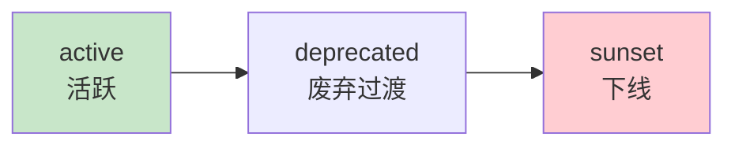

# Agent 工具版本管理最新

> 知识库 91 有 158 行、知识库 221 有深度。这篇整合为最新——语义版本、兼容检查和废弃流程。

---

## 一、版本管理



---

## 二、实现

```python
from dataclasses import dataclass
from enum import Enum
from datetime import datetime
from typing import Callable

class VersionStatus(str, Enum):
    ACTIVE = "active"
    DEPRECATED = "deprecated"
    SUNSET = "sunset"

@dataclass
class ToolVersion:
    """工具版本。"""
    tool_name: str
    version: str          # "1.0.0" 语义版本
    handler: Callable
    status: VersionStatus = VersionStatus.ACTIVE
    changelog: str = ""
    breaking_changes: str = ""
    deprecated_at: str = ""
    sunset_date: str = ""

class ToolVersionRegistry:
    """工具版本注册表。"""

    def __init__(self):
        self.versions: dict[str, list[ToolVersion]] = &#123;&#125;

    def register(self, version: ToolVersion):
        """注册新版本。"""
        if version.tool_name not in self.versions:
            self.versions[version.tool_name] = []
        self.versions[version.tool_name].append(version)

    def get_active(self, tool_name: str) -> ToolVersion | None:
        """获取活跃版本。"""
        for v in reversed(self.versions.get(tool_name, [])):
            if v.status == VersionStatus.ACTIVE:
                return v
        return None

    def get_compatible(self, tool_name: str, required_major: str = "") -> ToolVersion | None:
        """获取兼容版本——major相同=兼容。"""
        active = self.get_active(tool_name)
        if not active or not required_major:
            return active
        active_major = active.version.split(".")[0]
        if active_major == required_major:
            return active
        return active  # 兜底返回活跃版本

    def deprecate(self, tool_name: str, version: str, sunset_date: str = ""):
        """标记版本废弃。"""
        for v in self.versions.get(tool_name, []):
            if v.version == version:
                v.status = VersionStatus.DEPRECATED
                v.deprecated_at = datetime.now().isoformat()
                v.sunset_date = sunset_date

    def history(self, tool_name: str) -> list[dict]:
        """版本历史。"""
        return [
            &#123;"version": v.version, "status": v.status.value, "changelog": v.changelog&#125;
            for v in self.versions.get(tool_name, [])
        ]
```

---

## 三、最佳实践

| 实践 | 说明 | 优先级 |
|------|------|--------|
| 用语义版本号 | major.minor.patch | ★★★ |
| 新版本向后兼容 | 不破坏旧调用 | ★★★ |
| 废弃给过渡期 | deprecated→sunset | ★★★ |
| 有changelog | 每次变更记录 | ★★☆ |

---

## 四、检查清单

| 检查项 | 状态 |
|--------|------|
| 有版本注册表 | ☐ |
| 有兼容检查 | ☐ |
| 有废弃流程 | ☐ |
