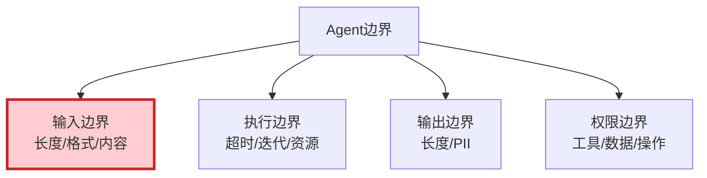

# Agent 边界与异常输入处理最新

> 知识库 98 仅 167 行、知识库 223 有深度。这篇整合为最新——输入边界、执行边界和优雅降级。

---

## 一、4类边界



---

## 二、实现

```python
import re
from dataclasses import dataclass
from enum import Enum

class RiskLevel(str, Enum):
    SAFE = "safe"
    WARNING = "warning"
    DANGEROUS = "dangerous"

class InputBoundaryChecker:
    """输入边界检查器。"""

    MAX_LENGTH = 10000
    BLOCKED_PATTERNS = [
        (r"ignore.&#123;0,15&#125;(previous|above|all).&#123;0,15&#125;(instruction|prompt)", "指令覆盖"),
        (r"(DAN|do anything now)", "越狱"),
        (r"__import__\s*\(", "代码注入"),
    ]

    @classmethod
    def check(cls, user_input: str) -> dict:
        """完整边界检查。"""
        issues = []
        sanitized = user_input

        # 1. 空输入
        if not user_input.strip():
            return &#123;"valid": False, "risk": RiskLevel.WARNING, "sanitized": "", "issues": ["空输入"]&#125;

        # 2. 长度限制
        if len(user_input) > cls.MAX_LENGTH:
            sanitized = user_input[:cls.MAX_LENGTH]
            issues.append("超长已截断")

        # 3. 危险模式
        dangerous = []
        for pattern, desc in cls.BLOCKED_PATTERNS:
            if re.search(pattern, sanitized, re.IGNORECASE):
                dangerous.append(desc)
                sanitized = re.sub(pattern, "[已过滤]", sanitized, flags=re.IGNORECASE)

        if dangerous:
            return &#123;"valid": False, "risk": RiskLevel.DANGEROUS, "sanitized": sanitized, "issues": [f"危险: &#123;', '.join(dangerous)&#125;"]&#125;

        risk = RiskLevel.WARNING if issues else RiskLevel.SAFE
        return &#123;"valid": True, "risk": risk, "sanitized": sanitized, "issues": issues&#125;


class ExecutionBoundary:
    """执行边界控制。"""

    def __init__(self, max_iterations=15, max_time=60, max_tool_calls=10):
        self.max_iter = max_iterations
        self.max_time = max_time
        self.max_tools = max_tool_calls

    def check(self, iterations, elapsed, tool_calls) -> dict:
        if iterations >= self.max_iter:
            return &#123;"exceeded": True, "reason": f"超过最大迭代&#123;self.max_iter&#125;"&#125;
        if elapsed >= self.max_time:
            return &#123;"exceeded": True, "reason": f"超过最大时间&#123;self.max_time&#125;s"&#125;
        if tool_calls >= self.max_tools:
            return &#123;"exceeded": True, "reason": f"超过工具调用&#123;self.max_tools&#125;次"&#125;
        return &#123;"exceeded": False&#125;


class GracefulDegradation:
    """优雅降级。"""

    @staticmethod
    def handle(risk_result: dict) -> dict:
        risk = risk_result.get("risk", RiskLevel.SAFE)
        if risk == RiskLevel.SAFE:
            return &#123;"action": "process", "input": risk_result["sanitized"]&#125;
        elif risk == RiskLevel.WARNING:
            return &#123;"action": "process_cleaned", "input": risk_result["sanitized"]&#125;
        else:
            return &#123;"action": "reject", "message": f"危险输入: &#123;risk_result.get('issues', [])&#125;"&#125;
```

---

## 三、最佳实践

| 边界 | 策略 | 优先级 |
|------|------|--------|
| 输入长度 | ≤10000字符 | ★★★ |
| 危险模式 | 模式匹配检测 | ★★★ |
| 最大迭代 | ≤15次 | ★★★ |
| 最大时间 | ≤60秒 | ★★★ |
| 优雅降级 | 不崩溃 | ★★★ |

---

## 四、检查清单

| 检查项 | 状态 |
|--------|------|
| 有输入边界检查 | ☐ |
| 有执行边界控制 | ☐ |
| 有优雅降级 | ☐ |
