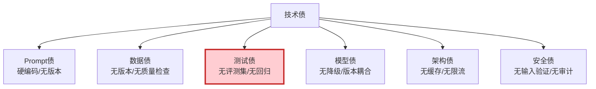
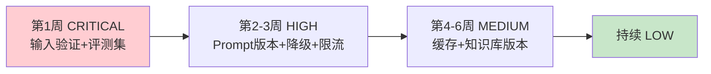

# LLM 应用技术债管理最新

> 知识库 99 仅 145 行、知识库 203 有深度。这篇整合为最新——6 类技术债、评估器和偿还计划。

---

## 一、6 类技术债



---

## 二、评估器

```python
from dataclasses import dataclass
from enum import Enum

class DebtLevel(str, Enum):
    CRITICAL = "critical"
    HIGH = "high"
    MEDIUM = "medium"
    LOW = "low"

@dataclass
class TechDebtItem:
    id: str
    category: str
    description: str
    level: DebtLevel
    impact: str
    effort_hours: float = 0
    resolved: bool = False

class TechDebtAssessor:
    """技术债评估器。"""

    @staticmethod
    def assess(status: dict) -> list[TechDebtItem]:
        """根据项目状态评估技术债。"""
        debts = []

        if not status.get("prompt_versioned"):
            debts.append(TechDebtItem("p1", "prompt", "Prompt硬编码无版本", DebtLevel.HIGH, "改Prompt需改代码", 4))
        if not status.get("has_eval_dataset"):
            debts.append(TechDebtItem("t1", "test", "无评测数据集", DebtLevel.CRITICAL, "无法量化评估", 16))
        if not status.get("model_fallback"):
            debts.append(TechDebtItem("m1", "model", "无模型降级", DebtLevel.HIGH, "API不可用时全断", 6))
        if not status.get("has_cache"):
            debts.append(TechDebtItem("a1", "arch", "无语义缓存", DebtLevel.MEDIUM, "重复查询浪费Token", 8))
        if not status.get("input_validation"):
            debts.append(TechDebtItem("s1", "security", "无输入验证", DebtLevel.CRITICAL, "可被注入", 4))
        if not status.get("kb_versioned"):
            debts.append(TechDebtItem("d1", "data", "知识库无版本", DebtLevel.MEDIUM, "无法回滚", 8))

        return debts

    @staticmethod
    def prioritize(debts: list[TechDebtItem]) -> list[TechDebtItem]:
        """按优先级排序。"""
        order = &#123;DebtLevel.CRITICAL: 0, DebtLevel.HIGH: 1, DebtLevel.MEDIUM: 2, DebtLevel.LOW: 3&#125;
        return sorted(debts, key=lambda d: order.get(d.level, 99))

    @staticmethod
    def summary(debts: list[TechDebtItem]) -> dict:
        from collections import Counter
        by_level = Counter(d.level.value for d in debts)
        return &#123;
            "total": len(debts),
            "by_level": dict(by_level),
            "critical_count": by_level.get("critical", 0),
            "total_effort_hours": sum(d.effort_hours for d in debts),
            "action": "立即处理CRITICAL" if by_level.get("critical", 0) > 0 else "按优先级偿还",
        &#125;
```

---

## 三、偿还路线图



---

## 四、最佳实践

| 实践 | 说明 | 优先级 |
|------|------|--------|
| 定期评估 | 每季度 | ★★★ |
| CRITICAL立即还 | 安全+测试优先 | ★★★ |
| 每Sprint留20%还债 | 不让债积累 | ★★☆ |
| 新功能不增债 | 先还再借 | ★★☆ |

---

## 五、检查清单

| 检查项 | 状态 |
|--------|------|
| 有技术债评估器 | ☐ |
| 有偿还计划 | ☐ |
