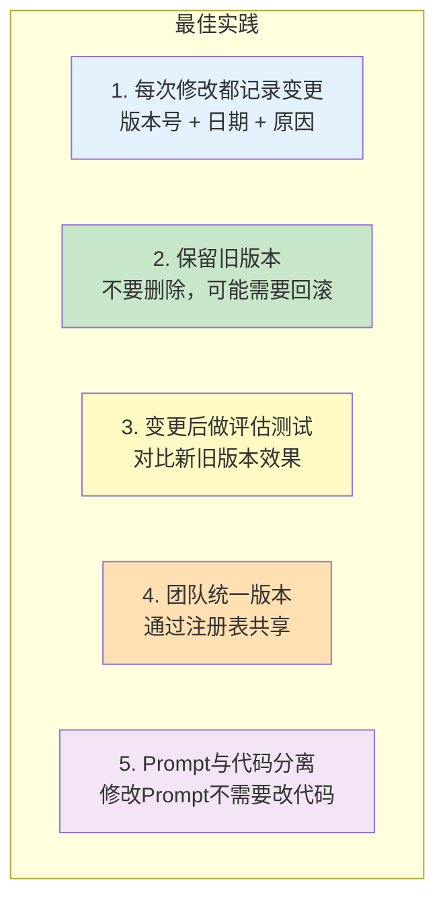

# Prompt 版本管理

> Prompt 是 LLM 应用的"源代码"。像管理代码一样管理 Prompt：版本化、对比、回滚。

---

## 一、为什么需要 Prompt 版本管理

```mermaid
graph TB
    subgraph 没有版本管理 ["没有版本管理"&#125;
        N1["修改Prompt后效果变差"]
        N2["不知道改了什么导致变差"]
        N3["无法回滚到之前的版本"]
        N4["团队成员各用各的Prompt"]
    end

    subgraph 有版本管理 ["有版本管理"&#125;
        Y1["每次修改有版本号"]
        Y2["可以A/B对比两个版本"]
        Y3["可以回滚到任意版本"]
        Y4["团队共享同一版本"]
    end

    style 没有版本管理 fill:#FFCDD2
    style 有版本管理 fill:#C8E6C9
```

## 二、本地 Prompt 管理

### 2.1 文件结构

```
prompts/
├── qa_system/
│   ├── v1.0.txt
│   ├── v1.1.txt
│   ├── v2.0.txt
│   └── current.txt → v2.0.txt
├── rag_system/
│   ├── v1.0.txt
│   └── current.txt → v1.0.txt
└── customer_service/
    ├── v1.0.txt
    ├── v1.1.txt
    └── current.txt → v1.1.txt
```

### 2.2 Prompt 文件格式

```python
# prompts/qa_system/v1.0.txt
"""
版本: v1.0
创建日期: 2025-01-15
作者: 张三
说明: 初始版本

---
你是一个有用的AI助手。用简洁的中文回答问题。
如果不确定，请明确说"我不确定"。
"""

# prompts/qa_system/v1.1.txt
"""
版本: v1.1
创建日期: 2025-01-20
作者: 张三
变更: 增加格式约束
说明: 要求回答不超过3句话

---
你是一个有用的AI助手。用简洁的中文回答问题。
规则：
1. 不确定时说"我不确定"
2. 回答不超过3句话
3. 用中文回答
"""
```

### 2.3 Prompt 加载器

```python
import os
from langchain_core.prompts import ChatPromptTemplate

class PromptManager:
    """Prompt 版本管理器"""

    def __init__(self, prompts_dir: str = "prompts"):
        self.prompts_dir = prompts_dir

    def load(self, prompt_name: str, version: str = "current") -> str:
        """加载指定版本的Prompt"""
        filepath = os.path.join(self.prompts_dir, prompt_name, f"&#123;version&#125;.txt")
        with open(filepath, "r", encoding="utf-8") as f:
            content = f.read()

        # 解析元数据和Prompt内容
        if content.startswith('"""'):
            # 提取 --- 之后的实际Prompt
            parts = content.split("---", 1)
            if len(parts) > 1:
                return parts[1].strip()
        return content.strip()

    def list_versions(self, prompt_name: str) -> list[str]:
        """列出所有版本"""
        dir_path = os.path.join(self.prompts_dir, prompt_name)
        if not os.path.exists(dir_path):
            return []
        versions = []
        for f in os.listdir(dir_path):
            if f.endswith(".txt") and f != "current.txt":
                versions.append(f.replace(".txt", ""))
        return sorted(versions)

    def diff(self, prompt_name: str, v1: str, v2: str) -> str:
        """对比两个版本的差异"""
        p1 = self.load(prompt_name, v1)
        p2 = self.load(prompt_name, v2)

        lines1 = p1.split("\n")
        lines2 = p2.split("\n")

        result = []
        import difflib
        diff = difflib.unified_diff(lines1, lines2, fromfile=v1, tofile=v2, lineterm="")
        result = "\n".join(diff)
        return result or "无差异"

# 使用
pm = PromptManager()

# 加载当前版本
prompt_text = pm.load("qa_system", "current")

# 加载特定版本
prompt_v1 = pm.load("qa_system", "v1.0")

# 列出所有版本
versions = pm.list_versions("qa_system")
print(f"可用版本: &#123;versions&#125;")

# 对比两个版本
diff = pm.diff("qa_system", "v1.0", "v1.1")
print(f"差异:\n&#123;diff&#125;")
```

## 三、使用 LangChain Hub

```python
# LangChain Hub 是社区共享Prompt的平台
from langchain import hub

# 拉取社区Prompt
prompt = hub.pull("rlm/rag-prompt")

# 推送自己的Prompt到Hub
# hub.push("your-username/qa-prompt-v2", prompt)
```

```mermaid
graph LR
    subgraph Hub工作流 ["LangChain Hub 工作流"&#125;
        DEV["本地开发Prompt"] --> PUSH["hub.push()"]
        PUSH --> HUB["LangChain Hub<br/>(云端存储)"]
        HUB --> PULL["hub.pull()"]
        PULL --> USE["在应用中使用"]
        HUB --> SHARE["团队共享/社区共享"]
    end

    style HUB fill:#E3F2FD
    style SHARE fill:#C8E6C9
```

## 四、Prompt 在代码中的结构化管理

### 4.1 集中管理

```python
# prompts/registry.py
from dataclasses import dataclass

@dataclass
class PromptVersion:
    version: str
    template: str
    description: str
    author: str
    date: str

# Prompt 注册表
PROMPTS = &#123;
    "qa_system": &#123;
        "v1.0": PromptVersion(
            version="v1.0",
            template="你是一个有用的AI助手。用中文回答问题。",
            description="初始版本",
            author="张三",
            date="2025-01-15",
        ),
        "v1.1": PromptVersion(
            version="v1.1",
            template="""你是一个有用的AI助手。
规则：
1. 用简洁的中文回答
2. 不确定时说"我不确定"
3. 回答不超过3句话""",
            description="增加格式约束和防幻觉规则",
            author="张三",
            date="2025-01-20",
        ),
    &#125;,
    "rag_system": &#123;
        "v1.0": PromptVersion(
            version="v1.0",
            template="""你是知识库问答助手。基于以下背景知识回答问题。
背景知识：&#123;context&#125;
问题：&#123;question&#125;
规则：只基于背景知识回答，不编造信息。""",
            description="RAG基础Prompt",
            author="李四",
            date="2025-01-25",
        ),
    &#125;,
&#125;

# 当前使用版本
CURRENT_VERSIONS = &#123;
    "qa_system": "v1.1",
    "rag_system": "v1.0",
&#125;

def get_prompt(name: str, version: str = None) -> str:
    """获取指定版本的Prompt"""
    if version is None:
        version = CURRENT_VERSIONS[name]
    return PROMPTS[name][version].template
```

### 4.2 版本切换

```python
# 切换版本只需要改一行
CURRENT_VERSIONS["qa_system"] = "v1.0"  # 回滚到v1.0

# 在Chain中使用
from langchain_core.prompts import ChatPromptTemplate

prompt_text = get_prompt("qa_system")
prompt = ChatPromptTemplate.from_template(prompt_text)
chain = prompt | llm | StrOutputParser()
```

## 五、Prompt 变更日志

```markdown
# prompts/CHANGELOG.md

## qa_system

### v1.1 (2025-01-20)
- 增加"回答不超过3句话"约束
- 增加"不确定时说不确定"防幻觉规则
- 测试结果：准确率从82%提升到89%

### v1.0 (2025-01-15)
- 初始版本
- 基础问答能力

## rag_system

### v1.0 (2025-01-25)
- 初始版本
- 基础RAG问答
```

## 六、Prompt 版本管理决策

```mermaid
graph TD
    Q&#123;"项目规模?"&#125;
    Q -->|"个人项目/学习"| LOCAL["简单文件管理<br/>prompts/目录 + 版本号"]
    Q -->|"团队项目"| REGISTRY["代码注册表<br/>集中管理 + 变更日志"]
    Q -->|"开源/社区"| HUB["LangChain Hub<br/>云端共享"]
    Q -->|"生产系统"| FULL["完整方案<br/>注册表 + CI测试 + 变更日志 + 监控"]

    style LOCAL fill:#C8E6C9
    style REGISTRY fill:#E3F2FD
    style HUB fill:#FFF9C4
    style FULL fill:#F3E5F5
```

## 七、Prompt 管理最佳实践


