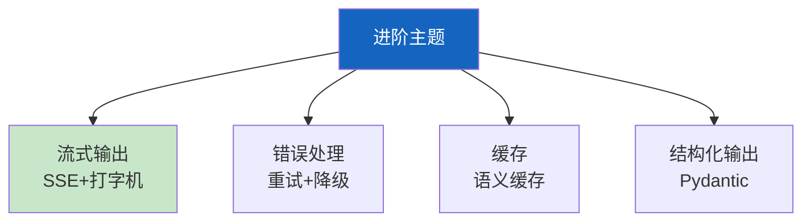

# 学习课程 08：LangChain 进阶与最佳实践最新

> 学习课程 08 有 323 行。这篇基于 v0.3 更新——流式输出、错误处理、降级和缓存。

---

## 一、进阶主题



---

## 二、流式输出

```python
from langchain_openai import ChatOpenAI

llm = ChatOpenAI(model="gpt-4o-mini", streaming=True)  # 必须streaming=True

# 基本流式
async for chunk in llm.astream("解释RAG"):
    print(chunk.content, end="", flush=True)

# LCEL管道流式
chain = prompt | llm | parser
async for chunk in chain.astream(&#123;"question": "什么是RAG?"&#125;):
    print(chunk, end="")
```

---

## 三、错误处理

```python
from langchain_openai import ChatOpenAI

# 降级链
main = ChatOpenAI(model="gpt-4o")
backup = ChatOpenAI(model="gpt-4o-mini")
llm = main.with_fallbacks([backup])

# 重试
llm = llm.with_retry(stop_after_attempt=3, wait_exponential_jitter=True)

chain = prompt | llm | parser
```

---

## 四、结构化输出

```python
from pydantic import BaseModel, Field

class Answer(BaseModel):
    answer: str = Field(description="回答内容")
    sources: list[str] = Field(description="信息来源")
    confidence: float = Field(description="置信度0-1", ge=0, le=1)

structured_llm = ChatOpenAI(model="gpt-4o-mini").with_structured_output(Answer)
result = structured_llm.invoke("什么是RAG?")
# result.answer, result.sources, result.confidence
```

---

## 五、最佳实践

| 主题 | 实践 | 优先级 |
|------|------|--------|
| 流式 | streaming=True | ★★★ |
| 降级 | with_fallbacks | ★★★ |
| 重试 | with_retry | ★★☆ |
| 结构化 | with_structured_output | ★★★ |

---

## 六、检查清单

| 检查项 | 状态 |
|--------|------|
| 能流式输出 | ☐ |
| 能降级重试 | ☐ |
| 能结构化输出 | ☐ |
