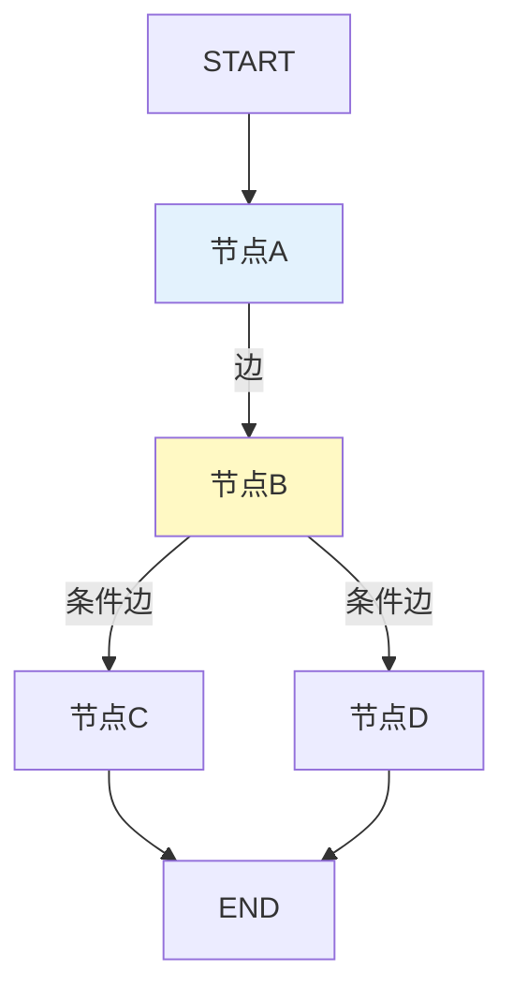

# 学习课程 09：LangGraph 入门最新

> 学习课程 09 有 287 行。这篇基于 v0.3 更新——StateGraph 创建、节点和边的基本用法。

---

## 一、LangGraph 核心概念



---

## 二、第一个 LangGraph

```python
from langgraph.graph import StateGraph, START, END
from typing import TypedDict, Annotated
from langgraph.graph.message import add_messages

# 1. 定义State
class MyState(TypedDict):
    messages: Annotated[list, add_messages]  # add_messages自动追加
    result: str

# 2. 定义节点
async def greet(state: MyState) -> dict:
    return &#123;"result": "你好！"&#125;

async def process(state: MyState) -> dict:
    return &#123;"result": f"处理完成: &#123;state['result']&#125;"&#125;

# 3. 构建图
graph = StateGraph(MyState)
graph.add_node("greet", greet)
graph.add_node("process", process)

# 4. 连接边
graph.add_edge(START, "greet")
graph.add_edge("greet", "process")
graph.add_edge("process", END)

# 5. 编译
app = graph.compile(checkpointer=MemorySaver())

# 6. 执行
result = app.invoke(&#123;"messages": [], "result": ""&#125;)
print(result["result"])
```

---

## 三、条件边

```python
def route(state: MyState) -> str:
    if "搜索" in state.get("result", ""):
        return "search"
    return "answer"

graph.add_conditional_edges(
    "process",  # 从哪个节点
    route,      # 路由函数
    &#123;"search": "search_node", "answer": "answer_node"&#125;,  # 映射
)
```

---

## 四、最佳实践

| 实践 | 说明 | 优先级 |
|------|------|--------|
| State用TypedDict+Reducer | 显式管理状态 | ★★★ |
| 条件路由用纯函数 | 不依赖外部 | ★★★ |
| Checkpointer必配 | 支持恢复 | ★★★ |
| 节点函数要幂等 | 重试安全 | ★★☆ |

---

## 五、检查清单

| 检查项 | 状态 |
|--------|------|
| 能构建图 | ☐ |
| 能用条件边 | ☐ |
