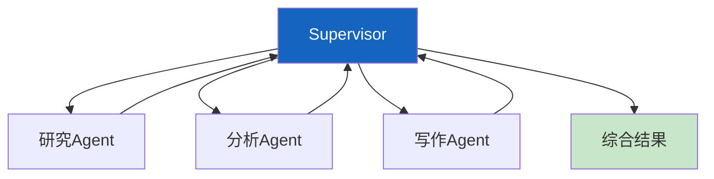

# 学习课程 11：构建复杂工作流与多 Agent 系统最新

> 学习课程 11 有 347 行。这篇基于 v0.3 更新——多 Agent 架构、Supervisor 模式和人机交互。

---

## 一、多 Agent 架构



---

## 二、Supervisor 模式实现

```python
from langgraph.graph import StateGraph, START, END
from typing import TypedDict, Annotated
from langgraph.graph.message import add_messages

class MultiAgentState(TypedDict):
    messages: Annotated[list, add_messages]
    task: str
    research: str
    analysis: str
    report: str

async def researcher(state: MultiAgentState) -> dict:
    """研究Agent。"""
    from langchain_core.messages import HumanMessage
    resp = await llm.ainvoke([HumanMessage(content=f"研究: &#123;state['task']&#125;")])
    return &#123;"research": resp.content&#125;

async def analyst(state: MultiAgentState) -> dict:
    """分析Agent。"""
    resp = await llm.ainvoke([HumanMessage(content=f"分析: &#123;state.get('research', '')[:500]&#125;")])
    return &#123;"analysis": resp.content&#125;

async def writer(state: MultiAgentState) -> dict:
    """写作Agent。"""
    resp = await llm.ainvoke([HumanMessage(content=f"基于分析写报告: &#123;state.get('analysis', '')[:500]&#125;")])
    return &#123;"report": resp.content, "messages": [resp]&#125;

# 构建图
graph = StateGraph(MultiAgentState)
graph.add_node("researcher", researcher)
graph.add_node("analyst", analyst)
graph.add_node("writer", writer)

graph.add_edge(START, "researcher")
graph.add_edge("researcher", "analyst")
graph.add_edge("analyst", "writer")
graph.add_edge("writer", END)

multi_agent = graph.compile(checkpointer=MemorySaver())
```

---

## 三、人机交互

```python
from langgraph.types import interrupt, Command

async def review_node(state: MultiAgentState) -> dict:
    """人工审批节点。"""
    approval = interrupt(&#123;
        "report": state.get("report", "")[:500],
        "question": "报告是否通过？",
    &#125;)
    if approval.get("approved"):
        return &#123;"messages": [&#123;"role": "ai", "content": "报告已通过"&#125;]&#125;
    return &#123;"messages": [&#123;"role": "ai", "content": "需要修改"&#125;]&#125;

# 恢复执行
# result = multi_agent.invoke(Command(resume=&#123;"approved": True&#125;), config)
```

---

## 四、最佳实践

| 实践 | 说明 | 优先级 |
|------|------|--------|
| Supervisor模式 | 中心调度 | ★★★ |
| 各Agent有明确角色 | 职责不重叠 | ★★☆ |
| 人机交互用interrupt | 可中断可恢复 | ★★★ |
| Agent间共享State | 数据流转 | ★★☆ |

---

## 五、检查清单

| 检查项 | 状态 |
|--------|------|
| 能构建多Agent图 | ☐ |
| 能实现人机交互 | ☐ |
