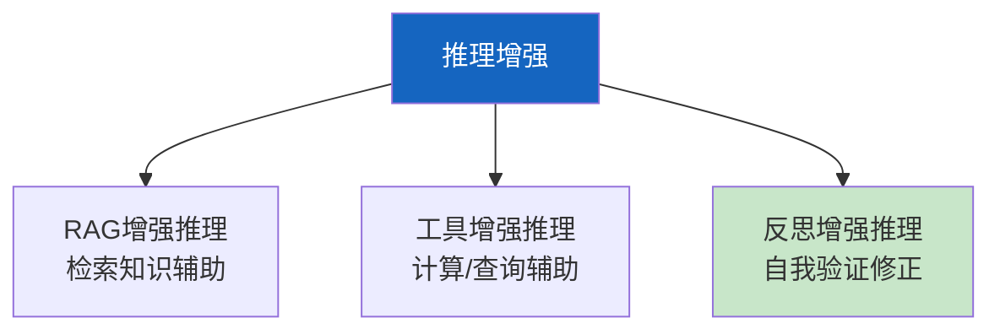

# Agent 推理增强技术

> 知识库 194 和 209 已有基础。这篇深入——推理增强的最新技术：RAG+推理融合、工具增强推理和反思增强。

---

## 一、推理增强三种方式



---

## 二、实现

```python
import asyncio
from dataclasses import dataclass
from langchain_core.messages import HumanMessage

@dataclass
class ReasoningConfig:
    max_retries: int = 2
    use_rag: bool = True
    use_tools: bool = True
    use_reflection: bool = True

class EnhancedReasoningEngine:
    """增强推理引擎——RAG+工具+反思三重增强。"""

    def __init__(self, llm, vectorstore=None, tools=None):
        self.llm = llm
        self.vectorstore = vectorstore
        self.tools = tools or []

    async def reason(self, question: str, config: ReasoningConfig = ReasoningConfig()) -> str:
        """增强推理。"""
        context = ""

        # 1. RAG增强
        if config.use_rag and self.vectorstore:
            docs = await self.vectorstore.asimilarity_search(question, k=3)
            context = "\n".join(d.page_content for d in docs)

        # 2. 工具增强推理
        tool_results = ""
        if config.use_tools:
            for tool in self.tools[:2]:
                try:
                    result = await tool.ainvoke(&#123;"query": question&#125;)
                    tool_results += f"\n[工具&#123;tool.name&#125;]: &#123;str(result)[:100]&#125;"
                except Exception:
                    pass

        # 3. 初始推理
        prompt = f"""基于以下信息推理。

知识: &#123;context[:500]&#125;
工具结果: &#123;tool_results[:200]&#125;
问题: &#123;question&#125;

推理过程:"""
        response = await self.llm.ainvoke([HumanMessage(content=prompt)])
        answer = response.content

        # 4. 反思增强
        if config.use_reflection:
            answer = await self._reflect(question, answer, context)

        return answer

    async def _reflect(self, question: str, answer: str, context: str) -> str:
        """反思修正。"""
        reflect_prompt = f"""检查以下推理是否有误。

问题: &#123;question&#125;
知识: &#123;context[:300]&#125;
推理: &#123;answer[:300]&#125;

如有错误请修正，无误则原样返回。"""
        response = await self.llm.ainvoke([HumanMessage(content=reflect_prompt)])
        return response.content
```

---

## 三、最佳实践

| 方式 | 效果 | 成本 | 优先级 |
|------|------|------|--------|
| RAG增强 | +15% | 低 | ★★★ |
| 工具增强 | +20% | 中 | ★★☆ |
| 反思增强 | +15% | 中 | ★★☆ |
| 三重组合 | +40% | 高 | ★★☆ |

---

## 四、检查清单

| 检查项 | 状态 |
|--------|------|
| 有增强推理引擎 | ☐ |
| 有反思机制 | ☐ |
