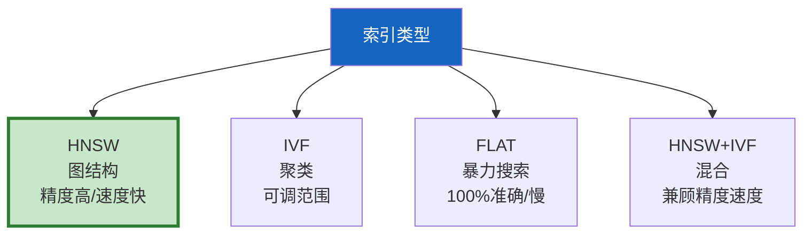

# 向量索引优化最新

> 知识库 43 仅 168 行、知识库 131 有 HNSW 调优。这篇整合为最新——HNSW 参数、IVF vs HNSW、索引重建和性能监控。

---

## 一、索引类型对比



---

## 二、HNSW 参数调优

```python
from dataclasses import dataclass

@dataclass
class HNSWParams:
    """HNSW索引参数。"""
    M: int = 16               # 每节点连接数(16-48)
    ef_construction: int = 200 # 构建搜索宽度(200-500)
    ef_search: int = 64       # 查询搜索宽度(50-200)

class HNSWOptimizer:
    """HNSW参数优化器。"""

    @staticmethod
    def recommend(usage: str = "balanced") -> HNSWParams:
        """根据使用场景推荐参数。"""
        presets = &#123;
            "fast": HNSWParams(M=8, ef_construction=100, ef_search=32),
            "balanced": HNSWParams(M=16, ef_construction=200, ef_search=64),
            "accurate": HNSWParams(M=32, ef_construction=400, ef_search=128),
            "max_accuracy": HNSWParams(M=48, ef_construction=500, ef_search=200),
        &#125;
        return presets.get(usage, presets["balanced"])

    @staticmethod
    def tradeoff_info() -> dict:
        """参数权衡说明。"""
        return &#123;
            "M↑": "精度↑ 内存↑ 构建慢",
            "ef_construction↑": "精度↑ 构建慢",
            "ef_search↑": "召回↑ 查询慢",
            "推荐起步": "M=16, ef_construction=200, ef_search=64",
        &#125;
```

---

## 三、最佳实践

| 参数 | 起步值 | 效果 | 优先级 |
|------|--------|------|--------|
| M | 16 | 精度/内存平衡 | ★★★ |
| ef_construction | 200 | 构建质量 | ★★★ |
| ef_search | 64 | 召回率 | ★★★ |
| 索引重建 | 定期 | 防碎片化 | ★★☆ |

---

## 四、检查清单

| 检查项 | 状态 |
|--------|------|
| 有HNSW参数指南 | ☐ |
| 有推荐预设 | ☐ |
