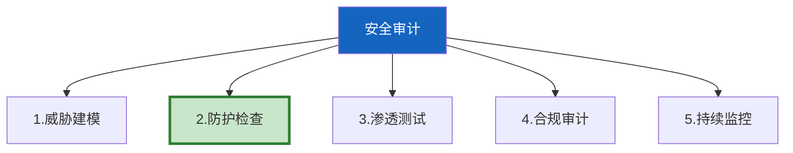

# Agent 安全审计框架

> 知识库 230/256/141/183 有安全防护。这篇整合为完整审计框架——从威胁建模到防护实施到合规审计。

---

## 一、审计框架



---

## 二、实现

```python
from dataclasses import dataclass, field
from enum import Enum

class AuditStatus(str, Enum):
    PASS = "pass"
    FAIL = "fail"
    WARNING = "warning"
    NOT_CHECKED = "not_checked"

@dataclass
class AuditItem:
    """审计项。"""
    category: str
    check: str
    status: AuditStatus = AuditStatus.NOT_CHECKED
    detail: str = ""

class AgentSecurityAuditor:
    """Agent安全审计器。"""

    CHECKLIST = &#123;
        "输入防护": [
            "输入长度限制≤10000",
            "Prompt注入检测",
            "编码绕过检测",
            "速率限制",
            "PII检测脱敏",
        ],
        "输出防护": [
            "输出PII脱敏",
            "代码执行指令过滤",
            "输出长度限制",
            "内容安全过滤",
        ],
        "工具防护": [
            "工具权限策略",
            "文件路径白名单",
            "网络域名白名单",
            "高危操作需审批",
            "代码沙箱隔离",
        ],
        "数据安全": [
            "传输加密TLS",
            "存储加密",
            "密钥管理",
            "审计日志",
            "数据保留期",
        ],
        "合规": [
            "用户可查看数据",
            "用户可删除数据",
            "数据处理透明",
            "定期合规审计",
        ],
    &#125;

    @classmethod
    def audit(cls, status: dict) -> dict:
        """执行安全审计。"""
        results = &#123;&#125;
        total = 0
        passed = 0

        for category, checks in cls.CHECKLIST.items():
            cat_passed = sum(1 for c in checks if status.get(c, False))
            total += len(checks)
            passed += cat_passed
            results[category] = &#123;
                "passed": cat_passed,
                "total": len(checks),
                "rate": round(cat_passed / len(checks), 4),
                "gaps": [c for c in checks if not status.get(c, False)],
            &#125;

        return &#123;
            "overall_rate": round(passed / total, 4),
            "status": "compliant" if passed == total else "non-compliant" if passed < total * 0.7 else "partial",
            "categories": results,
            "critical_gaps": [
                gap for cat in results.values()
                for gap in cat["gaps"]
                if "注入" in gap or "审批" in gap or "隔离" in gap or "加密" in gap
            ][:5],
        &#125;
```

---

## 三、最佳实践

| 审计项 | 频率 | 优先级 |
|--------|------|--------|
| 输入防护 | 每次发布 | ★★★ |
| 工具权限 | 每季度 | ★★★ |
| 渗透测试 | 上线前 | ★★★ |
| 合规审计 | 每季度 | ★★☆ |
| 持续监控 | 实时 | ★★☆ |

---

## 四、检查清单

| 检查项 | 状态 |
|--------|------|
| 有审计检查表 | ☐ |
| 有合规评分 | ☐ |
