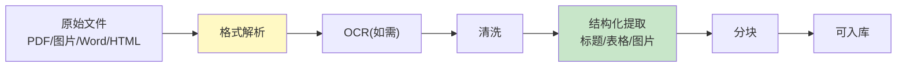

# RAG 文档预处理管线

> 知识库 31 和 144 有基础。这篇深入——OCR、格式转换、结构化提取和质量控制的完整预处理管线。

---

## 一、预处理流程



---

## 二、实现

```python
from dataclasses import dataclass, field
from typing import Optional

@dataclass
class ProcessedDocument:
    """预处理后的文档。"""
    source: str
    content: str
    title: str = ""
    sections: list[dict] = field(default_factory=list)
    tables: list[str] = field(default_factory=list)
    images: list[str] = field(default_factory=list)  # 图像描述
    metadata: dict = field(default_factory=dict)

class DocumentPreprocessor:
    """文档预处理管线。"""

    @staticmethod
    async def process_pdf(file_path: str, llm=None) -> ProcessedDocument:
        """处理PDF文档。"""
        # 1. 解析PDF
        from langchain_community.document_loaders import PyMuPDFLoader
        loader = PyMuPDFLoader(file_path)
        docs = await loader.aload()
        raw_text = "\n".join(d.page_content for d in docs)

        # 2. 清洗
        cleaned = DocumentPreprocessor._clean(raw_text)

        # 3. 提取结构
        sections = DocumentPreprocessor._extract_sections(cleaned)
        tables = DocumentPreprocessor._extract_tables(cleaned)

        return ProcessedDocument(
            source=file_path,
            content=cleaned,
            sections=sections,
            tables=tables,
            metadata=&#123;"page_count": len(docs)&#125;,
        )

    @staticmethod
    async def process_image(file_path: str, llm) -> ProcessedDocument:
        """处理图片——OCR+LLM理解。"""
        import base64
        from langchain_core.messages import HumanMessage

        with open(file_path, "rb") as f:
            b64 = base64.b64encode(f.read()).decode()

        prompt = f"""请提取这张图片中的所有文字内容，并描述图片的结构和关键信息。
如果是表格，请转为结构化文本。"""
        response = await llm.ainvoke([HumanMessage(content=[
            &#123;"type": "text", "text": prompt&#125;,
            &#123;"type": "image_url", "image_url": &#123;"url": f"data:image/png;base64,&#123;b64&#125;"&#125;&#125;,
        ])])

        return ProcessedDocument(
            source=file_path,
            content=response.content,
            metadata=&#123;"type": "image", "ocr": True&#125;,
        )

    @staticmethod
    def _clean(text: str) -> str:
        """清洗文本。"""
        import re
        text = re.sub(r'<[^>]+>', '', text)  # 去HTML
        text = re.sub(r'[ \t]+', ' ', text)  # 标准化空白
        text = re.sub(r'\n&#123;3,&#125;', '\n\n', text)
        text = text.replace('\ufffd', '')  # 去替换字符
        return text.strip()

    @staticmethod
    def _extract_sections(text: str) -> list[dict]:
        """提取章节结构。"""
        import re
        sections = []
        # 匹配Markdown标题
        for match in re.finditer(r'^(#&#123;1,3&#125;)\s+(.+)$', text, re.MULTILINE):
            level = len(match.group(1))
            title = match.group(2)
            sections.append(&#123;"level": level, "title": title, "position": match.start()&#125;)
        return sections

    @staticmethod
    def _extract_tables(text: str) -> list[str]:
        """提取表格内容。"""
        import re
        # 匹配Markdown表格
        tables = re.findall(r'\|.+\|\n\|[-: |]+\|\n(?:\|.+\|\n?)+', text)
        return tables
```

---

## 三、最佳实践

| 实践 | 说明 | 优先级 |
|------|------|--------|
| 图片用多模态LLM | OCR+理解 | ★★★ |
| 表格不拆散 | 整体入库 | ★★★ |
| 提取章节结构 | 保留层级 | ★★☆ |
| 清洗标准化 | 去HTML/空白 | ★★☆ |

---

## 四、检查清单

| 检查项 | 状态 |
|--------|------|
| 有PDF处理 | ☐ |
| 有图片OCR | ☐ |
| 有结构提取 | ☐ |
