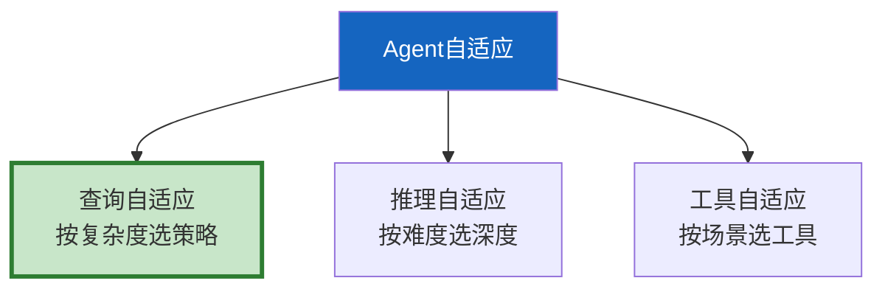

# Agent 自适应整合指南

> 4 篇提及自适应。这篇整合为完整指南——根据查询特征自动调整策略、推理深度和检索方式。

---

## 一、自适应三层



---

## 二、实现

```python
from dataclasses import dataclass
from enum import Enum

class QueryType(str, Enum):
    SIMPLE = "simple"      # 闲聊/简单问答
    FACTOID = "factoid"    # 事实查询
    COMPLEX = "complex"    # 分析/对比
    RELATIONAL = "relational"  # 关系查询

@dataclass
class AdaptiveConfig:
    """自适应配置。"""
    query_type: QueryType
    use_rag: bool = True
    use_tools: bool = False
    use_graph: bool = False
    reasoning_depth: int = 1  # 1=直接 2=CoT 3=分步
    k: int = 3
    rerank: bool = False
    verify: bool = False

class AdaptiveAgent:
    """自适应Agent——根据查询特征自动选择策略。"""

    PRESETS = &#123;
        QueryType.SIMPLE: AdaptiveConfig(QueryType.SIMPLE, use_rag=False, reasoning_depth=1),
        QueryType.FACTOID: AdaptiveConfig(QueryType.FACTOID, use_rag=True, k=5, rerank=True, verify=True),
        QueryType.COMPLEX: AdaptiveConfig(QueryType.COMPLEX, use_rag=True, use_tools=True, reasoning_depth=3, k=5, rerank=True, verify=True),
        QueryType.RELATIONAL: AdaptiveConfig(QueryType.RELATIONAL, use_rag=True, use_graph=True, reasoning_depth=2, k=3, rerank=True, verify=True),
    &#125;

    @staticmethod
    def classify(query: str) -> QueryType:
        """分类查询类型。"""
        if any(w in query for w in ["你好", "谢谢", "再见"]) and len(query) < 10:
            return QueryType.SIMPLE
        if any(w in query for w in ["的同事", "的关系", "属于", "管理"]):
            return QueryType.RELATIONAL
        if len(query) > 50 or any(w in query for w in ["对比", "分析", "综合", "研究"]):
            return QueryType.COMPLEX
        return QueryType.FACTOID

    @classmethod
    def get_config(cls, query: str) -> AdaptiveConfig:
        """获取自适应配置。"""
        qtype = cls.classify(query)
        return cls.PRESETS.get(qtype, cls.PRESETS[QueryType.FACTOID])
```

---

## 三、最佳实践

| 查询类型 | 策略 | 延迟 | 优先级 |
|----------|------|------|--------|
| 简单 | 直接回答 | 最低 | ★★★ |
| 事实 | RAG+重排+验证 | 中 | ★★★ |
| 复杂 | RAG+工具+CoT | 高 | ★★☆ |
| 关系 | 图谱+RAG+重排 | 高 | ★★☆ |

---

## 四、检查清单

| 检查项 | 状态 |
|--------|------|
| 有查询分类 | ☐ |
| 有自适应配置 | ☐ |
