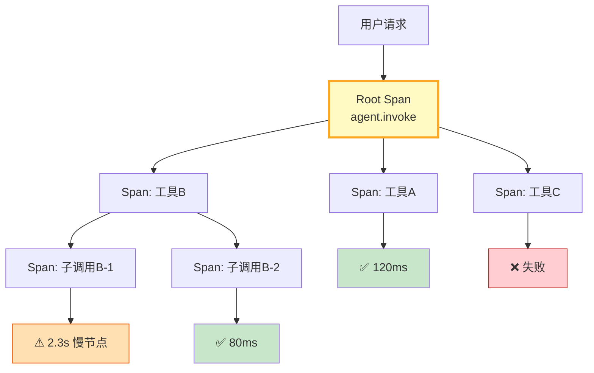

# Agent 工具调用链追踪与分布式 span 指南

> Agent 一次执行可能调用 5 个工具、跨 3 个服务、产生 20 个子步骤。出问题时，日志分散在各处，无法拼出完整调用链。这篇指南讲透 OpenTelemetry 风格的 span 追踪、调用树可视化和慢节点定位。

---

## 一、调用链追踪架构



每个 span 记录：开始时间、结束时间、工具名、输入参数摘要、输出摘要、状态（成功/失败/慢）、子 span 列表。一棵 span 树就是完整的调用链。

---

## 二、Span 追踪实现

```python
from dataclasses import dataclass, field
from datetime import datetime
from enum import Enum
from typing import Any, Optional
import time
import uuid
import asyncio
import functools

class SpanStatus(str, Enum):
    OK = "ok"
    ERROR = "error"
    SLOW = "slow"

@dataclass
class Span:
    """一个调用跨度。"""
    span_id: str = field(default_factory=lambda: uuid.uuid4().hex[:12])
    parent_id: Optional[str] = None
    name: str = ""
    start_time: float = field(default_factory=time.monotonic)
    end_time: Optional[float] = None
    status: SpanStatus = SpanStatus.OK
    attributes: dict = field(default_factory=dict)
    events: list[dict] = field(default_factory=list)
    children: list[str] = field(default_factory=list)  # child span_ids

    @property
    def duration_ms(self) -> float:
        end = self.end_time or time.monotonic()
        return round((end - self.start_time) * 1000, 1)

    def add_event(self, name: str, **attrs):
        self.events.append(&#123;
            "name": name,
            "timestamp": datetime.now().isoformat(),
            "attributes": attrs,
        &#125;)

    def set_attribute(self, key: str, value: Any):
        self.attributes[key] = str(value)[:200]

    def finish(self):
        self.end_time = time.monotonic()
        if self.duration_ms > 2000:
            self.status = SpanStatus.SLOW
        elif self.status == SpanStatus.OK and self.attributes.get("error"):
            self.status = SpanStatus.ERROR


class TraceCollector:
    """调用链收集器——构建 span 树。"""

    def __init__(self, slow_threshold_ms: float = 2000):
        self._spans: dict[str, Span] = &#123;&#125;
        self._root_id: Optional[str] = None
        self.slow_threshold_ms = slow_threshold_ms

    def start_span(self, name: str, parent_id: Optional[str] = None, **attrs) -> Span:
        """开始一个新 span。"""
        span = Span(name=name, parent_id=parent_id)
        for k, v in attrs.items():
            span.set_attribute(k, v)
        self._spans[span.span_id] = span

        if parent_id and parent_id in self._spans:
            self._spans[parent_id].children.append(span.span_id)

        if self._root_id is None:
            self._root_id = span.span_id

        return span

    def finish_span(self, span: Span, error: bool = False):
        """结束 span。"""
        if error:
            span.status = SpanStatus.ERROR
            span.set_attribute("error", True)
        span.finish()

    def get_trace_tree(self) -> dict:
        """获取完整调用树。"""
        if not self._root_id:
            return &#123;&#125;
        return self._build_tree(self._root_id)

    def _build_tree(self, span_id: str) -> dict:
        span = self._spans[span_id]
        return &#123;
            "span_id": span.span_id,
            "name": span.name,
            "duration_ms": span.duration_ms,
            "status": span.status.value,
            "attributes": span.attributes,
            "events": span.events,
            "children": [self._build_tree(cid) for cid in span.children],
        &#125;

    def get_slow_spans(self, threshold: float = None) -> list[dict]:
        """找出慢节点。"""
        threshold = threshold or self.slow_threshold_ms
        slow = []
        for span in self._spans.values():
            if span.duration_ms > threshold:
                slow.append(&#123;
                    "name": span.name,
                    "duration_ms": span.duration_ms,
                    "span_id": span.span_id,
                &#125;)
        return sorted(slow, key=lambda s: s["duration_ms"], reverse=True)

    def get_summary(self) -> dict:
        """调用链摘要。"""
        total = len(self._spans)
        errors = sum(1 for s in self._spans.values() if s.status == SpanStatus.ERROR)
        slow = sum(1 for s in self._spans.values() if s.status == SpanStatus.SLOW)
        root = self._spans.get(self._root_id) if self._root_id else None
        return &#123;
            "total_spans": total,
            "errors": errors,
            "slow_spans": slow,
            "total_duration_ms": root.duration_ms if root else 0,
            "root_name": root.name if root else "",
        &#125;


# 全局 collector
_collector: Optional[TraceCollector] = None

def get_collector() -> TraceCollector:
    global _collector
    if _collector is None:
        _collector = TraceCollector()
    return _collector

def reset_collector():
    global _collector
    _collector = TraceCollector()


def trace(name: str = ""):
    """追踪装饰器——自动创建 span。"""
    def decorator(func):
        @functools.wraps(func)
        async def wrapper(*args, **kwargs):
            collector = get_collector()
            parent_id = kwargs.pop("_parent_span_id", None)
            span_name = name or func.__name__
            span = collector.start_span(span_name, parent_id=parent_id)
            span.set_attribute("function", func.__name__)
            span.set_attribute("args", str(args)[:100])

            try:
                result = await func(*args, **kwargs)
                span.set_attribute("result", str(result)[:200])
                collector.finish_span(span)
                return result
            except Exception as e:
                span.add_event("exception", error=str(e)[:200])
                collector.finish_span(span, error=True)
                raise
        return wrapper
    return decorator
```

### 与 LangGraph Agent 集成

```python
from langchain_core.tools import tool
from langgraph.prebuilt import create_react_agent
from langchain_openai import ChatOpenAI

llm = ChatOpenAI(model="gpt-4o-mini", temperature=0)

@tool
@trace("search_records")
async def search_records(query: str) -> dict:
    """搜索记录。"""
    await asyncio.sleep(0.1)
    return &#123;"results": [f"记录: &#123;query&#125;"], "count": 1&#125;

@tool
@trace("enrich_data")
async def enrich_data(record_id: str) -> dict:
    """数据增强。"""
    await asyncio.sleep(0.15)
    return &#123;"id": record_id, "enriched": True, "source": "external_api"&#125;

@tool
@trace("generate_summary")
async def generate_summary(data: dict) -> dict:
    """生成摘要。"""
    await asyncio.sleep(0.2)
    return &#123;"summary": f"摘要: &#123;str(data)[:50]&#125;", "length": len(str(data))&#125;

# 运行时查看调用链
async def run_with_trace():
    reset_collector()
    collector = get_collector()

    root_span = collector.start_span("agent.invoke")
    agent = create_react_agent(llm, [search_records, enrich_data, generate_summary],
                               prompt="你是数据查询助手。")
    result = await agent.ainvoke(&#123;
        "messages": [&#123;"role": "user", "content": "搜索测试记录并生成摘要"&#125;]
    &#125;)
    collector.finish_span(root_span)

    # 查看调用链
    print("=== 调用链摘要 ===")
    print(collector.get_summary())
    print("\n=== 慢节点 ===")
    for slow in collector.get_slow_spans():
        print(f"  &#123;slow['name']&#125;: &#123;slow['duration_ms']&#125;ms")
    print("\n=== 调用树 ===")
    import json
    print(json.dumps(collector.get_trace_tree(), indent=2, ensure_ascii=False))
```

---

## 三、追踪字段标准

| 字段 | 说明 | 示例 |
|------|------|------|
| span_id | 唯一标识 | a1b2c3d4e5f6 |
| parent_id | 父span ID | f6e5d4c3b2a1 |
| name | 操作名称 | search_records |
| duration_ms | 耗时 | 120.5 |
| status | 状态 | ok/error/slow |
| attributes | 自定义属性 | &#123;"query": "test"&#125; |
| events | 关键事件 | [&#123;"name": "exception"&#125;] |

---

## 四、最佳实践

| 实践 | 说明 | 优先级 |
|------|------|--------|
| 每个工具一个span | 精确定位 | ★★★ |
| 记录输入输出摘要 | 可复现 | ★★★ |
| 慢节点自动标记 | 超阈值标slow | ★★★ |
| span树可视化 | 一眼看全链路 | ★★☆ |
| 异常事件记录 | exception event | ★★☆ |
| 与日志关联 | span_id写入日志 | ★★☆ |

---

## 五、检查清单

| 检查项 | 状态 |
|--------|------|
| 有span追踪器 | ☐ |
| 支持父子span树 | ☐ |
| 有慢节点检测 | ☐ |
| 有调用链摘要 | ☐ |
| 有装饰器集成 | ☐ |
| 有异常事件记录 | ☐ |
