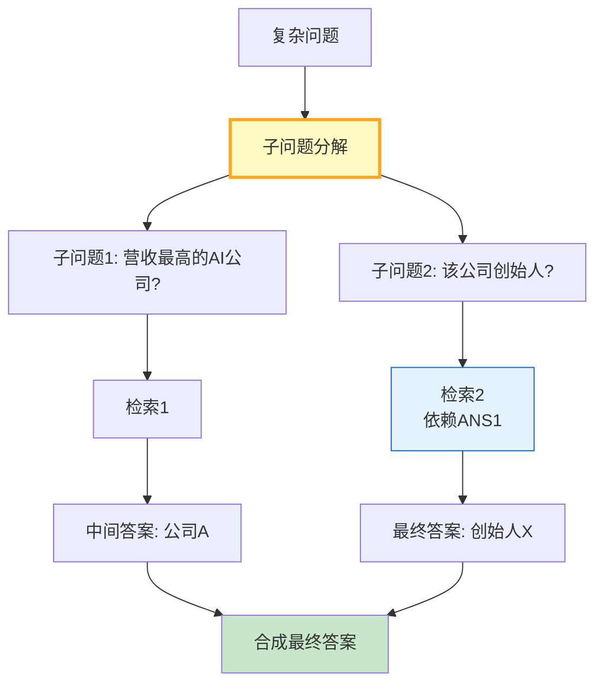

# RAG 多跳问答与推理链编排指南

> "2024年营收最高的AI公司的创始人是谁？"——这类问题需要先查营收排名，再查创始人，单次检索无法回答。这篇指南讲透多跳问答的推理链编排、子问题分解和迭代检索。

---

## 一、多跳问答架构



关键特征：子问题之间有**依赖关系**——子问题2的检索依赖于子问题1的答案。因此不能并行检索，必须串行迭代。

---

## 二、推理链编排实现

```python
from langchain_core.prompts import ChatPromptTemplate
from langchain_openai import ChatOpenAI
from langchain_core.output_parsers import StrOutputParser
from langchain_core.retrievers import BaseRetriever
from langchain_core.documents import Document
from dataclasses import dataclass, field
from typing import Optional
import json
import re

llm = ChatOpenAI(model="gpt-4o-mini", temperature=0)

@dataclass
class SubQuestion:
    """子问题。"""
    question: str
    retrieved_docs: list[Document] = field(default_factory=list)
    answer: str = ""
    depends_on: list[int] = field(default_factory=list)  # 依赖的子问题索引

@dataclass
class ReasoningChain:
    """推理链。"""
    original_question: str
    sub_questions: list[SubQuestion] = field(default_factory=list)
    final_answer: str = ""

    def get_context_for_subq(self, index: int) -> str:
        """获取子问题的上下文（含依赖子问题的答案）。"""
        context_parts = []
        sq = self.sub_questions[index]
        for dep_idx in sq.depends_on:
            dep = self.sub_questions[dep_idx]
            context_parts.append(f"前序问题: &#123;dep.question&#125;\n答案: &#123;dep.answer&#125;")
        if sq.retrieved_docs:
            docs_text = "\n".join(d.page_content[:200] for d in sq.retrieved_docs)
            context_parts.append(f"检索结果:\n&#123;docs_text&#125;")
        return "\n\n".join(context_parts)


DECOMPOSE_PROMPT = ChatPromptTemplate.from_messages([
    ("system", """你是问题分解器。将复杂多跳问题拆分为2-4个可以逐步回答的子问题。

规则:
- 每个子问题应该可以通过一次检索回答
- 如果子问题依赖前一个子问题的答案，标注 dependencies
- 按顺序编号

返回JSON数组:
[&#123;&#123;"question": "子问题", "depends_on": [依赖的子问题编号(从0开始), 无依赖则为空数组]&#125;&#125;]"""),
    ("human", "问题: &#123;question&#125;"),
])

ANSWER_PROMPT = ChatPromptTemplate.from_messages([
    ("system", "根据以下上下文回答问题。如果信息不足，回答'信息不足'。\n\n上下文:\n&#123;context&#125;\n\n问题: &#123;question&#125;"),
    ("human", "请简洁回答。"),
])


class MultiHopRAG:
    """多跳问答引擎。"""

    def __init__(self, llm, retriever: BaseRetriever):
        self.llm = llm
        self.retriever = retriever
        self.decompose_chain = DECOMPOSE_PROMPT | llm | StrOutputParser()
        self.answer_chain = ANSWER_PROMPT | llm | StrOutputParser()

    async def decompose(self, question: str) -> list[SubQuestion]:
        """分解问题为子问题。"""
        result = await self.decompose_chain.ainvoke(&#123;"question": question&#125;)

        try:
            parsed = json.loads(result)
        except json.JSONDecodeError:
            # 降级：按行解析
            lines = [l.strip() for l in result.split("\n") if l.strip() and not l.startswith("[") and not l.startswith("]")]
            parsed = [&#123;"question": l, "depends_on": []&#125; for l in lines]

        sub_questions = []
        for item in parsed[:4]:  # 最多4个子问题
            sq = SubQuestion(
                question=item.get("question", str(item)),
                depends_on=item.get("depends_on", []),
            )
            sub_questions.append(sq)

        return sub_questions

    async def answer_subquestion(self, chain: ReasoningChain, index: int) -> str:
        """回答单个子问题。"""
        sq = chain.sub_questions[index]

        # 构造检索查询（含前序答案）
        search_query = sq.question
        for dep_idx in sq.depends_on:
            dep = chain.sub_questions[dep_idx]
            search_query += f" &#123;dep.answer&#125;"

        # 检索
        docs = await self.retriever.ainvoke(search_query)
        sq.retrieved_docs = docs[:3]

        # 生成答案
        context = chain.get_context_for_subq(index)
        answer = await self.answer_chain.ainvoke(&#123;
            "context": context,
            "question": sq.question,
        &#125;)
        sq.answer = answer
        return answer

    async def synthesize(self, chain: ReasoningChain) -> str:
        """合成最终答案。"""
        synthesis_prompt = ChatPromptTemplate.from_messages([
            ("system", """根据以下子问题和答案，合成最终回答。

原始问题: &#123;original&#125;

子问题与答案:
&#123;sub_answers&#125;

请综合所有信息给出完整回答。"""),
        ])
        chain_synthesis = synthesis_prompt | self.llm | StrOutputParser()

        sub_answers = "\n".join(
            f"Q&#123;i+1&#125;: &#123;sq.question&#125;\nA: &#123;sq.answer&#125;"
            for i, sq in enumerate(chain.sub_questions)
        )
        return await chain_synthesis.ainvoke(&#123;
            "original": chain.original_question,
            "sub_answers": sub_answers,
        &#125;)

    async def answer(self, question: str) -> ReasoningChain:
        """多跳问答全流程。"""
        chain = ReasoningChain(original_question=question)

        # 1. 分解
        chain.sub_questions = await self.decompose(question)

        # 2. 串行回答（处理依赖）
        for i in range(len(chain.sub_questions)):
            await self.answer_subquestion(chain, i)

        # 3. 合成
        chain.final_answer = await self.synthesize(chain)
        return chain
```

---

## 三、使用示例

```python
import asyncio

# 模拟检索器
class MockRetriever:
    async def ainvoke(self, query):
        return [
            Document(page_content=f"关于'&#123;query&#125;'的检索结果1"),
            Document(page_content=f"关于'&#123;query&#125;'的检索结果2"),
        ]

async def main():
    rag = MultiHopRAG(llm, MockRetriever())
    chain = await rag.answer("2024年营收最高的AI公司的创始人是谁？")

    print(f"原始问题: &#123;chain.original_question&#125;")
    for i, sq in enumerate(chain.sub_questions):
        print(f"\n子问题&#123;i+1&#125;: &#123;sq.question&#125;")
        print(f"  依赖: &#123;sq.depends_on&#125;")
        print(f"  答案: &#123;sq.answer[:100]&#125;")
    print(f"\n最终答案: &#123;chain.final_answer[:300]&#125;")

asyncio.run(main())
```

---

## 四、多跳类型与策略

| 多跳类型 | 示例 | 子问题数 | 依赖关系 | 难度 |
|----------|------|----------|----------|------|
| 链式依赖 | A→B→C | 2-3 | 严格串行 | 中 |
| 桥接式 | A+B→C | 2 | 需合并 | 中高 |
| 比较式 | A vs B | 2 | 可并行 | 中 |
| 推理跳跃 | A→推断→B | 3+ | 隐式依赖 | 高 |

---

## 五、最佳实践

| 实践 | 说明 | 优先级 |
|------|------|--------|
| 限制子问题数 | 最多3-4个防止发散 | ★★★ |
| 依赖感知检索 | 检索查询含前序答案 | ★★★ |
| 中间答案校验 | "信息不足"时重试 | ★★☆ |
| 重排序在合成前 | 子答案也需相关文档 | ★★☆ |
| 推理链可视化 | 展示中间步骤 | ★★☆ |
| 超时降级 | 跳过无法回答的子问题 | ★☆☆ |

---

## 六、检查清单

| 检查项 | 状态 |
|--------|------|
| 有问题分解器 | ☐ |
| 有依赖感知检索 | ☐ |
| 有串行执行编排 | ☐ |
| 有最终合成 | ☐ |
| 中间答案可追溯 | ☐ |
| 限制最大子问题数 | ☐ |
