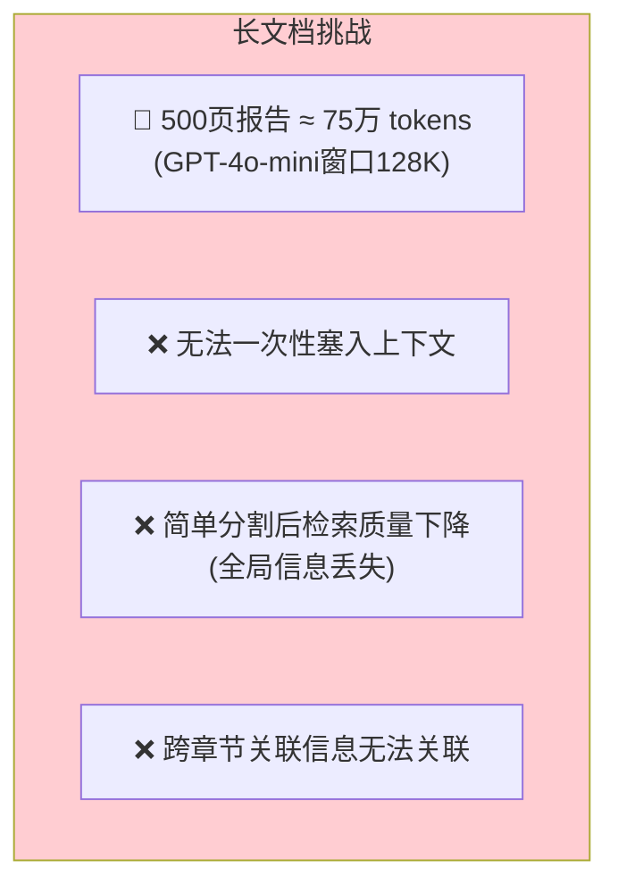
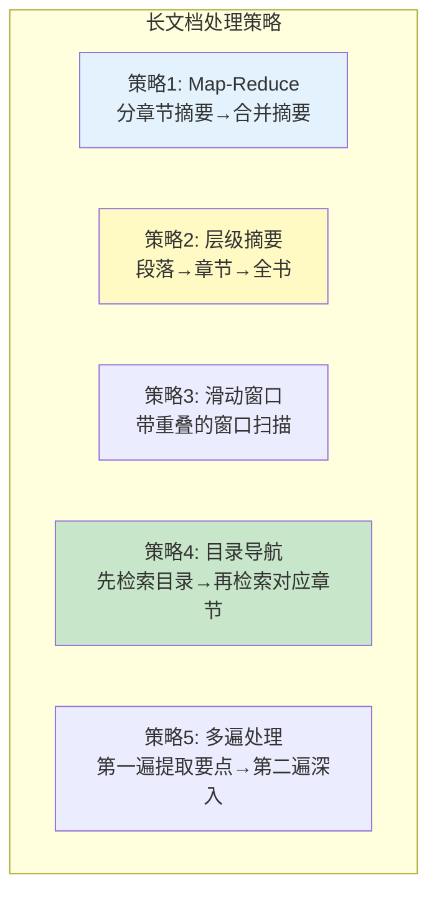
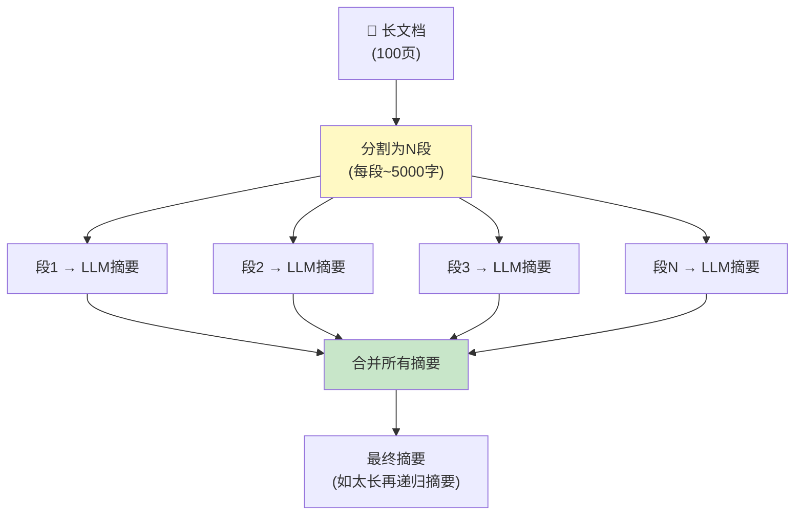
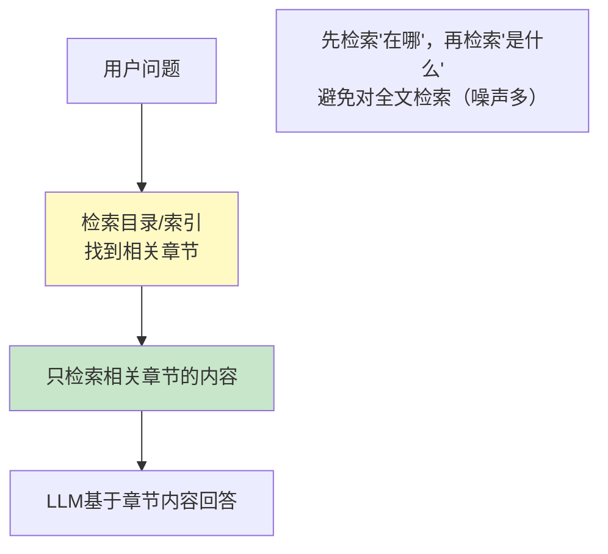

# 长文档处理策略

> 一本 500 页的书、一份 200 页的报告——当文档远超上下文窗口时，需要特殊策略。

---

## 一、长文档的挑战



## 二、处理策略全景



## 三、策略一：Map-Reduce 摘要



```python
from langchain_openai import ChatOpenAI
from langchain_core.prompts import ChatPromptTemplate
from langchain_core.output_parsers import StrOutputParser
from langchain_text_splitters import RecursiveCharacterTextSplitter

llm = ChatOpenAI(model="gpt-4o-mini", temperature=0)

def map_reduce_summary(text: str, chunk_size: int = 4000) -> str:
    """Map-Reduce 长文档摘要"""
    # Step 1: Map - 分段摘要
    splitter = RecursiveCharacterTextSplitter(
        chunk_size=chunk_size, chunk_overlap=200
    )
    chunks = splitter.split_text(text)

    summary_prompt = ChatPromptTemplate.from_template(
        "用200字以内总结以下内容的要点：\n&#123;text&#125;\n\n摘要："
    )
    chain = summary_prompt | llm | StrOutputParser()

    print(f"文档分割为 &#123;len(chunks)&#125; 段")
    summaries = []
    for i, chunk in enumerate(chunks):
        print(f"  正在摘要第&#123;i+1&#125;段...")
        summary = chain.invoke(&#123;"text": chunk&#125;)
        summaries.append(summary)

    # Step 2: Reduce - 合并摘要
    combined = "\n\n".join(summaries)

    # 如果合并后仍然太长，递归摘要
    if len(combined) > chunk_size:
        print("  合并后仍然较长，递归摘要...")
        return map_reduce_summary(combined, chunk_size)

    final_prompt = ChatPromptTemplate.from_template(
        "将以下各段摘要整合为一份连贯的总结：\n&#123;combined&#125;\n\n最终摘要："
    )
    final_chain = final_prompt | llm | StrOutputParser()
    return final_chain.invoke(&#123;"combined": combined&#125;)
```

## 四、策略二：层级摘要

```mermaid
graph TB
    subgraph 层级摘要 &#123;"层级摘要结构"&#125;
        L3["全书摘要<br/>(~500字)"]
        L2_1["第1章摘要"] & L2_2["第2章摘要"] & L2_3["第3章摘要"] & L2_N["第N章摘要"]
        L3 --> L2_1 & L2_2 & L2_3 & L2_N

        L2_1 --> L1_1["1.1节摘要"] & L1_2["1.2节摘要"]
        L2_2 --> L1_3["2.1节摘要"] & L1_4["2.2节摘要"]

        Note1["从粗到细的层级结构<br/>检索时可按需展开"]
    end

    style L3 fill:#E3F2FD
    style Note1 fill:#C8E6C9
```

```python
def hierarchical_summary(document: str, llm) -> dict:
    """层级摘要：文档→章节→段落"""
    # Step 1: 识别章节（按标题分割）
    import re
    chapters = re.split(r'\n#&#123;1,2&#125;\s', document)

    result = &#123;"chapters": []&#125;

    for i, chapter in enumerate(chapters):
        if len(chapter.strip()) < 50:
            continue

        # Step 2: 对每章做摘要
        chapter_prompt = ChatPromptTemplate.from_template(
            "用一句话总结这一章的主题：\n&#123;text[:3000]&#125;\n\n主题："
        )
        chapter_summary = (chapter_prompt | llm | StrOutputParser()).invoke(
            &#123;"text": chapter&#125;
        )

        result["chapters"].append(&#123;
            "index": i,
            "summary": chapter_summary,
            "length": len(chapter),
            "preview": chapter[:200],
        &#125;)

    # Step 3: 全书摘要
    all_summaries = "\n".join(
        f"第&#123;c['index']&#125;章: &#123;c['summary']&#125;" for c in result["chapters"]
    )
    book_prompt = ChatPromptTemplate.from_template(
        "基于各章节摘要，用100字总结全文主题：\n&#123;summaries&#125;\n\n全文摘要："
    )
    result["book_summary"] = (book_prompt | llm | StrOutputParser()).invoke(
        &#123;"summaries": all_summaries&#125;
    )

    return result
```

## 五、策略三：目录导航检索



```python
def toc_guided_rag(question: str, vectorstore, llm) -> str:
    """目录导航RAG：先找相关章节，再深入检索"""

    # Step 1: 检索目录/章节标题
    toc_results = vectorstore.similarity_search(
        f"目录 章节标题: &#123;question&#125;", k=3
    )

    # Step 2: 基于找到的章节，深入检索内容
    chapter_context = "\n".join(d.page_content for d in toc_results)

    deep_prompt = ChatPromptTemplate.from_template(
        """基于以下章节内容回答问题。

        章节内容：
        &#123;context&#125;

        问题：&#123;question&#125;

        回答："""
    )
    chain = deep_prompt | llm | StrOutputParser()
    return chain.invoke(&#123;
        "context": chapter_context,
        "question": question,
    &#125;)
```

## 六、策略四：多遍处理

```mermaid
graph TB
    subgraph 多遍处理 &#123;"多遍处理策略"&#125;
        P1["第1遍: 快速扫描<br/>LLM快速读取全文（分块）<br/>提取关键信息点和实体"]
        P1 --> P2["中间结果:<br/>关键实体列表<br/>重要段落标记"]
        P2 --> P3["第2遍: 深入分析<br/>基于第1遍的标记<br/>只读取相关段落深入分析"]
        P3 --> P4["最终结果<br/>综合性的深入分析"]
    end

    style P1 fill:#E3F2FD
    style P3 fill:#C8E6C9
```

## 七、策略选择决策

```mermaid
graph TD
    Q&#123;"文档长度?"&#125;
    Q -->|"<5000字"| S0["直接传入<br/>无需特殊处理"]
    Q -->|"5000-50000字"| S1["Map-Reduce摘要<br/>或直接RAG"]
    Q -->|">50000字<br/>(一本书)"| S2&#123;"需求?"&#125;

    S2 -->|"整体摘要"| M1["Map-Reduce<br/>或层级摘要"]
    S2 -->|"特定问题"| M2["目录导航检索"]
    S2 -->|"深度分析"| M3["多遍处理"]
    S2 -->|"问答系统"| M4["传统RAG<br/>(分割+向量化)"]

    style S0 fill:#C8E6C9
    style M1 fill:#E3F2FD
    style M2 fill:#FFF9C4
    style M4 fill:#F3E5F5
```

## 八、成本注意事项

| 策略 | LLM调用次数 | 成本 | 适用场景 |
|------|-----------|------|---------|
| 直接传入 | 1次 | 低 | 短文档(<5000字) |
| Map-Reduce | N+1次 | 中 | 中长文档摘要 |
| 层级摘要 | N+1次 | 中 | 结构化文档 |
| 目录导航 | 2次 | 低 | 长文档特定问题 |
| 多遍处理 | 2N+1次 | 高 | 深度分析 |

> 💡 对于问答系统，最经济的方案通常是直接用 RAG（分割+向量化），无需对全文做摘要。
