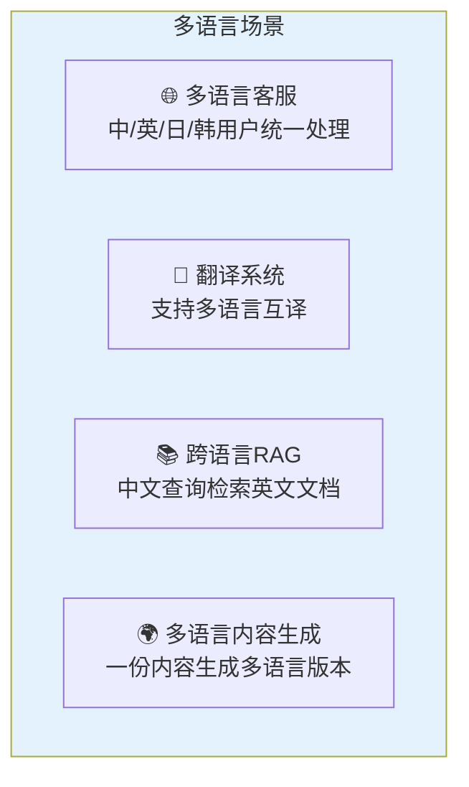
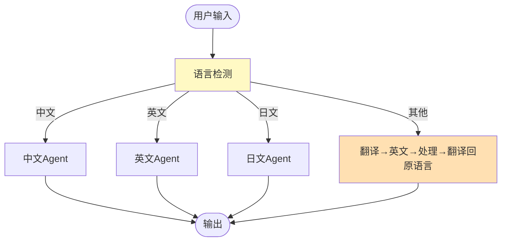

# 多语言与翻译 Agent

> 用 LLM 构建多语言应用：自动检测语言、翻译、跨语言 RAG、多语言对话。

---

## 一、多语言应用场景



## 二、语言检测

```python
from langchain_openai import ChatOpenAI
from langchain_core.prompts import ChatPromptTemplate
from langchain_core.output_parsers import StrOutputParser

llm = ChatOpenAI(model="gpt-4o-mini", temperature=0)

def detect_language(text: str) -> str:
    """检测文本语言"""
    prompt = ChatPromptTemplate.from_template(
        """检测以下文本的语言，只返回语言代码：
        zh(中文), en(英文), ja(日文), ko(韩文), fr(法语), de(德语)

        文本：&#123;text[:200]&#125;

        语言代码："""
    )
    chain = prompt | llm | StrOutputParser()
    lang = chain.invoke(&#123;"text": text&#125;).strip().lower()
    valid = ["zh", "en", "ja", "ko", "fr", "de"]
    return lang if lang in valid else "en"
```

## 三、翻译 Agent

### 3.1 基础翻译链

```python
def translate(text: str, target_lang: str) -> str:
    """翻译文本"""
    lang_names = &#123;"zh": "中文", "en": "英文", "ja": "日文", "ko": "韩文", "fr": "法语", "de": "德语"&#125;
    target_name = lang_names.get(target_lang, "英文")

    prompt = ChatPromptTemplate.from_template(
        """将以下文本翻译为&#123;target&#125;。
        规则：
        1. 保持原文语气和风格
        2. 专有名词保留原文并在括号中注释
        3. 只输出翻译结果

        原文：&#123;text&#125;

        翻译："""
    )
    chain = prompt | llm | StrOutputParser()
    return chain.invoke(&#123;"text": text, "target": target_name&#125;)
```

### 3.2 翻译 Agent（带质量检查的 LangGraph）

```python
from typing import TypedDict, Annotated
from operator import add
from langchain_core.messages import AnyMessage
from langgraph.graph import StateGraph, START, END

class TranslationState(TypedDict):
    original: str         # 原文
    source_lang: str       # 源语言
    target_lang: str       # 目标语言
    translation: str       # 翻译结果
    review: str            # 审查意见
    retry: int             # 重试次数

def translate_node(state: TranslationState) -> dict:
    """翻译节点"""
    result = translate(state["original"], state["target_lang"])
    return &#123;"translation": result, "retry": state.get("retry", 0) + 1&#125;

def review_node(state: TranslationState) -> dict:
    """翻译质量审查"""
    prompt = ChatPromptTemplate.from_template(
        """审查翻译质量。1-5分。如果≥4分回复PASS，否则回复FAIL和建议。

        原文(&#123;src&#125;): &#123;original&#125;
        翻译(&#123;tgt&#125;): &#123;translation&#125;

        审查："""
    )
    chain = prompt | llm | StrOutputParser()
    review = chain.invoke(&#123;
        "src": state["source_lang"],
        "tgt": state["target_lang"],
        "original": state["original"],
        "translation": state["translation"],
    &#125;)
    return &#123;"review": review&#125;

def route_review(state: TranslationState) -> str:
    if "PASS" in state.get("review", ""):
        return "done"
    if state.get("retry", 0) >= 2:
        return "done"
    return "retry"

# 构建图
graph = StateGraph(TranslationState)
graph.add_node("translate", translate_node)
graph.add_node("review", review_node)
graph.add_edge(START, "translate")
graph.add_edge("translate", "review")
graph.add_conditional_edges(
    "review", route_review,
    &#123;"retry": "translate", "done": END&#125;
)
app = graph.compile()

# 使用
result = app.invoke(&#123;
    "original": "人工智能正在改变世界",
    "source_lang": "zh", "target_lang": "en",
    "translation": "", "review": "", "retry": 0,
&#125;)
print(result["translation"])
```

## 四、跨语言 RAG

```mermaid
graph TB
    subgraph 跨语言RAG ["跨语言 RAG"&#125;
        Q["用户中文问题:<br/>'量子计算的应用'"] --> TRANS["翻译为英文<br/>(与文档语言一致)"]
        TRANS --> SEARCH["英文检索<br/>(英文文档库)"]
        SEARCH --> DOC["找到英文文档片段"]
        DOC --> TRANS2["翻译为中文<br/>(与用户语言一致)"]
        TRANS2 --> GEN["LLM用中文生成回答"]
    end

    style 跨语言RAG fill:#E3F2FD
```

```python
def cross_lingual_rag(question: str, vectorstore, llm, doc_lang: str = "en") -> str:
    """跨语言RAG"""
    user_lang = detect_language(question)

    # 如果用户语言与文档语言不同，先翻译查询
    if user_lang != doc_lang:
        translated_query = translate(question, doc_lang)
    else:
        translated_query = question

    # 用翻译后的查询检索
    docs = vectorstore.similarity_search(translated_query, k=3)
    context = "\n".join(d.page_content for d in docs)

    # 生成回答（用用户语言）
    lang_names = &#123;"zh": "中文", "en": "英文", "ja": "日文"&#125;
    answer_lang = lang_names.get(user_lang, "英文")

    prompt = ChatPromptTemplate.from_template(
        f"基于以下知识回答问题，用&#123;answer_lang&#125;回答：\n\n&#123;&#123;context&#125;&#125;\n\n问题：&#123;&#123;question&#125;&#125;"
    )
    chain = prompt | llm
    return chain.invoke(&#123;
        "context": context,
        "question": question,  # 用原始问题
    &#125;).content
```

## 五、多语言路由 Agent



```python
def multilingual_agent(user_input: str, llm) -> str:
    """多语言Agent：自动检测语言并用对应语言回复"""
    lang = detect_language(user_input)
    lang_names = &#123;"zh": "中文", "en": "英文", "ja": "日文", "ko": "韩文"&#125;

    prompt = ChatPromptTemplate.from_template(
        f"你是一个多语言助手。用&#123;lang_names.get(lang, '英文')&#125;回答：\n&#123;&#123;input&#125;&#125;"
    )
    chain = prompt | llm
    return chain.invoke(&#123;"input": user_input&#125;).content
```

## 六、策略选择

| 场景 | 推荐方案 | 复杂度 |
|------|---------|--------|
| 单语言应用 | 直接用该语言 | ★☆☆ |
| 多语言客服 | 语言检测+路由 | ★★☆ |
| 跨语言RAG | 翻译查询→检索→翻译回答 | ★★★ |
| 高质量翻译 | LangGraph翻译+审查循环 | ★★★ |
| 多语言内容生成 | 一次生成多语言版本 | ★★☆ |
