# Agent 流式输出与 SSE 实时推送指南

> Agent 回答一个长问题需要 8 秒——用户等不了。流式输出让用户逐字看到回答，SSE 推送让前端实时收到 Token。这篇指南讲透 LangGraph 流式 API、SSE 服务端实现和前端打字机效果。

---

## 一、流式输出架构

```mermaid
graph TB
    USER["用户请求"] --> AGENT["Agent开始执行"]
    AGENT --> STREAM["流式输出<br/>逐Token产生"]
    STREAM --> SSE["SSE Server<br/>Server-Sent Events"]
    SSE -->|"data: &#123;token&#125;"| FRONTEND["前端<br/>打字机渲染"]
    STREAM -->|"同时"| EVENT["事件流<br/>工具调用/状态变更"]
    EVENT -->|"event: tool"| FRONTEND

    style STREAM fill:#FFF9C4,stroke:#F9A825,stroke-width:3px
    style SSE fill:#E3F2FD,stroke:#1565C0
    style FRONTEND fill:#C8E6C9
```



---

## 二、SSE 服务端实现

```python
from dataclasses import dataclass, field
from datetime import datetime
from enum import Enum
from typing import Any, AsyncGenerator
import asyncio
import json

class EventType(str, Enum):
    TOKEN = "token"            # 文本Token
    TOOL_START = "tool_start"  # 工具开始
    TOOL_END = "tool_end"      # 工具结束
    ERROR = "error"
    DONE = "done"

@dataclass
class StreamEvent:
    """流式事件。"""
    event_type: EventType
    data: Any
    timestamp: str = field(default_factory=lambda: datetime.now().isoformat())

    def to_sse(self) -> str:
        """转为SSE格式。"""
        payload = json.dumps(&#123;"type": self.event_type.value, "data": self.data&#125;, ensure_ascii=False)
        return f"event: &#123;self.event_type.value&#125;\ndata: &#123;payload&#125;\n\n"


class SSEStreamManager:
    """SSE 流管理器。"""

    def __init__(self):
        self._queue: asyncio.Queue[StreamEvent] = asyncio.Queue()
        self._closed = False

    async def send_token(self, token: str):
        """发送文本Token。"""
        await self._queue.put(StreamEvent(EventType.TOKEN, token))

    async def send_tool_start(self, tool_name: str, args: dict):
        """发送工具开始事件。"""
        await self._queue.put(StreamEvent(EventType.TOOL_START, &#123;"tool": tool_name, "args": args&#125;))

    async def send_tool_end(self, tool_name: str, result: Any):
        """发送工具结束事件。"""
        await self._queue.put(StreamEvent(EventType.TOOL_END, &#123;"tool": tool_name, "result": str(result)[:200]&#125;))

    async def send_error(self, error: str):
        """发送错误。"""
        await self._queue.put(StreamEvent(EventType.ERROR, error))

    async def send_done(self):
        """发送完成信号。"""
        await self._queue.put(StreamEvent(EventType.DONE, None))
        self._closed = True

    async def stream(self) -> AsyncGenerator[str, None]:
        """生成SSE流。"""
        while not (self._closed and self._queue.empty()):
            try:
                event = await asyncio.wait_for(self._queue.get(), timeout=30.0)
                yield event.to_sse()
            except asyncio.TimeoutError:
                # 发送心跳保活
                yield ": heartbeat\n\n"

    async def close(self):
        """关闭流。"""
        await self.send_done()


# ===== LangGraph 流式集成 =====

from langgraph.prebuilt import create_react_agent
from langchain_openai import ChatOpenAI
from langchain_core.messages import HumanMessage

llm = ChatOpenAI(model="gpt-4o-mini", temperature=0, streaming=True)

class StreamingAgentRunner:
    """带流式输出的Agent运行器。"""

    def __init__(self, llm, tools=None):
        self.agent = create_react_agent(llm, tools or [], prompt="你是智能助手。")

    async def run_with_sse(self, query: str, stream_manager: SSEStreamManager):
        """运行Agent并通过SSE推送事件。"""
        try:
            # 使用astream_events获取所有事件
            async for event in self.agent.astream_events(
                &#123;"messages": [&#123;"role": "user", "content": query&#125;]&#125;,
                version="v2",
            ):
                event_type = event.get("event", "")
                data = event.get("data", "")

                # 文本Token
                if event_type == "on_chat_model_stream":
                    chunk = data.chunk if hasattr(data, "chunk") else ""
                    if chunk:
                        content = chunk.content if hasattr(chunk, "content") else str(chunk)
                        if content:
                            await stream_manager.send_token(content)

                # 工具调用开始
                elif event_type == "on_tool_start":
                    tool_name = event.get("name", "")
                    await stream_manager.send_tool_start(tool_name, &#123;&#125;)

                # 工具调用结束
                elif event_type == "on_tool_end":
                    tool_name = event.get("name", "")
                    output = event.get("data", "")
                    await stream_manager.send_tool_end(tool_name, str(output)[:200])

            await stream_manager.send_done()
        except Exception as e:
            await stream_manager.send_error(str(e))
            await stream_manager.send_done()


# ===== FastAPI SSE端点示例（伪代码） =====

class SSEEndpointHandler:
    """SSE端点处理器。"""

    @staticmethod
    async def handle_query(query: str):
        """处理查询请求——返回SSE流。"""
        stream_manager = SSEStreamManager()
        runner = StreamingAgentRunner(llm)

        # 后台任务运行Agent
        task = asyncio.create_task(runner.run_with_sse(query, stream_manager))

        # 返回SSE流
        async for sse_data in stream_manager.stream():
            yield sse_data

        await task
```

### 使用示例

```python
import asyncio

async def main():
    stream_manager = SSEStreamManager()
    runner = StreamingAgentRunner(llm)

    # 后台运行Agent
    task = asyncio.create_task(runner.run_with_sse("什么是LangGraph？", stream_manager))

    # 消费SSE流
    async for sse_data in stream_manager.stream():
        # 解析SSE
        if sse_data.startswith("event:"):
            lines = sse_data.strip().split("\n")
            event_type = lines[0].split(": ", 1)[1]
            if event_type == "token":
                data = json.loads(lines[1].split("data: ", 1)[1])
                print(data["data"], end="", flush=True)
            elif event_type == "tool_start":
                print(f"\n[工具开始]", end="")
            elif event_type == "tool_end":
                print(f"[工具结束]", end="")
            elif event_type == "done":
                print("\n[完成]")
                break
        elif sse_data.startswith(":"):
            pass  # 心跳

    await task

asyncio.run(main())
```

---

## 三、SSE 事件格式

```
event: token
data: &#123;"type":"token","data":"Lang"&#125;

event: token
data: &#123;"type":"token","data":"Graph"&#125;

event: tool_start
data: &#123;"type":"tool_start","data":&#123;"tool":"search","args":&#123;&#125;&#125;&#125;

event: tool_end
data: &#123;"type":"tool_end","data":&#123;"tool":"search","result":"..."&#125;&#125;

event: done
data: &#123;"type":"done","data":null&#125;
```

---

## 四、流式 vs 非流式对比

| 维度 | 非流式 | 流式 |
|------|--------|------|
| 首Token延迟 | 等全部生成完 | 200-500ms |
| 用户感知 | 等待焦虑 | 即时反馈 |
| 超时风险 | 长回答容易超时 | 低 |
| 实现复杂度 | 低 | 中 |
| 可中断性 | 不可中断 | 可随时断开 |

---

## 五、最佳实践

| 实践 | 说明 | 优先级 |
|------|------|--------|
| streaming=True | 模型初始化开启流式 | ★★★ |
| 心跳保活 | 30s发一次心跳 | ★★★ |
| 事件类型分离 | token/tool/error分开 | ★★★ |
| 前端打字机效果 | 逐字渲染 | ★★☆ |
| 错误也走流式 | 不突然断开 | ★★☆ |
| 可中断 | 前端可取消 | ★☆☆ |

---

## 六、检查清单

| 检查项 | 状态 |
|--------|------|
| 有SSE流管理器 | ☐ |
| 有Token推送 | ☐ |
| 有工具事件 | ☐ |
| 有心跳保活 | ☐ |
| 有错误处理 | ☐ |
| 有完成信号 | ☐ |
