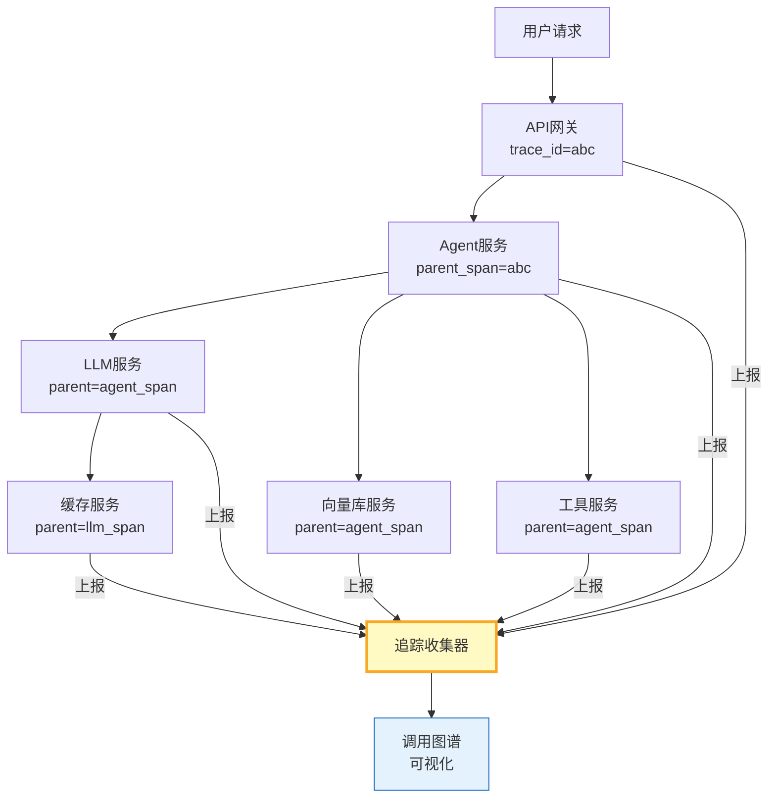

# LLM 应用分布式追踪与调用图谱指南

> Agent 调用链跨多个微服务——LLM网关、向量库、工具服务、缓存层。一个请求的调用链分散在各服务日志中，出问题时无法拼出完整路径。这篇指南讲透分布式追踪、调用图谱可视化和跨服务 span 关联。

---

## 一、分布式追踪架构



每个服务在自己的日志中记录 span（trace_id + parent_span_id），通过统一 trace_id 关联成完整调用树。

---

## 二、分布式追踪实现

```python
from dataclasses import dataclass, field
from datetime import datetime
from enum import Enum
from typing import Any, Optional
import uuid
import time
import asyncio
import json
from collections import defaultdict

class SpanKind(str, Enum):
    INTERNAL = "internal"   # 内部调用
    CLIENT = "client"        # 发起远程调用
    SERVER = "server"        # 接收远程调用
    PRODUCER = "producer"    # 消息生产者
    CONSUMER = "consumer"    # 消息消费者

@dataclass
class DistributedSpan:
    """分布式Span。"""
    trace_id: str             # 全局追踪ID
    span_id: str              # 本Span ID
    parent_span_id: Optional[str]  # 父Span ID
    service_name: str         # 服务名
    operation: str            # 操作名
    kind: SpanKind = SpanKind.INTERNAL
    start_time: float = field(default_factory=time.monotonic)
    end_time: Optional[float] = None
    tags: dict = field(default_factory=dict)
    logs: list[dict] = field(default_factory=list)
    status: str = "ok"        # ok / error

    @property
    def duration_ms(self) -> float:
        end = self.end_time or time.monotonic()
        return round((end - self.start_time) * 1000, 1)

    def set_tag(self, key: str, value: Any):
        self.tags[key] = str(value)[:200]

    def log_event(self, event: str, **fields):
        self.logs.append(&#123;
            "event": event,
            "timestamp": datetime.now().isoformat(),
            "fields": &#123;k: str(v)[:100] for k, v in fields.items()&#125;,
        &#125;)

    def finish(self, status: str = "ok"):
        self.end_time = time.monotonic()
        self.status = status

    def to_dict(self) -> dict:
        return &#123;
            "trace_id": self.trace_id,
            "span_id": self.span_id,
            "parent_span_id": self.parent_span_id,
            "service": self.service_name,
            "operation": self.operation,
            "kind": self.kind.value,
            "duration_ms": self.duration_ms,
            "status": self.status,
            "tags": self.tags,
            "logs": self.logs,
            "start_time": self.start_time,
        &#125;


class TraceContext:
    """追踪上下文——在服务间传递。"""

    def __init__(self, trace_id: str, parent_span_id: str = None):
        self.trace_id = trace_id
        self.parent_span_id = parent_span_id

    def to_headers(self) -> dict:
        """转为HTTP头——跨服务传递。"""
        return &#123;
            "X-Trace-Id": self.trace_id,
            "X-Parent-Span-Id": self.parent_span_id or "",
        &#125;

    @classmethod
    def from_headers(cls, headers: dict) -> "TraceContext":
        """从HTTP头恢复上下文。"""
        return cls(
            trace_id=headers.get("X-Trace-Id", str(uuid.uuid4().hex[:16])),
            parent_span_id=headers.get("X-Parent-Span-Id") or None,
        )


class DistributedTracer:
    """分布式追踪器。"""

    def __init__(self, service_name: str):
        self.service_name = service_name
        self._spans: list[DistributedSpan] = []
        self._current_context: Optional[TraceContext] = None

    def start_span(self, operation: str, kind: SpanKind = SpanKind.INTERNAL,
                   context: TraceContext = None) -> DistributedSpan:
        """开始一个Span。"""
        ctx = context or self._current_context or TraceContext(trace_id=uuid.uuid4().hex[:16])

        span = DistributedSpan(
            trace_id=ctx.trace_id,
            span_id=uuid.uuid4().hex[:12],
            parent_span_id=ctx.parent_span_id,
            service_name=self.service_name,
            operation=operation,
            kind=kind,
        )
        self._spans.append(span)

        # 更新当前上下文
        self._current_context = TraceContext(
            trace_id=ctx.trace_id,
            parent_span_id=span.span_id,
        )

        return span

    def finish_span(self, span: DistributedSpan, status: str = "ok"):
        """结束Span。"""
        span.finish(status)

    def get_trace_tree(self, trace_id: str) -> dict:
        """构建调用树。"""
        spans = [s for s in self._spans if s.trace_id == trace_id]
        if not spans:
            return &#123;&#125;

        # 构建父子关系
        span_map = &#123;s.span_id: &#123;**s.to_dict(), "children": []&#125; for s in spans&#125;
        roots = []
        for s in spans:
            if s.parent_span_id and s.parent_span_id in span_map:
                span_map[s.parent_span_id]["children"].append(span_map[s.span_id])
            else:
                roots.append(span_map[s.span_id])

        return &#123;"trace_id": trace_id, "roots": roots, "total_spans": len(spans)&#125;

    def get_call_graph(self, trace_id: str) -> dict:
        """生成调用图谱——服务间调用关系。"""
        spans = [s for s in self._spans if s.trace_id == trace_id]
        edges = []
        services = set()

        for span in spans:
            services.add(span.service_name)
            if span.parent_span_id:
                parent = next((s for s in spans if s.span_id == span.parent_span_id), None)
                if parent:
                    edges.append(&#123;
                        "from": parent.service_name,
                        "to": span.service_name,
                        "operation": span.operation,
                        "duration_ms": span.duration_ms,
                        "status": span.status,
                    &#125;)

        return &#123;
            "trace_id": trace_id,
            "services": list(services),
            "edges": edges,
            "total_calls": len(edges),
        &#125;

    def get_slow_paths(self, trace_id: str, threshold_ms: float = 1000) -> list[dict]:
        """找出慢调用路径。"""
        graph = self.get_call_graph(trace_id)
        slow = [e for e in graph["edges"] if e["duration_ms"] > threshold_ms]
        return sorted(slow, key=lambda e: e["duration_ms"], reverse=True)

    def get_stats(self) -> dict:
        return &#123;
            "total_spans": len(self._spans),
            "unique_traces": len(set(s.trace_id for s in self._spans)),
            "services": list(set(s.service_name for s in self._spans)),
            "errors": sum(1 for s in self._spans if s.status == "error"),
        &#125;
```

### 多服务追踪示例

```python
import asyncio
from langchain_openai import ChatOpenAI

llm = ChatOpenAI(model="gpt-4o-mini", temperature=0)

class TracedAgent:
    """带分布式追踪的Agent。"""

    def __init__(self):
        self.gateway_tracer = DistributedTracer("api-gateway")
        self.agent_tracer = DistributedTracer("agent-service")
        self.llm_tracer = DistributedTracer("llm-service")
        self.vec_tracer = DistributedTracer("vector-db")

    async def handle_request(self, query: str) -> dict:
        """处理请求——跨服务追踪。"""
        # 1. 网关层
        gw_span = self.gateway_tracer.start_span("handle_request", SpanKind.SERVER)
        gw_span.set_tag("query", query[:100])
        ctx = self.gateway_tracer._current_context

        # 2. Agent服务
        agent_span = self.agent_tracer.start_span("agent.execute", context=ctx)
        agent_span.set_tag("query", query[:100])

        # 3. 向量库检索
        vec_span = self.vec_tracer.start_span("vector.search", context=TraceContext(
            trace_id=ctx.trace_id, parent_span_id=agent_span.span_id))
        await asyncio.sleep(0.05)  # 模拟检索
        vec_span.set_tag("results_count", 5)
        self.vec_tracer.finish_span(vec_span)

        # 4. LLM调用
        llm_span = self.llm_tracer.start_span("llm.invoke", context=TraceContext(
            trace_id=ctx.trace_id, parent_span_id=agent_span.span_id))
        llm_span.set_tag("model", "gpt-4o-mini")
        response = await llm.ainvoke(query)
        llm_span.set_tag("response_length", len(response.content))
        self.llm_tracer.finish_span(llm_span)

        # 5. 完成
        self.agent_tracer.finish_span(agent_span)
        self.gateway_tracer.finish_span(gw_span)

        trace_id = ctx.trace_id
        return &#123;"response": response.content[:200], "trace_id": trace_id&#125;

    def get_trace(self, trace_id: str):
        """获取追踪数据。"""
        all_spans = (self.gateway_tracer._spans + self.agent_tracer._spans +
                     self.llm_tracer._spans + self.vec_tracer._spans)

        spans = [s for s in all_spans if s.trace_id == trace_id]
        span_map = &#123;s.span_id: &#123;**s.to_dict(), "children": []&#125; for s in spans&#125;
        roots = []
        for s in spans:
            if s.parent_span_id and s.parent_span_id in span_map:
                span_map[s.parent_span_id]["children"].append(span_map[s.span_id])
            else:
                roots.append(span_map[s.span_id])

        return &#123;"trace_id": trace_id, "tree": roots, "total_spans": len(spans)&#125;
```

---

## 三、调用图谱可视化

```python
def generate_mermaid_call_graph(trace_data: dict) -> str:
    """生成调用图谱的Mermaid代码。"""
    edges = trace_data.get("edges", [])
    if not edges:
        return "graph TB\n    empty[无调用数据]"

    lines = ["graph TB"]
    seen_nodes = set()

    for edge in edges:
        from_node = edge["from"].replace("-", "_")
        to_node = edge["to"].replace("-", "_")
        lines.append(f"    &#123;from_node&#125;[&#123;edge['from']&#125;]")

        color = "#C8E6C9" if edge["status"] == "ok" else "#FFCDD2"
        lines.append(f"    &#123;from_node&#125; -->|&#123;edge['duration_ms']:.0f&#125;ms| &#123;to_node&#125;[&#123;edge['to']&#125;]")

    return "\n".join(lines)
```

---

## 四、最佳实践

| 实践 | 说明 | 优先级 |
|------|------|--------|
| trace_id透传 | HTTP头传递到下游服务 | ★★★ |
| 每服务独立Tracer | 服务名标注来源 | ★★★ |
| 记录关键标签 | model/query/results_count | ★★★ |
| 慢路径自动标记 | >1s的span标记 | ★★☆ |
| 调用图谱可视化 | Mermaid/JSON导出 | ★★☆ |
| 与日志关联 | span_id写入日志 | ★★☆ |

---

## 五、检查清单

| 检查项 | 状态 |
|--------|------|
| 有分布式Span | ☐ |
| 有trace_id透传 | ☐ |
| 有调用树构建 | ☐ |
| 有调用图谱 | ☐ |
| 有慢路径检测 | ☐ |
| 有跨服务追踪 | ☐ |
