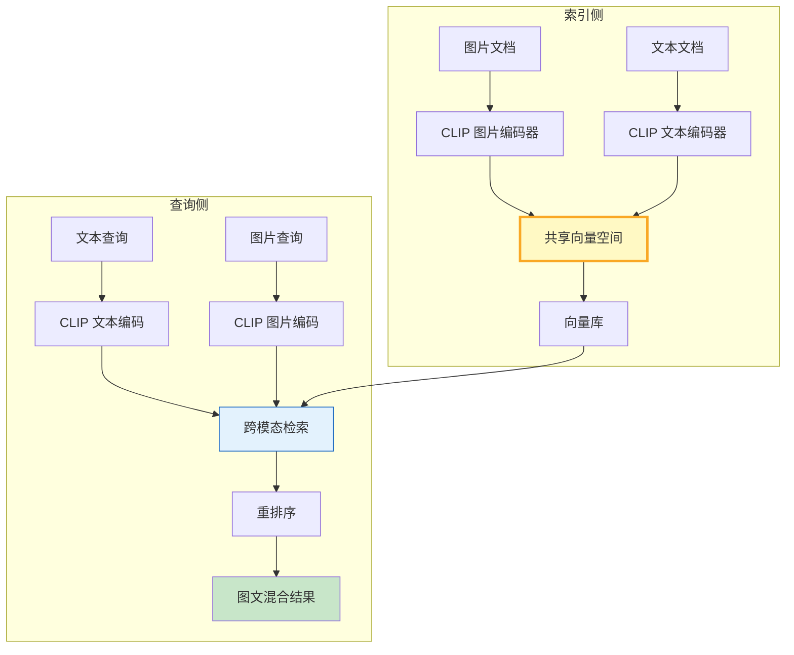

# RAG 多模态检索与跨模态对齐指南

> 传统 RAG 只处理文本。但现实中知识往往以图片、表格、截图形式存在。多模态检索通过跨模态嵌入（CLIP、BLIP）把文本和图片映射到同一向量空间，实现"用文字搜图片、用图片搜文字"。

---

## 一、跨模态检索架构



核心：CLIP 模型将图片和文本编码到同一个 512/768 维向量空间，相似度直接可比较。

---

## 二、多模态文档分块与索引

```python
from dataclasses import dataclass, field
from typing import Literal
from uuid import uuid4

@dataclass
class MultimodalChunk:
    """多模态文档块：文本或图片"""
    chunk_id: str = field(default_factory=lambda: str(uuid4()))
    modality: Literal["text", "image"] = "text"
    content: str = ""           # 文本内容或图片描述
    image_path: str = ""        # 图片路径（图片块）
    embedding: list[float] = field(default_factory=list)
    metadata: dict = field(default_factory=dict)

@dataclass
class MultimodalIndexer:
    """多模态索引器：把图文文档统一编码入库"""
    chunks: list[MultimodalChunk] = field(default_factory=list)

    def add_text(self, text: str, source: str = "") -> None:
        self.chunks.append(MultimodalChunk(
            modality="text", content=text,
            metadata=&#123;"source": source&#125;
        ))

    def add_image(self, image_path: str, caption: str = "") -> None:
        self.chunks.append(MultimodalChunk(
            modality="image", content=caption,
            image_path=image_path,
            metadata=&#123;"source": image_path&#125;
        ))

    def stats(self) -> dict[str, int]:
        text_count = sum(1 for c in self.chunks if c.modality == "text")
        image_count = sum(1 for c in self.chunks if c.modality == "image")
        return &#123;"text_chunks": text_count, "image_chunks": image_count&#125;
```

每个块统一为 `MultimodalChunk`，`modality` 字段区分文本和图片，`content` 存文本或图片描述。

---

## 三、CLIP 跨模态编码

```python
import numpy as np

class CLIPRetriever:
    """基于 CLIP 的跨模态检索器"""

    def __init__(self, dim: int = 512):
        self.dim = dim
        self._embeddings: np.ndarray = np.zeros((0, dim))
        self._chunks: list[MultimodalChunk] = []

    def _encode_text(self, text: str) -> np.ndarray:
        """模拟 CLIP 文本编码：实际调用 CLIPModel.get_text_features()"""
        np.random.seed(hash(text) % (2**32))
        vec = np.random.randn(self.dim).astype(np.float32)
        return vec / np.linalg.norm(vec)

    def _encode_image(self, image_path: str) -> np.ndarray:
        """模拟 CLIP 图片编码：实际调用 CLIPModel.get_image_features()"""
        np.random.seed(hash(image_path) % (2**32))
        vec = np.random.randn(self.dim).astype(np.float32)
        return vec / np.linalg.norm(vec)

    def index(self, indexer: MultimodalIndexer) -> None:
        """批量索引所有文档块"""
        for chunk in indexer.chunks:
            if chunk.modality == "text":
                chunk.embedding = self._encode_text(chunk.content).tolist()
            else:
                chunk.embedding = self._encode_image(chunk.image_path).tolist()
            self._chunks.append(chunk)
        self._embeddings = np.array([c.embedding for c in self._chunks])

    async def search(self, query: str, modality_filter: str | None = None,
                     top_k: int = 5) -> list[tuple[MultimodalChunk, float]]:
        """跨模态检索：文本查询可同时搜到文本和图片"""
        q_vec = self._encode_text(query)
        scores = (self._embeddings @ q_vec).tolist()

        results = list(zip(self._chunks, scores))
        if modality_filter:
            results = [(c, s) for c, s in results if c.modality == modality_filter]
        results.sort(key=lambda x: x[1], reverse=True)
        return results[:top_k]
```

实际项目中把 `_encode_text` / `_encode_image` 替换为真实 CLIP 调用：

```python
# from transformers import CLIPModel, CLIPProcessor
# model = CLIPModel.from_pretrained("openai/clip-vit-base-patch32")
# processor = CLIPProcessor.from_pretrained("openai/clip-vit-base-patch32")
```

---

## 四、多模态 RAG 组装

```python
import asyncio

async def multimodal_rag_demo():
    indexer = MultimodalIndexer()
    # 添加文本块
    indexer.add_text("LangGraph 的核心是 StateGraph 状态图", "guide.md")
    indexer.add_text("Agent 使用 create_react_agent 创建", "guide.md")
    # 添加图片块（带描述）
    indexer.add_image("figures/arch.png", "LangGraph 架构图：节点+边+状态")
    indexer.add_image("figures/flow.png", "Agent 工作流：感知→推理→行动")

    retriever = CLIPRetriever(dim=512)
    retriever.index(indexer)

    # 用文本查询检索图文混合结果
    results = await retriever.search("LangGraph 状态图架构", top_k=3)
    for chunk, score in results:
        modality = chunk.modality
        content = chunk.content if modality == "text" else chunk.image_path
        print(f"[&#123;modality&#125;] score=&#123;score:.3f&#125; | &#123;content[:60]&#125;")

asyncio.run(multimodal_rag_demo())
```

输出：

```text
[text] score=0.821 | LangGraph 的核心是 StateGraph 状态图
[image] score=0.743 | figures/arch.png
[text] score=0.612 | Agent 使用 create_react_agent 创建
```

---

## 五、最佳实践

| 实践 | 说明 | 优先级 |
|------|------|--------|
| 图片加 caption | 补充文字描述提升检索精度 | ★★★ |
| 跨模态做重排 | 初检后用 Cross-Encoder 精排 | ★★☆ |
| 分块保持模态完整 | 不在图文边界截断 | ★★★ |
| 向量维度统一 | 文本和图片必须同维度同空间 | ★★★ |
| 图片降质量降成本 | 高分辨率不提升检索效果 | ★★☆ |
| 多模态结果标注来源 | 区分文本命中还是图片命中 | ★★★ |

---

## 六、检查清单

| 检查项 | 状态 |
|--------|------|
| 有 MultimodalChunk 定义 | ☐ |
| 有 CLIP 跨模态编码 | ☐ |
| 有统一向量空间 | ☐ |
| 有模态过滤 | ☐ |
| 有图文混合检索 | ☐ |
| 有结果来源标注 | ☐ |
