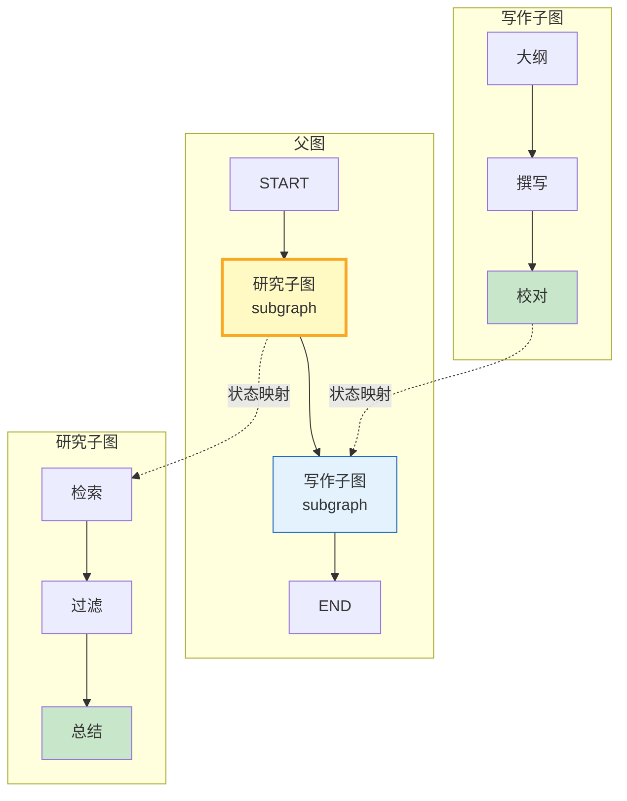

# LangGraph 子图通信与消息传递指南

> 当 Agent 工作流变得复杂，把所有逻辑塞进一张大图会难以维护。LangGraph 支持把图嵌套——子图作为父图中的一个节点，内部有自己的状态和边。关键是子图与父图之间的状态如何同步和通信。

---

## 一、子图嵌套架构



子图作为父图节点运行，通过状态映射（State Mapping）与父图交换数据。

---

## 二、子图状态与父图状态

```python
from typing import TypedDict, Annotated
from langgraph.graph import StateGraph, START, END
from langgraph.graph.message import add_messages
from langchain_core.messages import HumanMessage, AIMessage

# --- 子图状态 ---
class ResearchState(TypedDict):
    query: str
    documents: list[str]
    summary: str

# --- 父图状态 ---
class ParentState(TypedDict):
    messages: Annotated[list, add_messages]
    research_summary: str
    final_report: str
```

子图状态和父图状态是独立的 TypedDict，通过显式映射传递数据。

---

## 三、研究子图

```python
def retrieve_node(state: ResearchState) -> dict:
    """模拟检索"""
    docs = [f"文档&#123;i&#125;: 关于&#123;state['query']&#125;的内容" for i in range(3)]
    return &#123;"documents": docs&#125;

def filter_node(state: ResearchState) -> dict:
    """过滤相关文档"""
    filtered = [d for d in state["documents"] if len(d) > 5]
    return &#123;"documents": filtered&#125;

def summarize_node(state: ResearchState) -> dict:
    """总结研究结果"""
    docs_text = "\n".join(state["documents"])
    summary = f"研究总结（&#123;len(state['documents'])&#125;篇）:\n&#123;docs_text&#125;"
    return &#123;"summary": summary&#125;

# 构建研究子图
research_builder = StateGraph(ResearchState)
research_builder.add_node("retrieve", retrieve_node)
research_builder.add_node("filter", filter_node)
research_builder.add_node("summarize", summarize_node)
research_builder.add_edge(START, "retrieve")
research_builder.add_edge("retrieve", "filter")
research_builder.add_edge("filter", "summarize")
research_builder.add_edge("summarize", END)
research_graph = research_builder.compile()
```

子图有自己独立的状态流转：检索 → 过滤 → 总结。

---

## 四、写作子图

```python
class WritingState(TypedDict):
    research_summary: str
    outline: str
    draft: str
    final_report: str

def outline_node(state: WritingState) -> dict:
    """根据研究结果生成大纲"""
    return &#123;"outline": "1.背景 2.分析 3.结论"&#125;

def draft_node(state: WritingState) -> dict:
    """撰写初稿"""
    draft = f"基于'&#123;state['research_summary'][:30]&#125;...'撰写报告"
    return &#123;"draft": draft&#125;

def proofread_node(state: WritingState) -> dict:
    """校对定稿"""
    return &#123;"final_report": f"[终稿] &#123;state['draft']&#125;"&#125;

# 构建写作子图
writing_builder = StateGraph(WritingState)
writing_builder.add_node("outline", outline_node)
writing_builder.add_node("draft", draft_node)
writing_builder.add_node("proofread", proofread_node)
writing_builder.add_edge(START, "outline")
writing_builder.add_edge("outline", "draft")
writing_builder.add_edge("draft", "proofread")
writing_builder.add_edge("proofread", END)
writing_graph = writing_builder.compile()
```

---

## 五、父图组装与状态映射

```python
def call_research(state: ParentState) -> dict:
    """父图节点：调用研究子图并映射状态"""
    # 父图状态 → 子图状态
    sub_input = &#123;"query": state["messages"][-1].content if state.get("messages") else "default"&#125;
    # 执行子图
    result = research_graph.invoke(sub_input)
    # 子图状态 → 父图状态
    return &#123;"research_summary": result["summary"]&#125;

def call_writing(state: ParentState) -> dict:
    """父图节点：调用写作子图并映射状态"""
    sub_input = &#123;"research_summary": state.get("research_summary", "")&#125;
    result = writing_graph.invoke(sub_input)
    return &#123;"final_report": result["final_report"]&#125;

# 构建父图
parent_builder = StateGraph(ParentState)
parent_builder.add_node("research", call_research)
parent_builder.add_node("writing", call_writing)
parent_builder.add_edge(START, "research")
parent_builder.add_edge("research", "writing")
parent_builder.add_edge("writing", END)
parent_graph = parent_builder.compile()

# 运行完整流程
result = parent_graph.invoke(&#123;
    "messages": [HumanMessage(content="分析LangGraph子图通信机制")]
&#125;)
print("最终报告:", result["final_report"])
```

输出：

```text
最终报告: [终稿] 基于'研究总结（3篇）: 文档0: 关于分析LangGraph子...'撰写报告
```

关键：父图节点 `call_research` 做了两件事——把父图状态映射进子图、把子图结果映射回父图。

---

## 六、子图通信模式对比

| 模式 | 原理 | 适用场景 |
|------|------|----------|
| 状态映射 | 父图节点手动转换状态 | 字段不完全匹配 |
| 共享状态 | 子图与父图用相同 TypedDict | 字段完全重叠 |
| 消息传递 | 通过 messages 列表通信 | 对话型工作流 |
| 通道映射 | 用 reducer 合并子图输出 | 多子图并行输出 |

---

## 七、最佳实践

| 实践 | 说明 | 优先级 |
|------|------|--------|
| 子图状态独立 | 不与父图状态耦合 | ★★★ |
| 显式状态映射 | 父子图之间明确定义字段转换 | ★★★ |
| 子图可独立测试 | 单独编译运行验证 | ★★★ |
| 子图层级不超过3层 | 过深嵌套难调试 | ★★☆ |
| 子图输出加校验 | 防止映射后字段缺失 | ★★★ |
| 用 checkpoint 支持子图重试 | 子图失败可从断点恢复 | ★★☆ |

---

## 八、检查清单

| 检查项 | 状态 |
|--------|------|
| 有独立子图状态定义 | ☐ |
| 有父图状态定义 | ☐ |
| 有状态映射节点 | ☐ |
| 有子图独立编译 | ☐ |
| 有父图组装 | ☐ |
| 有端到端运行 | ☐ |
