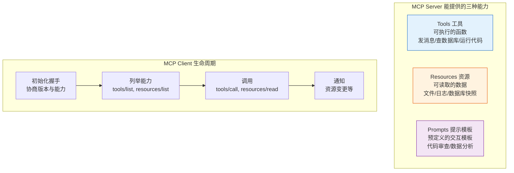

# MCP 协议与 LangChain 工具集成指南

> 2024 年底 Anthropic 发布了 Model Context Protocol（MCP），一个开放标准，让 AI 应用像 USB-C 一样即插即用地连接任意工具和数据源。2025 年 OpenAI 跟进支持，MCP 正在成为 Agent 工具生态的事实标准。本指南详解 MCP 架构、与 LangChain 的集成方式，以及生产实践。

---

## 1. 什么是 MCP

### 没有 MCP 的世界

```
Agent A → 自定义代码 → Slack API
Agent A → 自定义代码 → GitHub API
Agent A → 自定义代码 → 数据库
Agent B → 另一套代码 → Slack API（重复造轮子）

问题：
  - 每接一个工具就写一套适配代码
  - 不同 Agent 框架工具不通用
  - 工具升级需要逐个改
  - 安全策略各搞各的
```

### 有 MCP 的世界

```
                    ┌─ MCP Server (Slack)
Agent / LLM ── MCP ─┼─ MCP Server (GitHub)
  Client            ├─ MCP Server (PostgreSQL)
                    └─ MCP Server (文件系统)

一个协议连接一切：工具调用、资源读取、提示模板
换 Agent 框架 = 工具不用重写
换工具版本 = Agent 不用改
```

### MCP 核心概念

| 概念 | 角色 | 类比 |
|------|------|------|
| MCP Host | 运行 AI 应用的宿主 | 浏览器 |
| MCP Client | Host 内部的协议客户端 | 浏览器标签页 |
| MCP Server | 暴露工具/资源的独立进程 | Web 服务器 |
| Transport | Client-Server 通信层 | HTTP / WebSocket |
| Tool | 可被 LLM 调用的函数 | REST API 端点 |
| Resource | 可被读取的数据源 | GET 请求 |
| Prompt Template | 预定义的提示模板 | API 模板 |

---

## 2. MCP 协议架构

### 三大原语



### 通信层：Stdio vs SSE

```python
# === Stdio 传输（本地进程，最常用）===
# Client 通过子进程的 stdin/stdout 与 Server 通信
# 优点：零配置、低延迟、安全
# 缺点：只能本机

# === SSE 传输（远程服务）===
# Client 通过 HTTP Server-Sent Events 与远程 Server 通信
# 优点：可远程、可扩展
# 缺点：需要网络、需认证

from dataclasses import dataclass
from enum import Enum

class TransportType(Enum):
    STDIO = "stdio"          # 本地子进程
    SSE = "sse"              # 远程 Server-Sent Events
    STREAMABLE_HTTP = "http" # 2025 新标准，替代 SSE

@dataclass
class MCPClientConfig:
    """MCP 客户端配置"""
    transport: TransportType = TransportType.STDIO

    # Stdio 模式
    command: str = ""           # "npx"
    args: list[str] = None       # ["-y", "@modelcontextprotocol/server-slack"]
    env: dict[str, str] = None   # 环境变量

    # SSE / HTTP 模式
    url: str = ""                # "https://mcp.example.com/sse"
    headers: dict[str, str] = None

    # 通用
    name: str = "langchain-client"
    version: str = "1.0.0"
```

---

## 3. LangChain MCP 集成

### 架构总览

```
LangGraph Agent
    ↓
LangChain Tool（适配层）
    ↓
MCP Adapter（langchain-mcp-adapters）
    ↓
MCP Client
    ↓ MCP 协议
MCP Server（Slack / GitHub / DB / 文件系统）
```

### 安装与基础用法

```python
# 安装
# pip install langchain-mcp-adapters langchain langgraph

from langchain_mcp_adapters.client import MultiServerMCPClient

# === 方式一：连接多个 MCP Server ===
client = MultiServerMCPClient(&#123;
    "slack": &#123;
        "command": "npx",
        "args": ["-y", "@modelcontextprotocol/server-slack"],
        "env": &#123;"SLACK_BOT_TOKEN": "xoxb-..."&#125;,
        "transport": "stdio",
    &#125;,
    "github": &#123;
        "command": "npx",
        "args": ["-y", "@modelcontextprotocol/server-github"],
        "env": &#123;"GITHUB_TOKEN": "ghp_..."&#125;,
        "transport": "stdio",
    &#125;,
    "filesystem": &#123;
        "command": "npx",
        "args": ["-y", "@modelcontextprotocol/server-filesystem", "/data"],
        "transport": "stdio",
    &#125;,
&#125;)

# 获取所有工具，自动转为 LangChain Tool 对象
tools = await client.get_tools()
# tools = [send_slack_message, list_channels, search_repos,
#          create_issue, read_file, write_file, ...]

# 直接在 LangGraph Agent 中使用
from langgraph.prebuilt import create_react_agent
from langchain_openai import ChatOpenAI

model = ChatOpenAI(model="gpt-4o-mini")
agent = create_react_agent(model, tools)

result = await agent.ainvoke(&#123;
    "messages": [&#123;"role": "user", "content": "给 #general 频道发消息说部署完成"&#125;]
&#125;)
```

### 方式二：在 LangGraph StateGraph 中使用

```python
from langgraph.graph import StateGraph, MessagesState, START, END

# 初始化 MCP 客户端
mcp_client = MultiServerMCPClient(&#123;
    "db": &#123;
        "command": "npx",
        "args": ["-y", "@modelcontextprotocol/server-postgres",
                 "postgresql://localhost/mydb"],
        "transport": "stdio",
    &#125;,
&#125;)

async def query_node(state: MessagesState):
    """使用 MCP 提供的数据库工具查询"""
    tools = await mcp_client.get_tools()
    db_tools = [t for t in tools if "postgres" in t.name.lower()]

    model = ChatOpenAI(model="gpt-4o-mini").bind_tools(db_tools)
    response = await model.ainvoke(state["messages"])
    return &#123;"messages": [response]&#125;

async def execute_node(state: MessagesState):
    """执行工具调用"""
    from langgraph.prebuilt import ToolNode
    tools = await mcp_client.get_tools()
    tool_node = ToolNode(tools)
    return await tool_node.ainvoke(state)

def should_continue(state: MessagesState):
    last_msg = state["messages"][-1]
    if last_msg.tool_calls:
        return "execute"
    return END

graph = StateGraph(MessagesState)
graph.add_node("query", query_node)
graph.add_node("execute", execute_node)
graph.add_edge(START, "query")
graph.add_conditional_edges("query", should_continue, &#123;"execute": "execute", END: END&#125;)
graph.add_edge("execute", "query")
app = graph.compile()
```

---

## 4. 自建 MCP Server

### 用 Python SDK 创建自定义 Server

```python
# pip install mcp

from mcp.server import Server
from mcp.server.stdio import stdio_server
from mcp.types import Tool, TextContent
import json

server = Server("my-tools")

@server.list_tools()
async def list_tools() -> list[Tool]:
    """声明可用工具"""
    return [
        Tool(
            name="search_knowledge_base",
            description="搜索内部知识库，返回相关文档片段",
            inputSchema=&#123;
                "type": "object",
                "properties": &#123;
                    "query": &#123;
                        "type": "string",
                        "description": "搜索关键词"
                    &#125;,
                    "top_k": &#123;
                        "type": "integer",
                        "description": "返回数量，默认5",
                        "default": 5
                    &#125;
                &#125;,
                "required": ["query"]
            &#125;
        ),
        Tool(
            name="get_user_profile",
            description="根据用户ID获取用户画像",
            inputSchema=&#123;
                "type": "object",
                "properties": &#123;
                    "user_id": &#123;"type": "string", "description": "用户ID"&#125;
                &#125;,
                "required": ["user_id"]
            &#125;
        )
    ]

@server.call_tool()
async def call_tool(name: str, arguments: dict) -> list[TextContent]:
    """处理工具调用"""
    if name == "search_knowledge_base":
        query = arguments["query"]
        top_k = arguments.get("top_k", 5)
        # 这里替换为你的实际检索逻辑
        results = await search_kb(query, top_k)
        return [TextContent(
            type="text",
            text=json.dumps(results, ensure_ascii=False)
        )]

    elif name == "get_user_profile":
        user_id = arguments["user_id"]
        profile = await fetch_profile(user_id)
        return [TextContent(
            type="text",
            text=json.dumps(profile, ensure_ascii=False)
        )]

async def search_kb(query: str, top_k: int):
    """模拟知识库检索"""
    return [&#123;"content": f"关于 &#123;query&#125; 的文档...", "score": 0.95&#125;]

async def fetch_profile(user_id: str):
    """模拟用户画像查询"""
    return &#123;"user_id": user_id, "tier": "premium", "region": "CN"&#125;

# 启动 Server
async def main():
    async with stdio_server() as (read, write):
        await server.run(read, write, server.create_initialization_options())

if __name__ == "__main__":
    import asyncio
    asyncio.run(main())
```

### 在 LangChain 中连接自建 Server

```python
from langchain_mcp_adapters.client import MultiServerMCPClient

client = MultiServerMCPClient(&#123;
    "my-tools": &#123;
        "command": "python",
        "args": ["my_mcp_server.py"],
        "transport": "stdio",
    &#125;
&#125;)

tools = await client.get_tools()
# 获得 search_knowledge_base, get_user_profile 两个 LangChain Tool
```

---

## 5. Resources 与 Prompts

### 读取 MCP Resources

```python
from langchain_mcp_adapters.client import MultiServerMCPClient

client = MultiServerMCPClient(&#123;
    "filesystem": &#123;
        "command": "npx",
        "args": ["-y", "@modelcontextprotocol/server-filesystem", "/data"],
        "transport": "stdio",
    &#125;
&#125;)

# 列举可用资源
resources = await client.list_resources()
# [
#   Resource(uri="file:///data/report.md", name="report.md"),
#   Resource(uri="file:///data/config.yaml", name="config.yaml"),
# ]

# 读取资源内容
content = await client.read_resource("file:///data/report.md")
```

### 在 LangGraph 中混合使用 Tools + Resources

```python
@dataclass
class AgentState:
    messages: list
    context: str = ""          # 从 Resource 读取的上下文
    tool_results: list = None

async def load_context_node(state: AgentState):
    """从 MCP 文件系统 Server 加载上下文文档"""
    content = await client.read_resource("file:///data/context.md")
    return &#123;"context": content&#125;

async def reason_node(state: AgentState):
    """结合上下文和工具回答"""
    tools = await client.get_tools()
    model = ChatOpenAI(model="gpt-4o-mini").bind_tools(tools)

    messages = state["messages"] + [
        &#123;"role": "system", "content": f"参考上下文：\n&#123;state['context']&#125;"&#125;
    ]
    response = await model.ainvoke(messages)
    return &#123;"messages": [response]&#125;

graph = StateGraph(AgentState)
graph.add_node("load_context", load_context_node)
graph.add_node("reason", reason_node)
graph.add_edge(START, "load_context")
graph.add_edge("load_context", "reason")
```

---

## 6. 生产实践

### 连接池与生命周期管理

```python
from contextlib import asynccontextmanager
from langchain_mcp_adapters.client import MultiServerMCPClient

@dataclass
class MCPPool:
    """MCP 连接池管理"""
    client: MultiServerMCPClient = None
    _tools_cache: list = None
    _lock: asyncio.Lock = None

    async def start(self, config: dict):
        self.client = MultiServerMCPClient(config)
        self._lock = asyncio.Lock()
        # 预加载工具列表
        self._tools_cache = await self.client.get_tools()

    async def get_tools(self) -> list:
        """获取缓存工具列表，避免重复列举"""
        async with self._lock:
            if self._tools_cache is None:
                self._tools_cache = await self.client.get_tools()
            return self._tools_cache

    async def refresh(self):
        """刷新工具列表（工具变更后调用）"""
        async with self._lock:
            self._tools_cache = await self.client.get_tools()

    async def stop(self):
        """关闭所有 MCP 连接"""
        if self.client:
            # 关闭底层 transport
            await self.client.__aexit__(None, None, None)


# 使用示例
pool = MCPPool()
await pool.start(&#123;
    "slack": &#123;"command": "npx", "args": ["-y", "@modelcontextprotocol/server-slack"],
              "env": &#123;"SLACK_BOT_TOKEN": "..."&#125;, "transport": "stdio"&#125;,
    "db": &#123;"command": "npx", "args": ["-y", "@modelcontextprotocol/server-postgres",
           "postgresql://..."], "transport": "stdio"&#125;,
&#125;)

# 在 Agent 中使用
tools = await pool.get_tools()
agent = create_react_agent(model, tools)

# 优雅关闭
await pool.stop()
```

### 安全策略

```python
@dataclass
class MCPSecurityConfig:
    """MCP 安全配置"""

    # 工具白名单：只允许指定工具
    allowed_tools: set[str] = None

    # 参数过滤：移除敏感参数
    param_filters: dict[str, list[str]] = None

    # 超时限制
    call_timeout: float = 30.0

    # 最大返回长度（防止 Token 爆炸）
    max_result_chars: int = 10000

    def filter_tools(self, tools: list) -> list:
        if not self.allowed_tools:
            return tools
        return [t for t in tools if t.name in self.allowed_tools]

    def sanitize_params(self, tool_name: str, params: dict) -> dict:
        if tool_name in self.param_filters:
            blocked = self.param_filters[tool_name]
            return &#123;k: v for k, v in params.items() if k not in blocked&#125;
        return params

    def truncate_result(self, result: str) -> str:
        if len(result) > self.max_result_chars:
            return result[:self.max_result_chars] + "\n...[截断]"
        return result


# 配置示例
security = MCPSecurityConfig(
    allowed_tools=&#123;"search_knowledge_base", "get_user_profile", "read_file"&#125;,
    param_filters=&#123;
        "get_user_profile": ["internal_id"],  # 过滤内部字段
    &#125;,
    call_timeout=15.0,
    max_result_chars=5000,
)
```

---

## 7. 常见 MCP Server 一览

| Server | 功能 | 安装 |
|--------|------|------|
| server-filesystem | 读写本地文件 | `npx @modelcontextprotocol/server-filesystem /path` |
| server-github | 仓库管理、Issue、PR | `npx @modelcontextprotocol/server-github` |
| server-slack | 发消息、读频道 | `npx @modelcontextprotocol/server-slack` |
| server-postgres | 查询 PostgreSQL | `npx @modelcontextprotocol/server-postgres <conn>` |
| server-puppeteer | 浏览器自动化 | `npx @modelcontextprotocol/server-puppeteer` |
| server-sqlite | 查询 SQLite | `npx @modelcontextprotocol/server-sqlite --db-path <path>` |
| server-brave-search | Brave 搜索 | `npx @modelcontextprotocol/server-brave-search` |
| server-memory | 持久化知识图谱 | `npx @modelcontextprotocol/server-memory` |

---

## 8. MCP vs 传统 LangChain Tool 对比

| 维度 | 传统 LangChain Tool | MCP Tool |
|------|---------------------|----------|
| 定义方式 | Python 函数 + 装饰器 | MCP Server 协议 |
| 跨框架复用 | 仅限 LangChain 生态 | 任意 MCP 兼容客户端 |
| 运行方式 | 同进程 | 独立进程（隔离） |
| 安全隔离 | 需自行实现 | 进程级天然隔离 |
| 动态发现 | 需手动注册 | 自动 list_tools 发现 |
| 资源读取 | 不支持 | 原生支持 resources |
| 远程部署 | 需自建 API | SSE / HTTP 原生支持 |
| 生态规模 | LangChain Hub | MCP Server 目录持续增长 |
| 性能开销 | 函数调用级 | IPC / 网络通信 |

### 选型建议

```
用传统 Tool：
  - 快速原型、单机部署
  - 工具逻辑简单、不需要跨框架
  - 延迟敏感场景

用 MCP：
  - 多框架混用（LangChain + 其他）
  - 工具需要跨团队共享
  - 需要进程级安全隔离
  - 连接第三方 SaaS（Slack/GitHub/DB）
  - 远程工具服务
```

---

## 9. 调试与排错

### 常见问题

| 问题 | 原因 | 解决 |
|------|------|------|
| Server 启动后无工具 | 命令路径错误 / 依赖缺失 | 手动运行 npx 命令验证 |
| 工具调用超时 | Server 处理慢 / 网络问题 | 设置 call_timeout + 重试 |
| 工具参数不匹配 | Schema 定义与实际不符 | 检查 inputSchema 定义 |
| 连接频繁断开 | Stdio 缓冲区满 / 进程崩溃 | 减小返回数据量 / 增加重连逻辑 |
| Token 爆炸 | 工具返回过多内容 | 设置 max_result_chars 截断 |

### 调试工具

```python
# MCP Inspector - 官方可视化调试工具
# npx @modelcontextprotocol/inspector

# 在代码中打印工具详情
async def debug_tools(client: MultiServerMCPClient):
    tools = await client.get_tools()
    for t in tools:
        print(f"工具名: &#123;t.name&#125;")
        print(f"  描述: &#123;t.description[:80]&#125;")
        print(f"  Schema: &#123;json.dumps(t.args_schema, indent=2)&#125;")
        print()
```

---

## 10. 检查清单

| 检查项 | 状态 |
|--------|------|
| 理解 MCP 三大原语（Tools/Resources/Prompts） | ☐ |
| 能用 MultiServerMCPClient 连接 MCP Server | ☐ |
| 能在 LangGraph Agent 中使用 MCP 工具 | ☐ |
| 能自建 MCP Server 暴露自定义工具 | ☐ |
| 理解 Stdio vs SSE 传输方式 | ☐ |
| 配置了安全策略（白名单/超时/截断） | ☐ |
| 了解 MCP 与传统 Tool 的选型标准 | ☐ |
| 会用 MCP Inspector 调试 | ☐ |

---

## 11. 与其他知识库的关联

| 关联编号 | 文档 | 关系 |
|----------|------|------|
| 134 | Agent 代码执行沙箱安全指南 | MCP Server 提供进程级隔离 |
| 137 | LLM 网关与多模型 API 管理 | MCP 是工具层网关，LLM 网关是模型层网关 |
| 142 | Agent 工具链设计 | MCP 是工具链标准化方案 |
| 413 | Agent 通信协议 | MCP 定义 Agent 与工具的协议 |
| 425 | Agent 工具动态发现与绑定 | MCP 的 list_tools 实现动态发现 |
| 426 | LLM 网关与统一模型管理 | 模型网关 + 工具网关 = 完整 AI 网关 |
