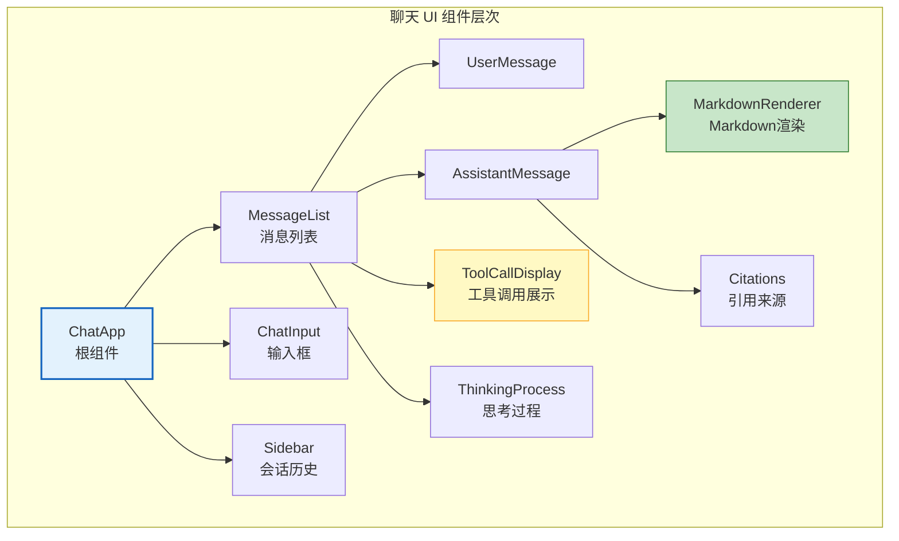

# Agent 前端与聊天 UI 构建指南

> 后端 Agent 再强大，用户看到的只是一个聊天框。流式输出时的打字机效果、工具调用时的状态展示、多轮对话的上下文管理、错误处理的优雅降级——前端体验直接决定了用户对 AI 产品的评价。本指南系统讲解 Agent 聊天 UI 的架构设计、流式渲染、工具调用可视化，以及前后端集成方案。

---

## 1. 聊天 UI 的核心挑战

### 与传统 Web 应用的区别

```
传统 Web 应用：
  请求 → 等待 → 响应（一次性返回完整数据）
  UI：加载动画 → 展示结果

聊天 Agent UI：
  请求 → 流式返回（逐字输出）→ 可能有工具调用（中间状态）→ 最终回答
  UI：打字机效果 → 工具调用展示 → 引用来源 → 思考过程
  额外挑战：
  - 流式渲染（SSE/WebSocket）
  - 工具调用状态可视化
  - 可中断/重试
  - 多轮上下文
  - Markdown 渲染（代码高亮/表格）
  - 错误恢复
```

### 关键体验指标

| 指标 | 目标 | 影响 |
|------|------|------|
| 首 Token 延迟 | < 500ms | 用户感知响应速度 |
| 流式渲染帧率 | 30fps+ | 打字机效果流畅度 |
| 工具调用可见性 | 实时 | 信任感和透明度 |
| 错误恢复时间 | < 2s | 连接断开后的恢复 |
| Markdown 渲染 | < 100ms | 代码/表格展示速度 |

---

## 2. 前端架构设计

### 组件层次



### 前后端通信架构

```
后端（LangGraph Agent）
  ↓ SSE (Server-Sent Events)
前端（React/Vue）
  ↓ 事件解析
  ├─ token 事件 → 追加到当前消息
  ├─ tool_start 事件 → 显示工具调用状态
  ├─ tool_end 事件 → 展示工具结果
  ├─ thinking 事件 → 展示思考过程
  └─ done 事件 → 消息完成
```

---

## 3. React 聊天组件实现

### 消息类型定义

```typescript
// types/chat.ts

interface Message &#123;
  id: string;
  role: "user" | "assistant" | "system";
  content: string;
  timestamp: number;
  // 工具调用
  toolCalls?: ToolCall[];
  // 引用来源
  citations?: Citation[];
  // 思考过程
  thinking?: string;
  // 状态
  status: "streaming" | "complete" | "error";
&#125;

interface ToolCall &#123;
  id: string;
  name: string;           // "web_search"
  args: Record<string, any>;  // &#123;"query": "LangChain"&#125;
  result?: string;
  status: "running" | "done" | "error";
  duration?: number;       // 耗时（ms）
&#125;

interface Citation &#123;
  id: number;
  source: string;          // 来源
  content: string;          // 引用内容片段
  url?: string;             // 链接
&#125;
```

### SSE 流式接收 Hook

```typescript
// hooks/useChatStream.ts

import &#123; useState, useCallback, useRef &#125; from "react";

interface UseChatStreamOptions &#123;
  apiUrl: string;
  onToken?: (token: string) => void;
  onToolCall?: (toolCall: ToolCall) => void;
  onDone?: () => void;
  onError?: (error: string) => void;
&#125;

export function useChatStream(options: UseChatStreamOptions) &#123;
  const [messages, setMessages] = useState<Message[]>([]);
  const [isStreaming, setIsStreaming] = useState(false);
  const abortRef = useRef<AbortController | null>(null);

  const sendMessage = useCallback(async (content: string) => &#123;
    // 添加用户消息
    const userMsg: Message = &#123;
      id: crypto.randomUUID(),
      role: "user",
      content,
      timestamp: Date.now(),
      status: "complete",
    &#125;;

    // 添加空的 assistant 消息（流式填充）
    const assistantMsg: Message = &#123;
      id: crypto.randomUUID(),
      role: "assistant",
      content: "",
      timestamp: Date.now(),
      status: "streaming",
    &#125;;

    setMessages(prev => [...prev, userMsg, assistantMsg]);
    setIsStreaming(true);

    // 创建 AbortController（可中断）
    const controller = new AbortController();
    abortRef.current = controller;

    try &#123;
      const response = await fetch(options.apiUrl, &#123;
        method: "POST",
        headers: &#123; "Content-Type": "application/json" &#125;,
        body: JSON.stringify(&#123; message: content, history: messages &#125;),
        signal: controller.signal,
      &#125;);

      // SSE 流式读取
      const reader = response.body!.getReader();
      const decoder = new TextDecoder();
      let buffer = "";

      while (true) &#123;
        const &#123; done, value &#125; = await reader.read();
        if (done) break;

        buffer += decoder.decode(value, &#123; stream: true &#125;);

        // 解析 SSE 事件（按 \n\n 分隔）
        const events = buffer.split("\n\n");
        buffer = events.pop() || "";

        for (const event of events) &#123;
          const lines = event.split("\n");
          const eventType = lines
            .find(l => l.startsWith("event:"))
            ?.replace("event: ", "");
          const data = lines
            .find(l => l.startsWith("data:"))
            ?.replace("data: ", "");

          if (!data) continue;
          const parsed = JSON.parse(data);

          switch (eventType) &#123;
            case "token":
              // 追加 token 到 assistant 消息
              setMessages(prev => &#123;
                const updated = [...prev];
                const last = updated[updated.length - 1];
                last.content += parsed.token;
                return updated;
              &#125;);
              break;

            case "tool_call":
              // 添加工具调用
              setMessages(prev => &#123;
                const updated = [...prev];
                const last = updated[updated.length - 1];
                last.toolCalls = [...(last.toolCalls || []), parsed.toolCall];
                return updated;
              &#125;);
              break;

            case "tool_result":
              // 更新工具结果
              setMessages(prev => &#123;
                const updated = [...prev];
                const last = updated[updated.length - 1];
                const tc = last.toolCalls?.find(t => t.id === parsed.id);
                if (tc) &#123;
                  tc.result = parsed.result;
                  tc.status = "done";
                  tc.duration = parsed.duration;
                &#125;
                return updated;
              &#125;);
              break;

            case "thinking":
              // 更新思考过程
              setMessages(prev => &#123;
                const updated = [...prev];
                const last = updated[updated.length - 1];
                last.thinking = (last.thinking || "") + parsed.content;
                return updated;
              &#125;);
              break;

            case "citations":
              setMessages(prev => &#123;
                const updated = [...prev];
                const last = updated[updated.length - 1];
                last.citations = parsed.citations;
                return updated;
              &#125;);
              break;

            case "done":
              setMessages(prev => &#123;
                const updated = [...prev];
                updated[updated.length - 1].status = "complete";
                return updated;
              &#125;);
              break;

            case "error":
              setMessages(prev => &#123;
                const updated = [...prev];
                updated[updated.length - 1].status = "error";
                return updated;
              &#125;);
              break;
          &#125;
        &#125;
      &#125;
    &#125; catch (err: any) &#123;
      if (err.name === "AbortError") &#123;
        // 用户主动中断
        setMessages(prev => &#123;
          const updated = [...prev];
          updated[updated.length - 1].status = "complete";
          updated[updated.length - 1].content += "\n\n[已中断]";
          return updated;
        &#125;);
      &#125; else &#123;
        setMessages(prev => &#123;
          const updated = [...prev];
          updated[updated.length - 1].status = "error";
          return updated;
        &#125;);
      &#125;
    &#125; finally &#123;
      setIsStreaming(false);
      abortRef.current = null;
    &#125;
  &#125;, [messages]);

  const stop = useCallback(() => &#123;
    abortRef.current?.abort();
  &#125;, []);

  return &#123; messages, isStreaming, sendMessage, stop &#125;;
&#125;
```

### 消息渲染组件

```tsx
// components/MessageList.tsx

import React from "react";
import &#123; Message &#125; from "../types/chat";
import &#123; MarkdownRenderer &#125; from "./MarkdownRenderer";
import &#123; ToolCallDisplay &#125; from "./ToolCallDisplay";
import &#123; ThinkingPanel &#125; from "./ThinkingPanel";
import &#123; Citations &#125; from "./Citations";

export function MessageList(&#123; messages &#125;: &#123; messages: Message[] &#125;) &#123;
  return (
    <div className="flex flex-col gap-4 p-4">
      &#123;messages.map(msg => (
        <MessageItem key=&#123;msg.id&#125; message=&#123;msg&#125; />
      ))&#125;
    </div>
  );
&#125;

function MessageItem(&#123; message &#125;: &#123; message: Message &#125;) &#123;
  const isUser = message.role === "user";

  return (
    <div className=&#123;`flex $&#123;isUser ? "justify-end" : "justify-start"&#125;`&#125;>
      <div
        className=&#123;`max-w-[80%] rounded-2xl p-4 $&#123;
          isUser
            ? "bg-blue-500 text-white"
            : "bg-gray-100 text-gray-900"
        &#125;`&#125;
      >
        &#123;/* 头像 + 角色 */&#125;
        <div className="flex items-center gap-2 mb-2">
          <span className="text-sm font-medium">
            &#123;isUser ? "你" : "AI"&#125;
          </span>
          <span className="text-xs opacity-50">
            &#123;new Date(message.timestamp).toLocaleTimeString()&#125;
          </span>
        </div>

        &#123;/* 思考过程（可折叠） */&#125;
        &#123;message.thinking && (
          <ThinkingPanel content=&#123;message.thinking&#125; />
        )&#125;

        &#123;/* 工具调用展示 */&#125;
        &#123;message.toolCalls?.map(tc => (
          <ToolCallDisplay key=&#123;tc.id&#125; toolCall=&#123;tc&#125; />
        ))&#125;

        &#123;/* 消息内容（Markdown 渲染） */&#125;
        &#123;!isUser ? (
          <MarkdownRenderer content=&#123;message.content&#125; />
        ) : (
          <p className="whitespace-pre-wrap">&#123;message.content&#125;</p>
        )&#125;

        &#123;/* 引用来源 */&#125;
        &#123;message.citations && message.citations.length > 0 && (
          <Citations citations=&#123;message.citations&#125; />
        )&#125;

        &#123;/* 状态指示器 */&#125;
        &#123;message.status === "streaming" && (
          <div className="flex items-center gap-1 mt-2">
            <span className="inline-block w-2 h-4 bg-gray-400 animate-pulse" />
          </div>
        )&#125;
        &#123;message.status === "error" && (
          <div className="text-red-500 text-sm mt-2">
            ⚠️ 回复出错，请重试
          </div>
        )&#125;
      </div>
    </div>
  );
&#125;
```

### 工具调用展示组件

```tsx
// components/ToolCallDisplay.tsx

export function ToolCallDisplay(&#123; toolCall &#125;: &#123; toolCall: ToolCall &#125;) &#123;
  const [expanded, setExpanded] = useState(false);

  return (
    <div
      className="my-2 border rounded-lg p-3 bg-white"
      onClick=&#123;() => setExpanded(!expanded)&#125;
    >
      <div className="flex items-center gap-2 text-sm">
        &#123;/* 状态图标 */&#125;
        &#123;toolCall.status === "running" && (
          <span className="animate-spin">⚙️</span>
        )&#125;
        &#123;toolCall.status === "done" && <span>✅</span>&#125;
        &#123;toolCall.status === "error" && <span>❌</span>&#125;

        &#123;/* 工具名 */&#125;
        <span className="font-medium">&#123;toolCall.name&#125;</span>

        &#123;/* 参数摘要 */&#125;
        <span className="text-gray-500">
          &#123;JSON.stringify(toolCall.args).slice(0, 50)&#125;
        </span>

        &#123;/* 耗时 */&#125;
        &#123;toolCall.duration && (
          <span className="text-xs text-gray-400">
            &#123;toolCall.duration&#125;ms
          </span>
        )&#125;
      </div>

      &#123;/* 展开详情 */&#125;
      &#123;expanded && toolCall.result && (
        <div className="mt-2 p-2 bg-gray-50 rounded text-xs overflow-x-auto">
          <pre>&#123;toolCall.result&#125;</pre>
        </div>
      )&#125;
    </div>
  );
&#125;
```

### Markdown 渲染组件

```tsx
// components/MarkdownRenderer.tsx

import ReactMarkdown from "react-markdown";
import &#123; Prism as SyntaxHighlighter &#125; from "react-syntax-highlighter";
import &#123; oneDark &#125; from "react-syntax-highlighter/dist/esm/styles/prism";

export function MarkdownRenderer(&#123; content &#125;: &#123; content: string &#125;) &#123;
  return (
    <ReactMarkdown
      components=&#123;&#123;
        // 代码块高亮
        code(&#123; node, inline, className, children, ...props &#125;) &#123;
          const match = /language-(\w+)/.exec(className || "");
          return !inline && match ? (
            <SyntaxHighlighter
              language=&#123;match[1]&#125;
              style=&#123;oneDark&#125;
              PreTag="div"
              &#123;...props&#125;
            >
              &#123;String(children).replace(/\n$/, "")&#125;
            </SyntaxHighlighter>
          ) : (
            <code className="bg-gray-200 px-1 rounded" &#123;...props&#125;>
              &#123;children&#125;
            </code>
          );
        &#125;,
        // 表格渲染
        table(&#123; children &#125;) &#123;
          return (
            <table className="border-collapse border border-gray-300 my-2 w-full">
              &#123;children&#125;
            </table>
          );
        &#125;,
        // 引用渲染
        blockquote(&#123; children &#125;) &#123;
          return (
            <blockquote className="border-l-4 border-gray-300 pl-4 my-2 italic text-gray-600">
              &#123;children&#125;
            </blockquote>
          );
        &#125;,
      &#125;&#125;
    >
      &#123;content&#125;
    </ReactMarkdown>
  );
&#125;
```

---

## 4. 后端 SSE 适配

### LangGraph SSE 端点

```python
# server.py — FastAPI 后端

from fastapi import FastAPI
from fastapi.responses import StreamingResponse
from fastapi.middleware.cors import CORSMiddleware
from langgraph.graph import StateGraph, MessagesState, START, END
from langchain_openai import ChatOpenAI
from langchain_core.tools import tool
import json
import asyncio

app = FastAPI()
app.add_middleware(CORSMiddleware, allow_origins=["*"])

@tool
def web_search(query: str) -> str:
    """搜索网络"""
    return f"搜索结果: &#123;query&#125;"

@tool
def calculator(expression: str) -> str:
    """计算"""
    return str(eval(expression))

llm = ChatOpenAI(model="gpt-4o-mini")
agent = create_react_agent(llm, [web_search, calculator])

async def sse_stream(user_message: str):
    """将 LangGraph 事件流转为 SSE"""
    async for event in agent.astream_events(
        &#123;"messages": [&#123;"role": "user", "content": user_message&#125;]&#125;,
        version="v2",
    ):
        kind = event["event"]
        data = event["data"]

        if kind == "on_chat_model_stream":
            # Token 流
            chunk = data.get("chunk")
            if chunk and chunk.content:
                yield f"event: token\ndata: &#123;json.dumps(&#123;'token': chunk.content&#125;)&#125;\n\n"

        elif kind == "on_tool_start":
            # 工具开始
            yield f"event: tool_call\ndata: &#123;json.dumps(&#123;'toolCall': &#123;'id': data.get('run_id',''), 'name': data.get('name',''), 'args': data.get('input',&#123;&#125;), 'status': 'running'&#125;&#125;)&#125;\n\n"

        elif kind == "on_tool_end":
            # 工具结束
            yield f"event: tool_result\ndata: &#123;json.dumps(&#123;'id': data.get('run_id',''), 'result': str(data.get('output',''))[:500], 'duration': 0&#125;)&#125;\n\n"

    yield f"event: done\ndata: &#123;json.dumps(&#123;&#125;)&#125;\n\n"

@app.post("/chat")
async def chat(request: dict):
    message = request.get("message", "")
    return StreamingResponse(
        sse_stream(message),
        media_type="text/event-stream",
        headers=&#123;
            "Cache-Control": "no-cache",
            "Connection": "keep-alive",
            "X-Accel-Buffering": "no",  # nginx 关闭缓冲
        &#125;,
    )
```

---

## 5. 高级体验优化

### 自动滚动与手动暂停

```typescript
// hooks/useAutoScroll.ts

export function useAutoScroll(dependency: any) &#123;
  const containerRef = useRef<HTMLDivElement>(null);
  const [autoScroll, setAutoScroll] = useState(true);

  // 监听用户手动滚动
  const handleScroll = () => &#123;
    const container = containerRef.current;
    if (!container) return;
    const &#123; scrollTop, scrollHeight, clientHeight &#125; = container;
    const atBottom = scrollHeight - scrollTop - clientHeight < 50;
    setAutoScroll(atBottom);
  &#125;;

  // 自动滚动到底部
  useEffect(() => &#123;
    if (autoScroll && containerRef.current) &#123;
      containerRef.current.scrollTop = containerRef.current.scrollHeight;
    &#125;
  &#125;, [dependency, autoScroll]);

  return &#123; containerRef, handleScroll, autoScroll &#125;;
&#125;
```

### 连接断开重连

```typescript
class ReconnectSSE &#123;
  private reconnectAttempts = 0;
  private maxReconnects = 3;
  private reconnectDelay = 1000;

  async connectWithRetry(url: string, onMessage: Function) &#123;
    while (this.reconnectAttempts < this.maxReconnects) &#123;
      try &#123;
        await this.connect(url, onMessage);
        this.reconnectAttempts = 0; // 成功后重置
      &#125; catch (err) &#123;
        this.reconnectAttempts++;
        const delay = this.reconnectDelay * Math.pow(2, this.reconnectAttempts);
        await new Promise(r => setTimeout(r, delay));
      &#125;
    &#125;
    throw new Error("连接失败，请检查网络");
  &#125;
&#125;
```

### 输入增强

```tsx
// 组件：自动调整高度 + 快捷键 + 建议提示
function ChatInput(&#123; onSend, disabled, suggestions &#125;: Props) &#123;
  const [value, setValue] = useState("");
  const textareaRef = useRef<HTMLTextAreaElement>(null);

  // 自动调整高度
  useEffect(() => &#123;
    const ta = textareaRef.current;
    if (ta) &#123;
      ta.style.height = "auto";
      ta.style.height = Math.min(ta.scrollHeight, 200) + "px";
    &#125;
  &#125;, [value]);

  const handleKeyDown = (e: KeyboardEvent) => &#123;
    // Enter 发送，Shift+Enter 换行
    if (e.key === "Enter" && !e.shiftKey) &#123;
      e.preventDefault();
      if (value.trim() && !disabled) &#123;
        onSend(value);
        setValue("");
      &#125;
    &#125;
  &#125;;

  return (
    <div className="border-t p-4">
      &#123;/* 建议提示 */&#125;
      &#123;suggestions.length > 0 && !value && (
        <div className="flex gap-2 mb-2">
          &#123;suggestions.map(s => (
            <button
              key=&#123;s&#125;
              onClick=&#123;() => setValue(s)&#125;
              className="px-3 py-1 text-sm bg-gray-100 rounded-full hover:bg-gray-200"
            >
              &#123;s&#125;
            </button>
          ))&#125;
        </div>
      )&#125;

      <div className="flex gap-2">
        <textarea
          ref=&#123;textareaRef&#125;
          value=&#123;value&#125;
          onChange=&#123;e => setValue(e.target.value)&#125;
          onKeyDown=&#123;handleKeyDown&#125;
          placeholder="输入消息... (Enter 发送, Shift+Enter 换行)"
          className="flex-1 resize-none border rounded-lg p-2"
          rows=&#123;1&#125;
        />
        <button
          onClick=&#123;() => &#123;
            if (value.trim()) &#123; onSend(value); setValue(""); &#125;
          &#125;&#125;
          disabled=&#123;disabled || !value.trim()&#125;
          className="px-4 bg-blue-500 text-white rounded-lg disabled:opacity-50"
        >
          &#123;disabled ? "停止" : "发送"&#125;
        </button>
      </div>
    </div>
  );
&#125;
```

---

## 6. 检查清单

| 检查项 | 状态 |
|--------|------|
| 理解聊天 UI 与传统 Web 的区别 | ☐ |
| 实现了 SSE 流式接收 | ☐ |
| 支持打字机效果渲染 | ☐ |
| 工具调用状态可视化 | ☐ |
| Markdown 渲染（代码高亮/表格） | ☐ |
| 引用来源展示 | ☐ |
| 思考过程折叠面板 | ☐ |
| 自动滚动 + 手动暂停 | ☐ |
| 连接断开重连 | ☐ |
| 输入增强（快捷键/建议） | ☐ |
| 后端 SSE 端点对接 | ☐ |

---

## 7. 与其他知识库的关联

| 关联编号 | 文档 | 关系 |
|----------|------|------|
| 13 | 流式输出与异步编程 | 流式基础 |
| 24 | 前后端集成教程 | 前后端集成 |
| 98 | 流式输出前端集成图解 | 前端流式 |
| 130 | 流式输出前端集成指南 | 前端集成 |
| 146 | LangGraph 流式 API 深度 | LangGraph 流式 |
| 147 | Agent 用户体验设计 | UX 设计 |
| 353 | Agent 流式输出与 SSE | SSE 推送 |
| 383 | Agent 流式输出与 SSE 实时推送 | SSE 实现 |
| 391 | Agent 云原生部署与容器化 | 前端部署 |
